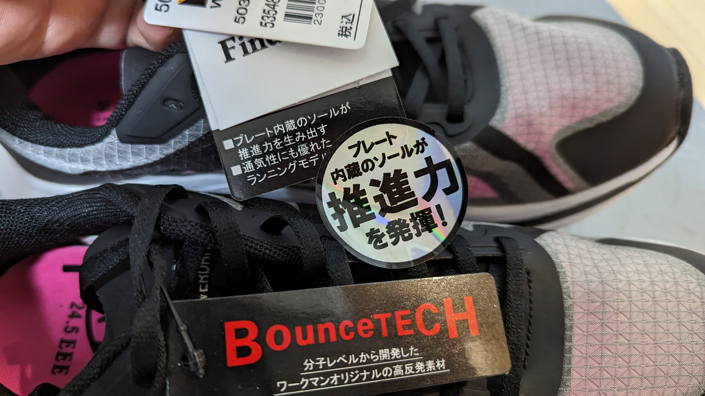
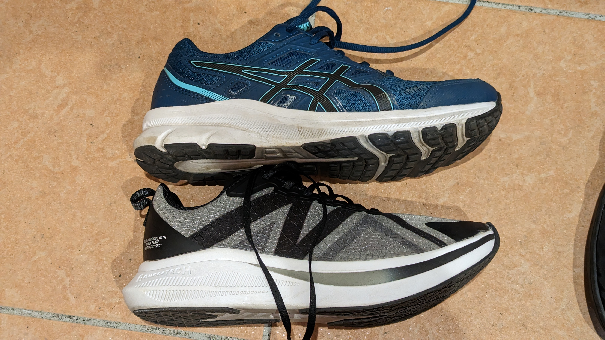
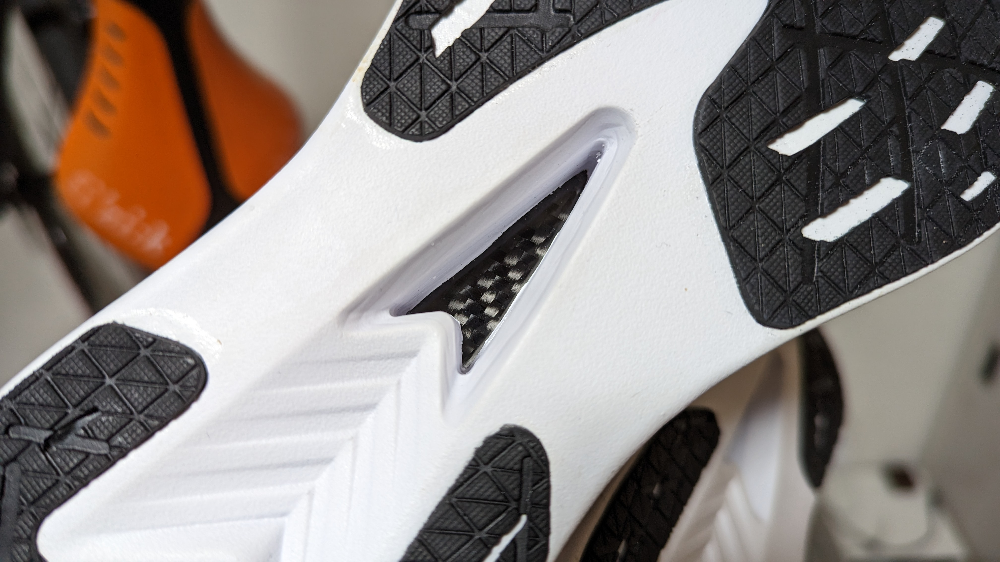
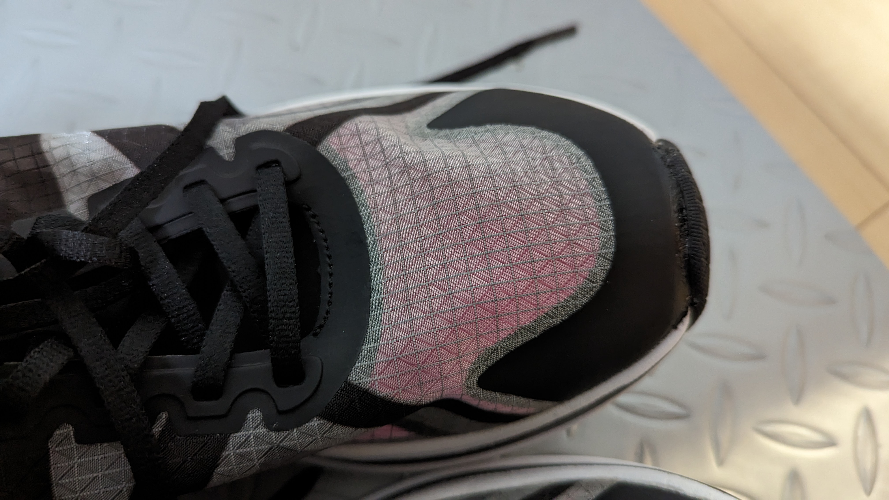
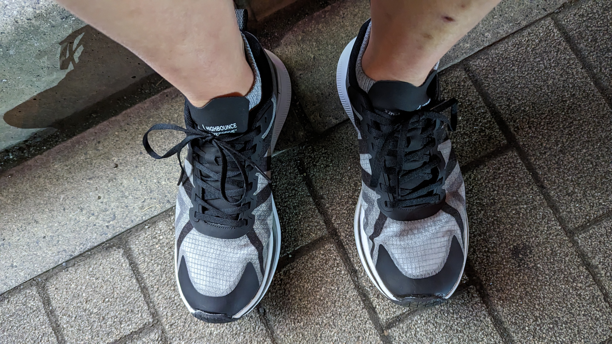

レース活動はシクロクロスだけなので、春先に最後のレースを終えるとハードなトレーニングとはおさらば。

暖かいうちは夜も外に出られるので、ランニングをすることが多い。今年は話題になっていたワークマンのカーボンプレート入りシューズを使う機会ができたので、オフトレの勢いをつけるために購入してみた。

正式な製品名は**「アスレシューズハイバウンスオーバードライブ」**。スポーツ系のFind-outラインだ。

## ルックス

箱根駅伝で存在を知った人も多いと思うが、現代のランニングシューズはソールに入ったプレートと厚いソールで反発力を稼ぎ、シューズ性能を使って走るためのものになっている。

これまで厚底シューズを使わずトラディショナルなランニングシューズしか使っていなかったので、この反りや厚さは新鮮だ。

ソール側からはカーボンプレート…**一昔前に自転車パーツでよく見た化粧カーボン柄**がのぞいている。ちょっとだけ親近感。

ちなみに**お値段2900円**。アシックスのエントリーシューズより安い。性能はいかほどなのだろうか…

## フィット感

幅広甲高の自分でも難なくフィットした。

一番上のシューレース穴は使うと紐が足りなくなるし、締め付けがきついので外している。

重量は十分な軽さになっているし、アッパーもインソールが透けて見えるほどの薄さで、しなやかで通気性も文句はない。（あくまでオフトレのレベルではあるが）

## 使用感

反りあがっているつま先と、母指球当たりの反発を歩いているだけでも感じる。

**走行感はポヨンポヨンとしている。**「蹴り出す」という行為をする必要が無いので、キロ5分程度のペースならば反発のベクトルを前に制御して、勝手に脚を回すだけで十分だ。脚に力がいらないので、負担も少なく感じる。

これに比べるとこれまで履いていたシューズはペタペタと走っていたと思う。

自分の力で走っている感じが少ないと思う人もいるかもしれないが、機材スポーツから来た身にとって**「自分の力を効率的に使っている」感覚は楽しいの一言だ。**

[ForeRunner255S](https://amzn.to/3JtIW2g)の機能でランニングパワーなるメトリクスが取れることを初めて知った。

<blockquote class="twitter-tweet">
  

    ランニングにもパワーあるんだ{" "}
    <a href="https://t.co/q4eNQl0jp3">pic.twitter.com/q4eNQl0jp3</a>
  

  &mdash; ゲン (@gen_sobunya) <a href="https://twitter.com/gen_sobunya/status/1630885596393795585?ref_src=twsrc%5Etfw">March 1, 2023</a>
</blockquote> 

マルチスポーツウォッチというカテゴリではあるものの、さすがRunnerの名前を冠しているだけある。

<LinkBox url="https://www.amazon.co.jp/dp/B0B18JL1PK/" isAmazonLink />

## まとめ

2900円のシューズとは思えない性能だ（耐久性は低いと思うが…）

勝手に脚が回るし、膝への衝撃も少ない気がするので、怪我したくないオフトレにはピッタリだ。しかも、軽く走っていてもペースはかなり速い。

ワークマン製品の運命として、耐久性はあまり期待できないのでカーボンプレートがヘタったら買い直しになると思われる。

なお、ランニングをしっかりやっている人からするとこのシューズは「まがい物に近い」性能らしい。

本物のカーボンプレートシューズを確かめてみたい気持ちに駆られるが、本職ではないのだからがまんがまん…
