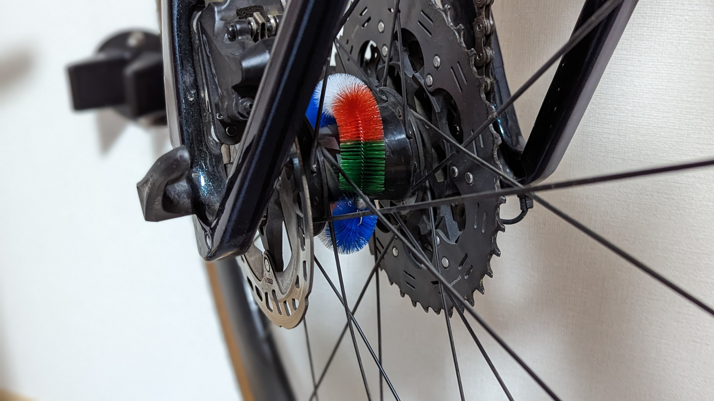
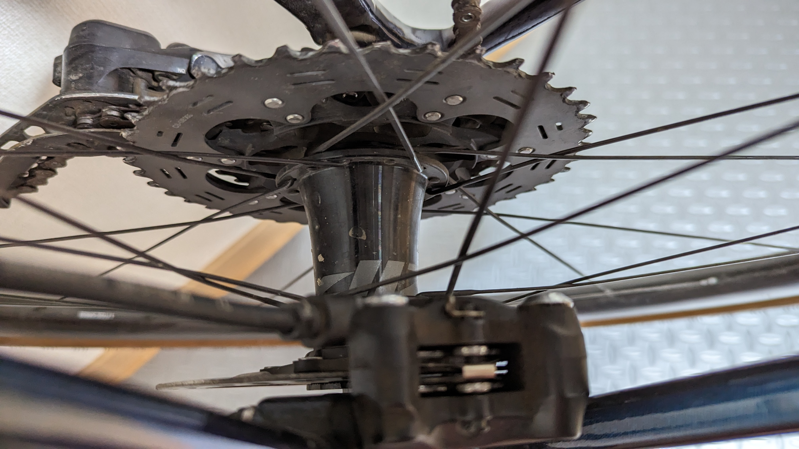
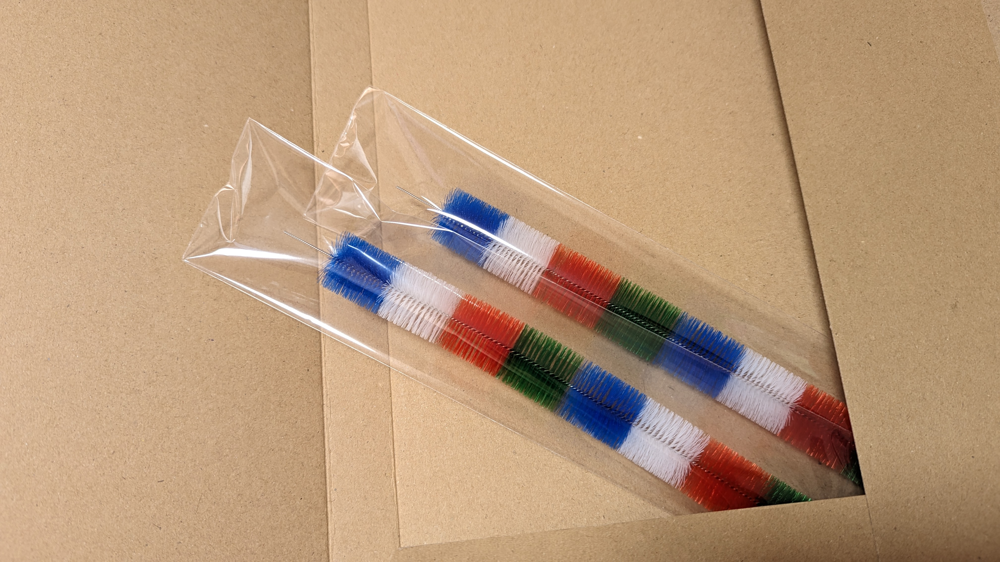
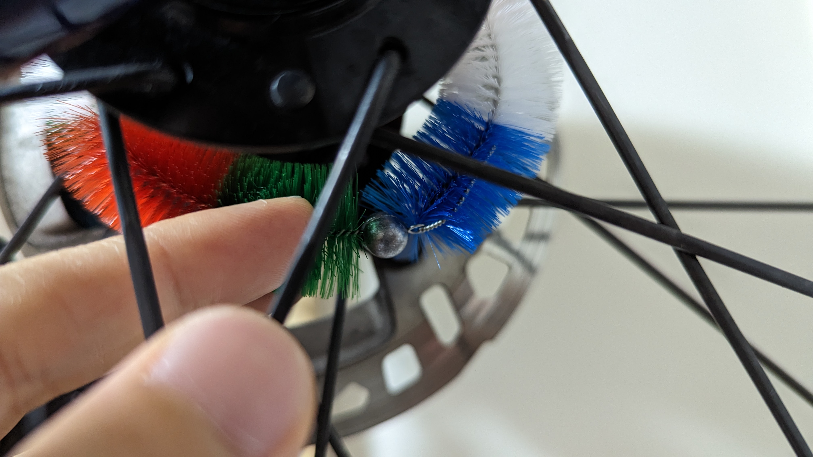
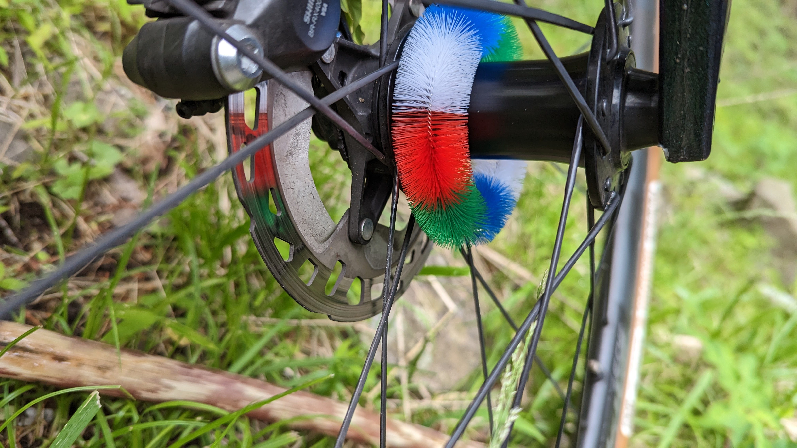

大阪にいたときの友人であるもつなべ（[@motunabe888](https://twitter.com/motunabe888)）が復刻させたハブ毛を遅ればせながら入手した。

**パフォーマンス第一であれば絶対に必要ない**このパーツ。とにかく可愛いからヨシ！

## ハブ毛復刻・そして購入

丁寧な経緯については以下の朝日新聞オンラインの記事が詳しい。

ハブ毛を製造していた最後の1社である三優商会が製造をやめて、**日本からハブ毛の会社が消滅していた**ところを、もつなべ氏が個人で請け負ってくれる工場と交渉し、復刻製造したという顛末。

<LinkBox url="https://www.asahi.com/articles/ASQ9F2Q8ZQ8TOHGB005.html" />

> 自転車の車軸「ハブ」に巻く輪状のブラシ。名前もちゃんとあって「ハブ毛（け）」という。ママチャリなどの車輪をカラフルに飾っていたが、近ごろはすっかり見かけなくなった。絶滅が危惧された一品だが、生産終了と聞き、執念で復刻した愛用者がいた。

市場を見渡せば、まだ[在庫はある](https://amzn.to/3qmfGU5)ものの、法人による新規生産はされていないのが現状。

復刻したハブ毛は下記のメルカリShopより購入できる。

<LinkBox url="https://mercari-shops.com/products/rF8Xwm2TA4WA3CBuRe54R4" />

機能的な説明をすれば、ハブボディを綺麗に保ってくれるためのもの。しかし、自転車としての走行性能性能を突き詰めるために、軽量化と空力を考えた際には明らかに余計なものだ。

彼はとにかくレトロとモダンをいったりきたりしており、最新・デジタル技術一辺倒の自分とは逆の嗜好をもっている。

**ロードバイクやシクロクロスばかり乗っていた際は特に必要と感じなかった**ので、欲しい人が沢山いる中で1枠奪うのも申し訳ないと思っていたが、**グラベルロードがメインとなった今は話が別**。

ハブはオフロードを走ると結構汚れるのだが、拭き取りは結構大変だ。

シクロクロスのように毎回高圧洗浄をするなら水を当てればいいが、そうでもなければスポークの隙間からウエスを突っ込んでホイールの角度を変えながら汚れをぬぐう必要がある。

ディスクブレーキの場合は近くにローターが位置していることもあり、簡易コーティング系のケミカルを滲みこませたウエスが触れないよう気を遣う必要があったり…と、**汚れを見て見ぬふりをしがち**だ。

そんなグラベルロードの外観を綺麗に保ちつつ、アクセントにもなると思い、購入を決意。

## 装着方法がわからん

購入したはいいものの、これはどう装着するんだ…？

端の輪にワイヤーを通せばよさそうだが、折り方をミスったらワイヤーの先が常にハブに当たってキズが付きそうだ。

<blockquote class="twitter-tweet">
  

    丸めてハブに巻いてオモリがついてる側の穴に余ってるワイヤーを通したら曲げて抜けないようにする
  

  &mdash; もつなべ (@motunabe888) <a href="https://twitter.com/motunabe888/status/1659441646545805312?ref_src=twsrc%5Etfw">May 19, 2023</a>
</blockquote>

とりあえず方針は合っているらしい。

折り返したワイヤーがハブを傷つけないように、外側に折り返して毛の中に埋め込み、絶対に毛の外へ出ないように気を使って方向を決める。

**ワイヤーは意外とコシがあって**、内側と外側がひっくり返ったり、曲がりすぎたりすることは無かった。当初の不安は杞憂だったようだ…

## レトロ感と実用性

<blockquote class="twitter-tweet">
  

    ニセコグラベル行きたかったが家の都合なので秦野の林道で満足します{" "}
    <a href="https://t.co/cD48nqgPJb">pic.twitter.com/cD48nqgPJb</a>
  

  &mdash; ゲン (@gen_sobunya) <a href="https://twitter.com/gen_sobunya/status/1660093085597208577?ref_src=twsrc%5Etfw">May 21, 2023</a>
</blockquote>

走行中、目に入ってくるカラフルな小物は、存外目を楽しませてくれる。

この日のライドは雨が上がって2日目で、ところどころ水たまりが残っていた。

<blockquote class="twitter-tweet">
  

    きたねえ <a href="https://t.co/xVBA8qRFkl">pic.twitter.com/xVBA8qRFkl</a>
  

  &mdash; ゲン (@gen_sobunya) <a href="https://twitter.com/gen_sobunya/status/1660123453117304832?ref_src=twsrc%5Etfw">May 21, 2023</a>
</blockquote>

当然、自転車は恐ろしく汚れる。

しかし、そんな中でもハブは綺麗なままだった、流石ハブ毛。

毛はやわらかいが保水するような素材でもないので、水でジャバジャバ洗ってもすぐ乾いてくれる。意外と実用性も高い。

ハブ毛大明神を拝んでおこう。
