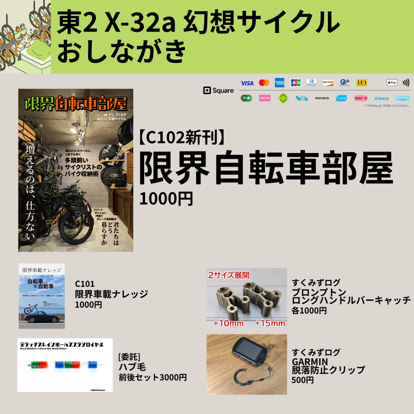
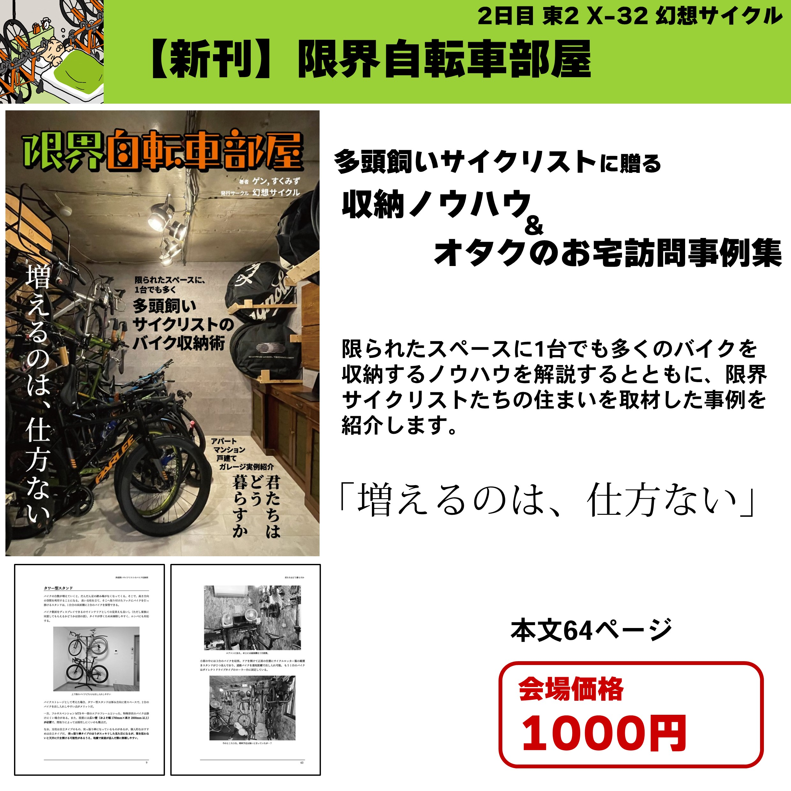
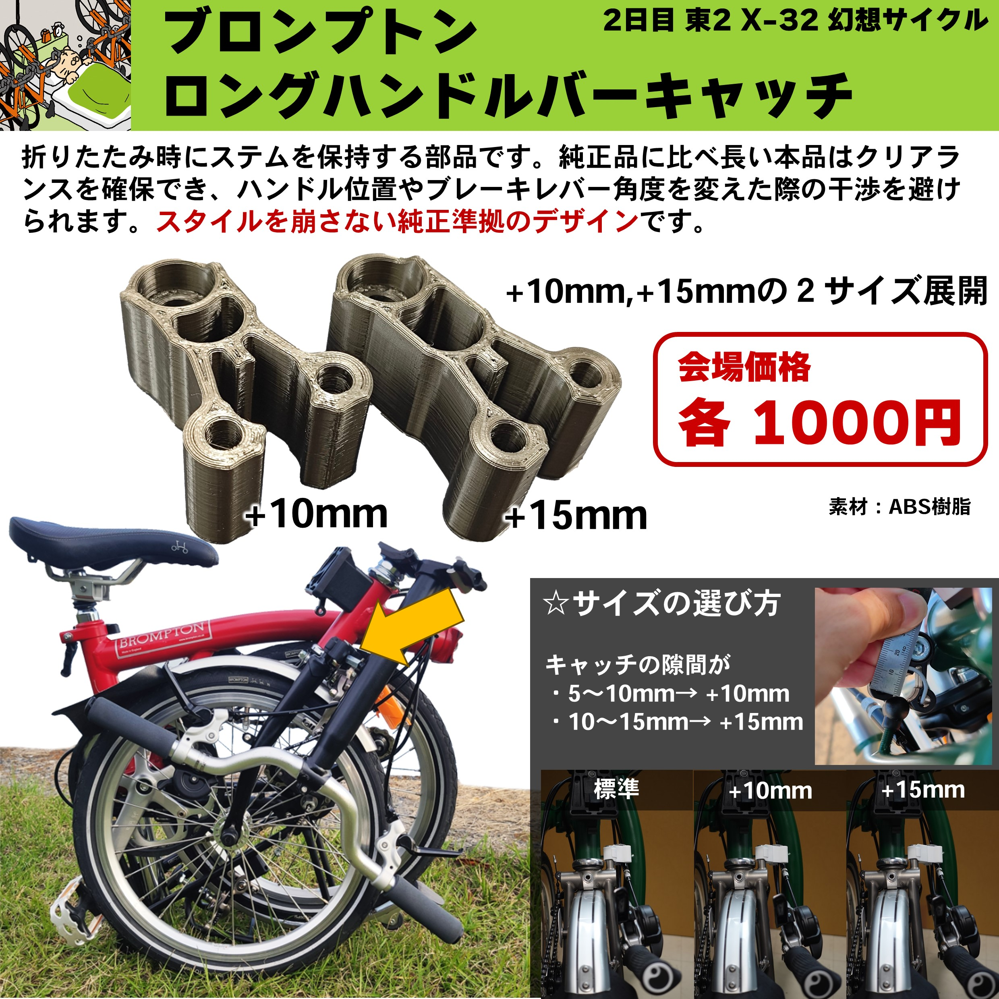
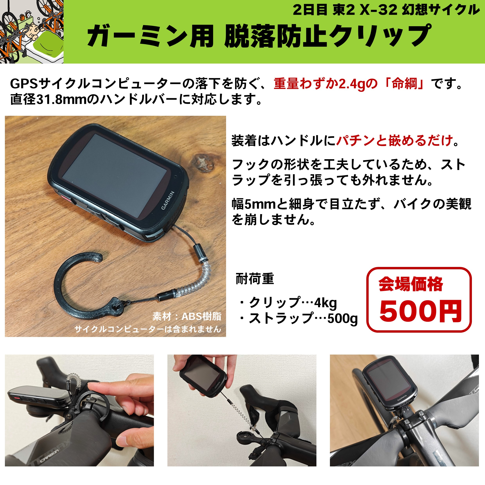
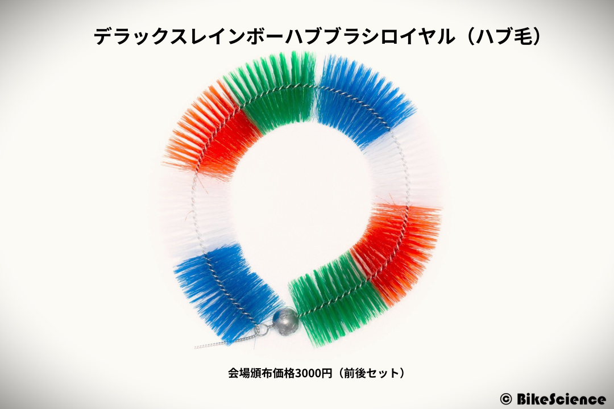

このブログでは直前の告知になるが、今年もサークル「幻想サイクル」としてコミックマーケットに参戦。

**8/13東京ビッグサイト**でサークルスペースは**X-32a**。もはや定番となった[すくみずさん](https://skmzlog.com/)との共著で新刊と『限界自転車部屋』と各種3Dプリンタグッズを頒布する。

今更告知されても予定確保してないよ！という方には本当に申し訳ない。

**C102では[午後入場の当日券](https://twitter.com/comiketofficial/status/1689827726931456000)も用意されている**ので、もし8/13の予定が空いていれば是非ともうちのサークルをはじめとした[自転車島](https://togetter.com/li/2202054)にも足を運んでほしい。

コミックマーケットというと、漫画やアニメの二次創作というイメージも強いが、評論島と呼ばれる趣味を煮詰めた本を出しているエリアがあり、料理・納税・キャンプなどためになる本も多く頒布されている。自転車島もその一部。

通販対応していないサークルも多いため、評論島のほうがコミケ現地ならではの楽しみといえるくらい。

[メロンブックスの委託通販](https://www.melonbooks.co.jp/detail/detail.php?product_id=2027847)と、[Kindleの電子版](https://amzn.to/3QfYLgP)があるので、ご利用頂ければと思う。

<LinkBox url="https://www.melonbooks.co.jp/detail/detail.php?product_id=2027847" />

<LinkBox url="https://www.amazon.co.jp/dp/B0CD62L95G/" isAmazonLink />

事前にSNSへメッセージを送ってもらえれば、レース会場での受け渡しも手元在庫がある限り対応していきます。

## C102新刊『限界自転車部屋』

コアなサイクリストのための、自転車収納術の紹介と、エクストリームサイクリストのお宅紹介まとめ本。

雑誌の1ページを飾れるような、生活に自転車が溶け込んだ映える収納ではなく、自転車のためのエリアを自宅の中に生成する方法を紹介していく。

目的別にホイール・バイク・遠征装備を**増やしてしまうことは自然の摂理**。

その仕方ない現象を家に押し込んでいくための手法と、実際に押し込んだ事例を集合住宅・一戸建て・**その他**という区分で実例を紹介。

**本文64ページ、頒布価格1000円。**

### 委託販売

来場できない方も[メロンブックスの委託通販](https://www.melonbooks.co.jp/detail/detail.php?product_id=2027847)か、[Kindleで電子版](https://amzn.to/3QfYLgP)を購入可能です。

## 3Dプリントパーツ：ブロンプトン　ロングハンドルバーキャッチ

ブロンプトン**Mハンドルのポジションを低く遠くした時にも、ハンドル折り畳みを可能にする**パーツ。

純製品より長めに作られており、ハンドルとフレームの干渉を小さくするように作られている。

フォークに純正固定ボルト・スプリングをそのまま使って取り付けることができる。材質はABS樹脂。干渉の具合にあわせて選択できるよう、+10mm、+15mmの2種類のサイズを用意。

<LinkBox url="https://skmzlog.com/brompton-long-handlebar-catch/" />

詳細な説明は上記[ブログ記事](https://skmzlog.com/brompton-long-handlebar-catch/)を参照。

**会場頒布価格1000円**。[DMM.makeクリエイターズマーケットでも販売中](https://make.dmm.com/shop/236079/)

## 3Dプリントパーツ：GARMIN 脱落防止クリップ

GARMINのサイクルコンピューターに付けるストラップ、そのままだとゴム紐を輪のように通してハンドルやアウトフロントマウントに取り付ける必要がある。

ただ、複数台を運用していると付け外しが大変なのも事実。しかし、高価なサイクルコンピューターに脱落防止機構を付けないというのも不安

これは、31.8mmのハンドルにそのままパチッと嵌めこむことができるクリップ。弾力がありワンタッチで装着できるが、衝撃やひっぱりで外れないように設計された。今日はロード、明日はCX、明後日はグラベル…という人にぴったり。

<LinkBox url="https://skmzlog.com/garmin-tether-clip/" />

詳細な説明は、[すくみずさんのブログ記事](https://skmzlog.com/garmin-tether-clip/)を参照してほしい。

**会場頒布価格500円。**

## 委託販売：デラックスレインボーハブブラシロイヤル（ハブ毛）

大阪にいたときの友人であるもつなべ（[@motunabe888](https://twitter.com/motunabe888)）が復刻させたハブ毛。

ハブ毛を製造していた最後の1社である三優商会が製造をやめて、**日本からハブ毛の会社が消滅していた**ところを、もつなべ氏が個人で請け負ってくれる工場と交渉し、製造にこぎつけたこだわりの一品。

オリジナル製品よりもコストがかかっており、毛のコシや、芯材のステンレス化により耐久性がアップしているとのこと。

何セットか預かったので、会場で委託頒布を行う。**1セット3000円。**

グラベルロード時のインプレは下記参照。

<LinkBox url="https://blog.gensobunya.net/post/2023/05/hub-ge/" />

## ビッグサイトでおまちしています！

C102はついに当日券での入場が可能となり、ふとした立ち寄りの方が増えそうで非常に楽しみにしています！

<LinkBox url="https://www.melonbooks.co.jp/detail/detail.php?product_id=2027847" />

<LinkBox url="https://www.amazon.co.jp/dp/B0CD62L95G/" isAmazonLink />
