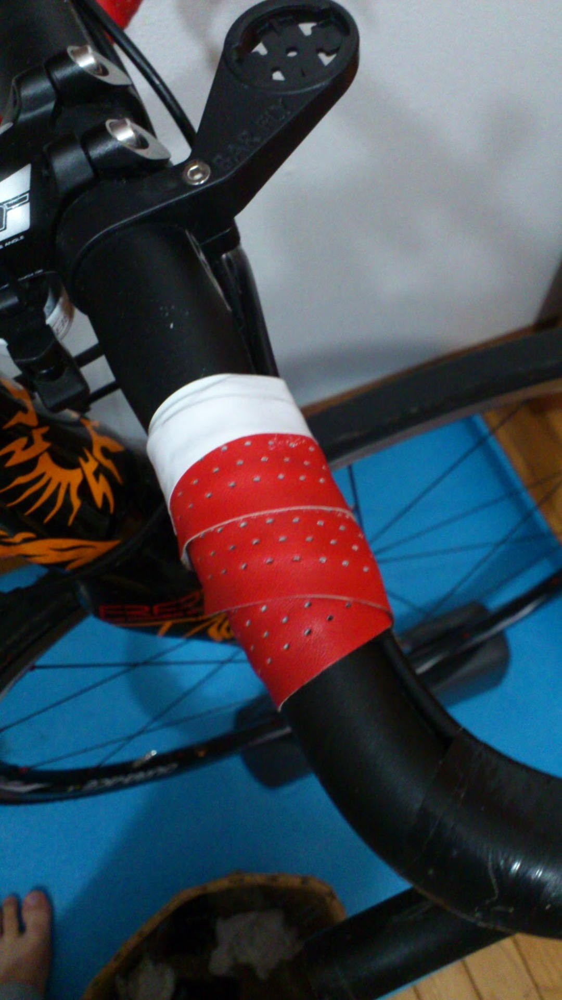

ロードバイクでTTポジション。取りたい時ありますよね？

エンデューロで先頭を引いていたり、一人旅になってしまった時。ツーリングで平坦な道を延々と走るとき。
ずっと平地を走っていると本当に空気抵抗が鬱陶しく感じて自分はよくハンドルに肘を置いて手をだら～んと前に垂らして走っていることがあります。

でもこの体勢、肘（というか前腕）がかなり痛くなってくるんですよね…

愛用のFizi:kのバーテープ薄さも相まってかなり体重でハンドルが食い込んできます。DHバーをつければ肘置きがあるんですが、使用不可のレースがほとんどなので取り付けられない…

そこで肘付近が痛くならないようちょっと一工夫してみました。

ちょうど肘が当たる部分に、古いバーテープを少しだけ巻いて、クッションにします。

この時ちゃんと腕を当てて実際にポジションを取った際にグラつかない様に気をつけます。そして上から新しいバーテープを巻いて出来上がり、明らかに太くなっていますね。

## 実走行

悪くない！悪くないです！

乗せる面が広くなったことでより肘に近い部分で上半身を支えたりできるようになったりと少し幅が広がりました。安定性もいいのでレースでも使えますね、独走時とか

ただ、施工から実走までに間に気づいてしまったのですが…これ、エルゴノヴァのような上ハンが平たいタイプのハンドルにバージェルを巻くだけで良かったような

お金ができたらそっちの組み合わせも試してみたいですね
