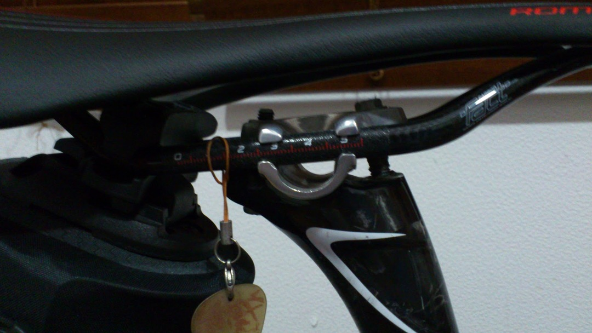

1ヶ月半前、ヨーロッパツーリングの際に安く手に入れていたサドルをようやく交換。

スペシャ同士でTOUPE ExpertからROMIN Proへの交換だったのですが、

何が問題だったかというと…コイツです

ようするにシートポストのヤグラとの相性ですね。

カーボンレールになった分気を使わなければいけなくなりました。本来はこのヤグラのように点ではなく面で捉えるヤグラがレールを傷めないのでカーボンレールには適しています。

更にレールが丸ではなく7x9mmの楕円形状なんですよね。そちらの相性もあります。

今使っているのはAVEDIOの純正シートポスト（Venusシートピラー）なのですが、最初にヤグラ確認した時「これダメじゃん！」て思いました。

でもよく考えるとAVEDIO自身カーボンサドルを出してるし試乗車やら展示車にガンガン組み付けてた気がするんですよね…

そこでジャパンカップでブースに寄った際、中の人に聞いてみました。そしたら「トルク気をつければ大丈夫だよ！」との答えが帰ってきたのでようやく取り付けに至ったわけです。展示車にも同じく楕円形レールのサドルが組み付けられてましたしね。

その時気づいたんですがこのシートポスト、コルnｹﾞﾌﾝｹﾞﾌﾝ…某イタリアメーカーのやつにも同じ形状のものが付いてますね。ヤグラもこのままだったりそうでなかったり…同じ形状で面でレールを捉えられるヤグラがついているモデルもあったのでそこだけ交換できるのでは？とか思いましたが実行には至っていません。

サドルの交換に伴い、今まで使っていたORTLIEBのサドルバッグも付け替えたのですが、これまたカーボンレールにやさしくなさそうなマウントを使っていますww

でもこの部分の負荷なんでクランプ部のトルクに比べたら可愛いものなのでフツーに使っています、オーバートルクにならないようだけ気をつけましたが。

んでインプレです。

まだローラーで1時間ほど乗っただけですが、TOUPEに比べてどっしり座れて安定しているような気がします。スペシャの前はSMPを使ってしっくりきていたのでケツが落ち着くサドルの方が相性良いみたいですね。

ちなみにSMPは座る場所を後ろに動かしづらいので退職して頂きました。ROMINはこの点でもなかなか優秀でTOUPEほどフラットではないものの、結構ケツを動かせます。穴あき派で登り下り平地で座る位置を動かす自分のような人には良い感じです。

かなりヘタったTOUPEと違ってまだ座面が硬いので150km走ったらまた違う感想が出てくるかもしれませんね。

以前の白サドルに合わせて白いバーテープをストックしていたのにサドルが黒くなってしまった…
