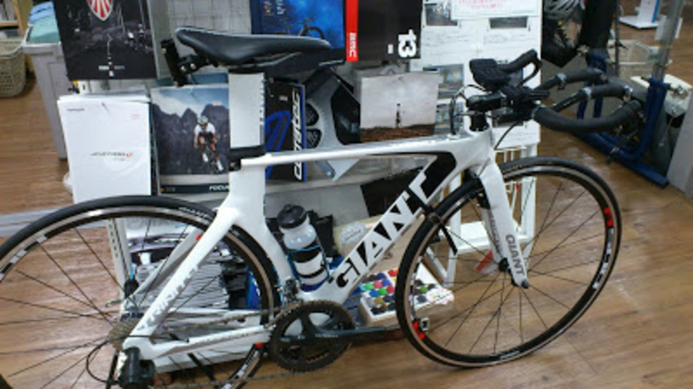

安かったし金が入ったので買った。

特に後悔はしていない。

などと容疑者は供述しており…

買っちゃいました、TTバイク。

レースも平地派だし、痛チャリにするときもディスク似合うし、問題ないよ、ね？

TTレースとかイベント遠征とかトライアスロンに使う予定。

**購入前**の写真がこちら

いいね！かこいいね！

**購入後**の写真がこちら

迫り来る現実

どうしようもない。

予定としては

・後輪ディスク ←RENN購入済

・前輪ディープ

・ロードのROTORクランク移植

・アルテDi2で10s電動化

…現状のコンポが全部要りませんので売りました。

あとこんなんも買いました。ISMのADAMO ROAD、パッドマシマシです。

前乗りにすごく良さそうだしね！

これからがんばってカスタムしていきます。

ハンドル落差を少しでも演出するために平行ブレーキレバーのブルホーンハンドルも買おうかと。候補はSynopとかSVETですねー

ところでDi2のケーブルルーティングを確認しようとBB裏を確認したらこんな具合でした

真ん中上部の穴からはFDケーブルが、左はRDケーブルが通っていました。

おそらくE-tubeを左上部の穴から出して下部のそれぞれの穴に通していくことになると思うのですが、これジャンクションはどこへ…？

どなたかお優しい方教えて…
