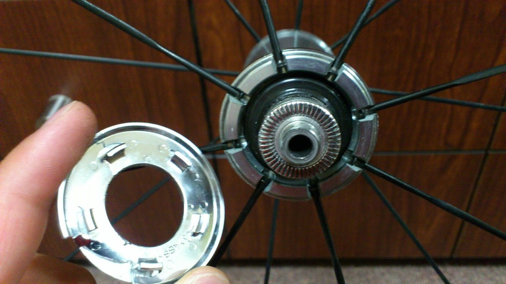

浜松まで餃子を食べにロングライドしていたある日…

東海道由比あたりの自歩道ダートを走らなければならない区域で突如

＼バシィン！／

「なんかすげー飛び石だな…」とか呑気なことを思っていたら、フロントホイールの一部が割れてました

とはいえ、ハブキャップのみの破損だったため、走行に支障はなし。当日は普通に走りきりました。

それでもハブ内部の一部が露出しているのは気持ち悪いし、

シマノホイールの大きなメリットである防塵性防水性も落ちそうなので交換することにしました。

注文から一週間以内で届くあたりさすがシマノです。日本に住んでるんだからみんなシマノのこういうメリットを享受すればいいのに…

普通に素手で外して素手で嵌めていきます。プラ製の爪で留まっているので特に工具はいりませんね。

ハブキャップ代　 995-

高いと思うか安いと思うかは人による金額です。

自分はこのキャップとハブの鈍い輝きがデュラホイールで非常に好きなので躊躇なく買いました。

その点 9000 系は黒ハブでいただけませんね…地味にフロントがペアスポークだったりするのは面白くていいんですけれども。（でも多分買う）
