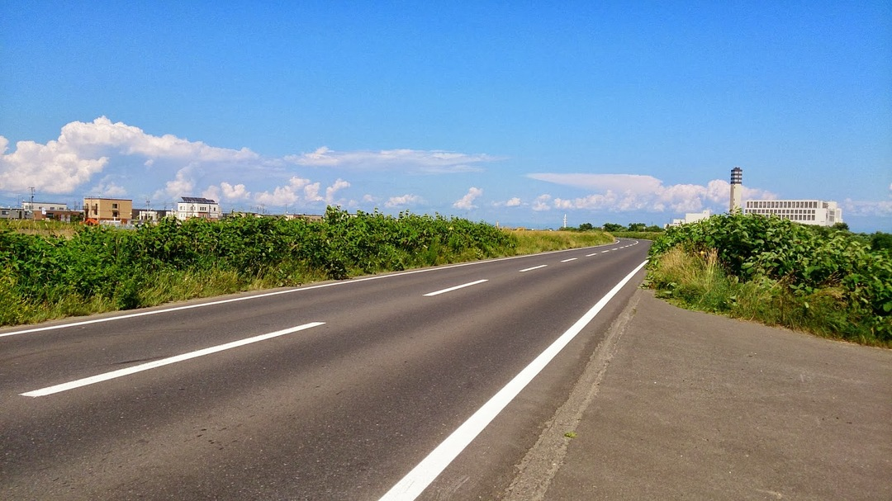

仕事の都合で半年ほど北海道へ行っておりました

言い渡された時、TT バイクを持っていました。

…持っていくしかないでしょう！

なんせ北海道です。平坦な道がどどーん！TT バイク持ってくしかねえ！

現地入りして聞き込み

「支笏湖へ豊平川 CR で行くが人気コースかな～」

HAHAHAHA、素敵な山岳コースじゃないか！

CR は平坦でいいですね、街中はそこそこ整備されてますし。

ただ一般道の舗装がヒドイひどい…（東京基準

TT バイクだと縦剛性が高めでな上、前乗りで振動が上体に直接来てしまうので舗装のひどさで体力をかなり持って行かれます。

ついでにディスク＋ 12-23T のスプロケしか持って行って無かったので普通に登りで死ねます。

天辺かと思ったらなんどか下って上って繰り返しだし！

ロード欲しかったです（）

ただその後の景色は格別でした

ロードも結構いましたね、今度は軽快に登りたいｗ
