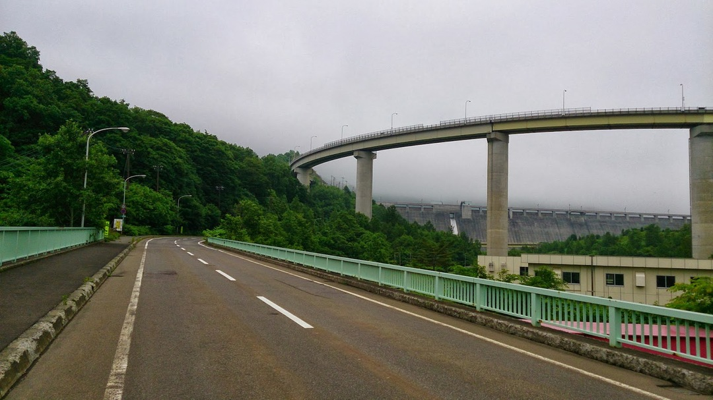

  札幌から小樽方面に抜けていく途中にある「朝里峠」

   

  住宅街を抜けるとこーんなループ橋が

  

  

  

  それから自然の中をゴリゴリ登ります（7~12％くらい）

  

  

  

最後にトンネルを抜けてゴールです。定山渓に抜けられるので長い長い下り坂。

ただ、よくて3%程度しか斜度がないのと、当日は向かい風だったので漕がないと進まない羽目に…

トレーニングに通いたいタイプの峠ですね

