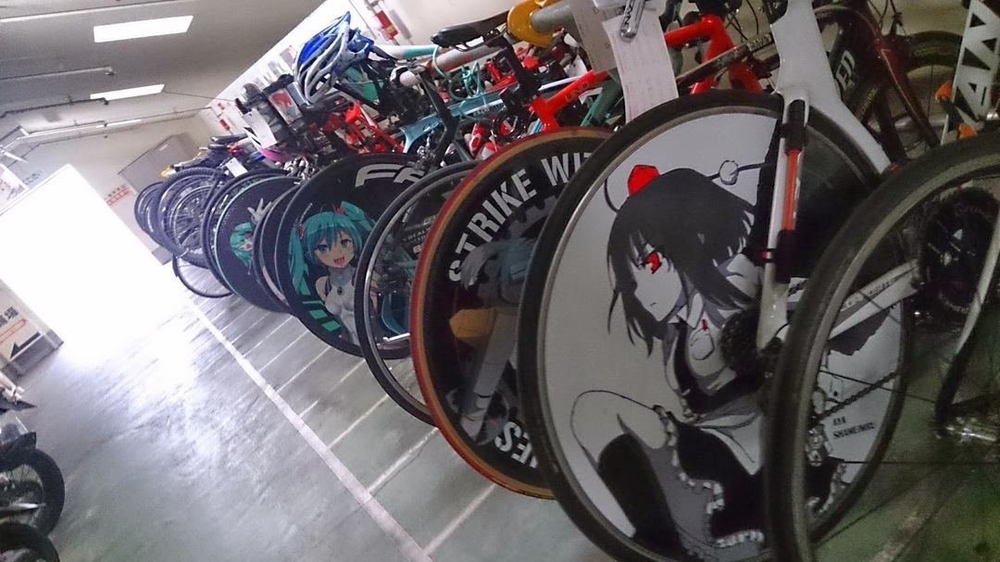
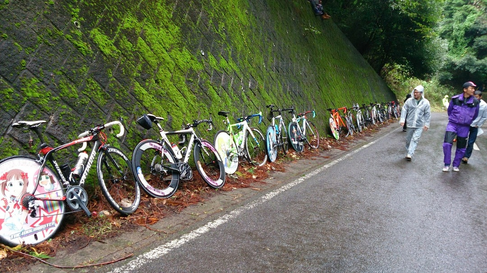
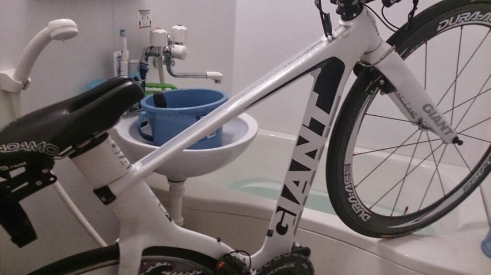
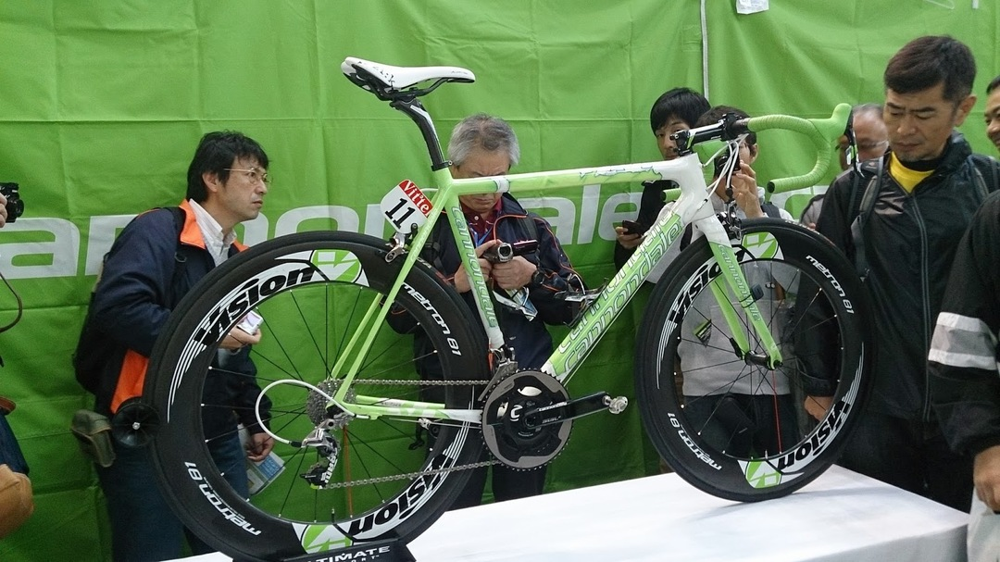
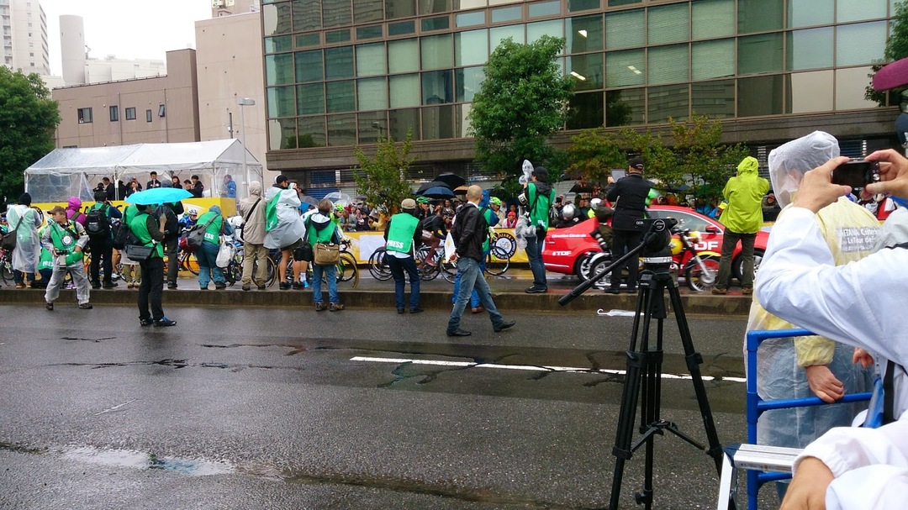

それぞれのイベントで記事を作ろうかと思ったけど色々比較したい点があったので一緒にします。

10 月はやっちゃばフェス、ジャパンカップ、さいたまクリテと自転車イベント目白押しで非常に楽しい週末ライフ。

11 月もレースとサイクルモードで自転車漬けの模様…秋は自転車業界楽しい時期ですね

写真は XperiaA なのでピントだのなんだのが雑魚ですがカメラ沼には沈みたくない…

スマホ外付けレンズを買うべきか…

<h3>
ジャパンカップ
</h3>

安定の土曜午前から自走で会場入り。TT バイクでのロングは辛い…

言わずと知れた自転車もとい痛チャリの最大イベントでもあるジャパンカップ

某所の駐輪場はすでにこんな具合に

そしてオリオン通りにはこんなものが…

『赤く萌えろ！』

地元出身の某氏が一瞬でハンドタオルを買っていきました…

スタッフ「他のタオルも有りますよ！」

某氏「これで」

スタッフ「こっちですか？」

某氏「こっちだけで！」

男だ

クリテは写真撮りそこねたので割愛。

翌朝は雨にもかかわらずオタクチャリが来るわ来るわ

雨は 1mm 予報だったからいけるとおもったんだ…この時は

プレスの方からもかなり認知されており国内外のジャーナリストから

かなり写真撮られてましたね、イタリア人ジャーナリストはビアンキとルッキーニちゃんがお気に入りの模様。

そして途中から豪雨。どうしてこうなった

寒いのでサイリウムを振ってテンションを上げていくオタク共。

ただひたすらバッソコール

それでも選手は走り続ける、というかバッソさんめっちゃ笑顔（わかりにくいけど

結局寒すぎたのでラスト 3 周くらいで山を降りてパブリックビューで観戦（それでもかなり寒い）

ゴールした瞬間自転車に乗って宇都宮の南大門へ GO。アイマス自転車の方々は最後まで山にいたらしい、強すぎる。

温まった後はみんみんの餃子を食べて帰宅。

翌日に泥だらけの自転車を入渠して終戦

<h3>
さいたまクリテ
</h3>

また雨予報です。

台風です。

910hpa です、シャレにならない。

ですが、運良くそれてくれたので雨は JC ほど強くはなりませんでしたね。

JC より近いのですが前回で雨は懲りたので電車で参戦。

まずは SSA にてブースを見て回る。\
 サガンの実車を発見！　しかしこれ以外に撮るべきものがないぞ！自転車と関係ないブースがやたら多い印象。雨が止むまでｇｄｇｄしていました

腹ごしらえをして観戦に出発！\
 クリテならコーナーだろ！ってことでアンダーパス後の折り返しに出撃！

「観戦禁止区域でーす」

…？\
 ？？\
 よもやそんな場所がコース上にあるとは…というかパンフには何も載ってないんですが…

しかたないので次なる観戦ポイントスタート・ゴール地点へ\
 いい場所ゲット！と思いきや

あ、そこプレスが来るんですか…\
 そうですか…

仕方ないからアンダーパスを上から眺め…

え？ここも観戦禁止？\
 （アンダーパス覗き込める場所）

橋の上は…なんか布が

コーナ…え？ここもだめ？\
 フェンスあるけど…はいそうですか

少し遠くに…え？横断不可？\
 パンフに書くか看板立てるかしてくれ…

観戦者にやさしくなさすぎる運営にかなりイラつきながらもなんとか観戦場所を探し当てる。ポイントレースは全体的にスローペースでのんびりムードの中地元日本人選手が気を吐く展開。\
 JC に比べると選手はレースではなく走りにきているだけっぽいことを既に感じ始める

本番のクリテリウムに向けてもうちっといい場所を探しに行き、遥か遠くでなんとか写真を撮れそうな場所に。その間も観客よりコース側を通る謎の通路に幾度も出会いその度にモヤモヤ。

しかしレース開始後すぐにモヤモヤにはさようなら

アラシーロ！

「（ワット管理しないとトレーナーうるさいんだよな…）」の構えを見せるフルーム

展開は知っての通りマイヨ・ジョーヌ、マイヨ・ヴェール、アルカンシェルの三人で逃げてフルームがロングスプリントでバンザイゴールという結末。\
 明らかなパフォーマンスでしたがどうやらこういったクリテリウムは興行としての意味合いが強くいつもこんな具合みたいですね。知らなかった。

着順以外だとフミの一人逃げや早稲田の佐々木選手の逃げ集団入りが熱かったですね！

佐々木くんは生涯「アルカンシェルを牽いた男」として生きていける…羨ましいぞ佐々木くん

レースとしての面白みは JC はに軍配が上がりますが自転車ファン以外への訴求という意味ではこちらの方が上かもしれませんね…

ただ観戦には向かないコースと下手くそな運営はちょっと擁護できませんね、\
 いくら初めての開催とはいえツールの名前を関したレースにしてはお粗末。

冒頭に挙げた観戦不可地域も戻ってみたら制限が解除されていたので納得いかずに聞いてみたところ「そうなんですか？とにかく通路なんでさっさと歩いてね」との言。\
 場が場なら論理攻めするところですがぐっとこらえ。

ツアーオブジャパンやジャパンカップも開催を重ねていたのだから何らかのフィードバックがあるかと思ったのですがどうやらそんなことも無いようで。\
 出展ブースの傾向から言っても自転車業界には余りお声がかからずお役所だけで物事を進めた感じがします。\
 しかもこんなオフィス街では地元にあまりお金も落ちませんし経済効果も少ないのでは…

次回以降があるようですので今回の反省をしっかりして次はよりよい場を作って欲しいですね。
