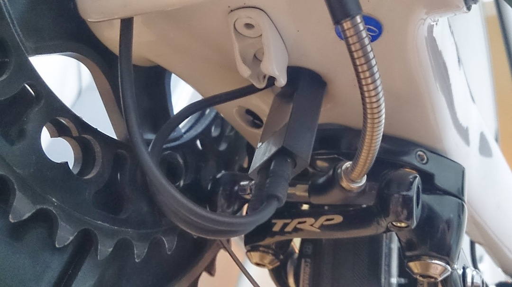

# 紐変速だった TRINITY composite を電動化

TT バイクにおいて電動コンポの恩恵はロードよりはるかに高いです。

TT バイクのシフターは、ワイヤーの取り回し・レバー自体の長さなどの要因でかなり引きが重くなります。不安定な TT ポジションで指先に力をかけて変速するとバランスを崩すことも有り結構ストレスがたまります。
しかも、ブレーキレバー側にはシフターがないのでギアを軽くしながらブレーキできないので、レースではさておき公道ではかなり面倒。

電動なら上記 2 つのデメリットを一気に解消できるのでフレームの時点で電動コンポ仕様を前提に探していたほどです。
肝心のコンポ選定ですが、

- TT バイクの性質上レースでフロント変速するタイミングがほぼない
- 安い

という面からアルテグラ 6770 をチョイス。
ST-6871 も出てきたので後々使っていきたいと思います。ひとまずは DH バー部分の SW-671。

TRINITY コンポジットは、チェーンステー裏にバッテリーが付けられるタイプの電動対応フレームなので、装着については本来余り気を揉む必要はありません。

ただ、現在はすでに紐コンポが付いているほか、BB も圧入済みのため、完全内装を行うと結構手間がかかります。

そこで、現行のシフトワイヤーが通っている部分をそのままケーブルの通し場所にして半内蔵で組付けを行います。

## 【工程 ①】

シフトワイヤーを全て抜き、代わりにケーブルを通す

RD,FD,バッテリのケーブルは楽なので先に行います。BB 裏に比較的大きな穴が空いているので、ここからラジオペンチやピンセットで頑張って近くまで持ってきたケーブルを掴み、引き出します。

かなりブサイクですがまぁよしとします。
バッテリーの為の穴をかなり探したんですがどうしてもこの Ridesense 用の穴以外に見当たらず…GIANT さんちゃんと考えてよ…
※写真は完成時のもの
※現在はちゃんと BB 抜いて完全に内装しています

## 【工程 ②】

という構成を作ることができるのですが、今回は中継する STI 部がないので、ジャンクション B をもう一つ使い、無理やり接続します。

TT シフター &#8212;&#8212;ジャンクション B&#8212;&#8212;ジャンクション A&#8212;&#8211;ジャンクション B&#8212;&#8211;リア周り

となるわけですね。

なお、5 ポートジャンクションの SM-EW90B を使うことでこの問題は回避できます。というかそっちがオススメです。ST6871 をブレーキレバーとして使う場合は尚更。

## 【工程 ③】

最難関、ジャンクション A から BB 下までケーブルを通します。
Di2 ケーブルはアウターのように剛性が高くないので、内部の波打ったカーボンフレームの中を素直に通ってくれません。
そこで、アウターそのものをガイドとして Di2 ケーブルとセロテープでくくりつけ、中を通していきます。ですが、トップチューブの小さい穴からでは BB 下までワイヤーを通すのは神様でもない限り不可能です。

そこで、フォークを抜いてヘッドチューブから取り出して、中を通す…かなりの荒業ですがこの技をフォロワーに教えていただきなんとか完遂できました。

### 図解

赤が Di2 ケーブル、青がガイド代わりのアウターワイヤです。がんばれればそのうち BB 下の穴からワイヤが出てきます。
くっついてる Di2 ケーブルが来たら結線して調整して完了です。

結論から言うとちゃんと BB 外して内装したほうが見た目も綺麗ですし楽ちんです。
