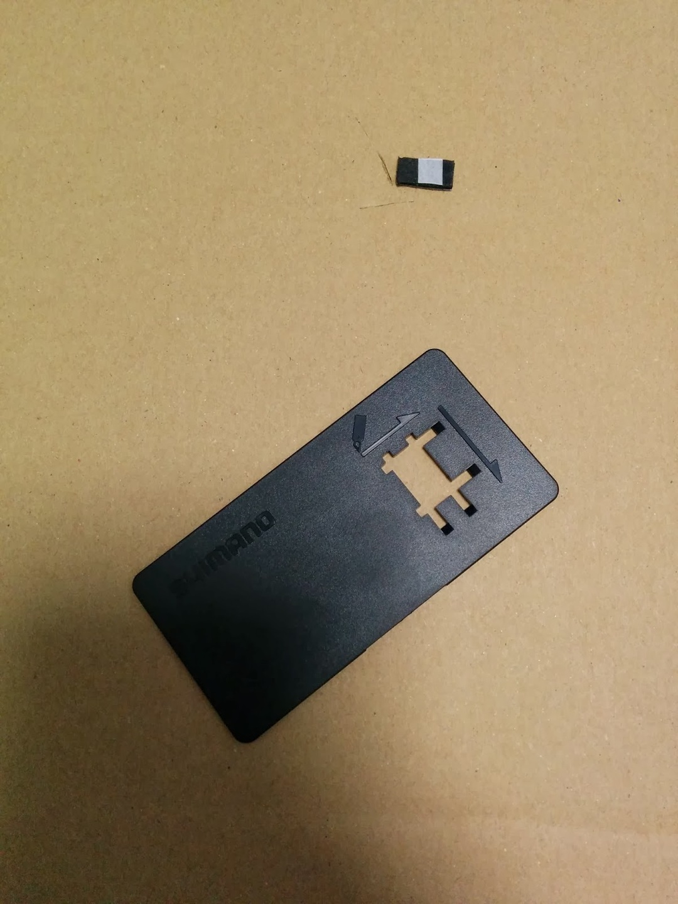

  

電動変速にしか無いメリットの一つ。

レバー以外での変速動作。

お世辞にもクライマーではないので、スプリンタースイッチを9070化と共に導入。

  

こんな工具をつかってバーテープに穴をあけます。こいつのせいでバーテープ巻の難易度が跳ね上がります。

9070に組みかえしてから、何回かロングライドに使いました。

結論から言うと、Di2なのに増設スイッチを使わないのは非常に勿体無いです。

というか付けないならワイヤーのほうがいいと思います、価格的に。

以下に、レースでのスプリント時以外のメリットを記します。

**<u>メリット①　下り基調</u>**

下り基調だと、空気抵抗を減らすだけで相当楽にスピードをのせることが出来ます。

でも、斜度が一定ということはほとんどなくシフトチェンジを迫られます。

下ハン持ちたいところですけど、レバーまで指を伸ばすのが面倒…特に手が小さい人には。

そんな時、親指を少し上に動かすだけでカチカチ変速できます。

スプリンタースイッチのみでリアのアップダウンができます。レースしなくても役に立つんです。

<u>**メリット②　巡行**</u>

自分は、巡航時にブラケットを握るのではなく、ハンドルとブラケットカバーで出来ている平らな部分に手を置くだけのことが多いです。

実は、レバーよりスプリンタースイッチのほうが近いのです。リアだけの変速がらくちんです。

…書き上げてみましたが、正直大したことないように見えます。しかし、特に①は一度使うとやみつきです。

シマノの電動レバーはクリック感に乏しいので、そこだけが不満（EPS見習え！）なのですがスプリンタースイッチはクリック感バッチリです。

TTは電動一択ですが、ロードの電動変速もいいものですよ。というお話でした。

  

    
  

  

    

<a href="http://www.amazon.co.jp/exec/obidos/ASIN/B00BPJKM4E/gensobunya-22/ref=nosim/" name="amazletlink" target="_blank">3M スコッチ はがせる両面テープ 強力 薄手 19mm×15m SRE-19</a>

  posted with <a href="http://www.amazlet.com/" title="amazlet" target="_blank">amazlet</a> at 16.03.21

3M (スリーエム)  売り上げランキング: 39

  <a href="http://www.amazon.co.jp/exec/obidos/ASIN/B00BPJKM4E/gensobunya-22/ref=nosim/" name="amazletlink" target="_blank">Amazon.co.jpで詳細を見る</a>

  

  

  

