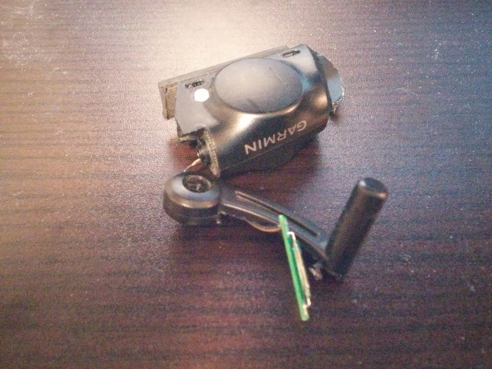

もうずっと前からケイデンスを拾わなくなった GARMIN の GSC10 の修理を試みました。

可能性としては、高い順に

① 断線

② ケイデンス拾うメカニズムの故障

と考えます。

断線ならハンダ付けで直るでしょうし、ネットの海にもそういった類のレポがあります。

いざマイナスドライバーとゴムハンマーでガシガシと

開きました。

先の部分にある基板を引っ張り出します。どうやらここがケイデンスを拾う装置のようです。

断線箇所は見当たりません

…見当たりません

先っぽの基板の内部に金属板が 2 枚あり、磁石を近づけるとくっついて回路が接続されて信号を送る仕組みになっているようです。

磁石を近づけます。動きません。というか最初からくっついてますねこれ。

電流流れっぱなし？のようで ONOFF の信号が送れていないと。

中の鉄板が磁性を帯びたのかなんなのかはわかりませんがこれでは修理しようがありません。

破棄して新しいのをポチります。

何故かアマゾンが安かった

  

    
  

  

    

<a href="http://www.amazon.co.jp/exec/obidos/ASIN/B00JM6DKUA/gensobunya-22/ref=nosim/" name="amazletlink" target="_blank">Garmin Bike Speed/Cadence Sensor</a>

  posted with <a href="http://www.amazlet.com/" title="amazlet" target="_blank">amazlet</a> at 16.03.21

GARMIN  売り上げランキング: 35,627

  <a href="http://www.amazon.co.jp/exec/obidos/ASIN/B00JM6DKUA/gensobunya-22/ref=nosim/" name="amazletlink" target="_blank">Amazon.co.jpで詳細を見る</a>

  

  

  

