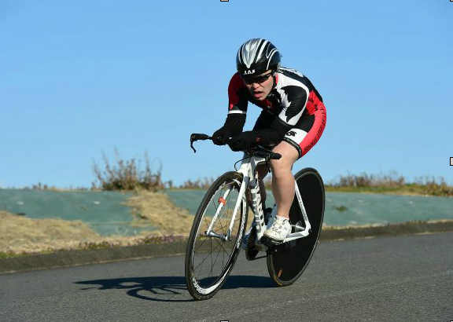
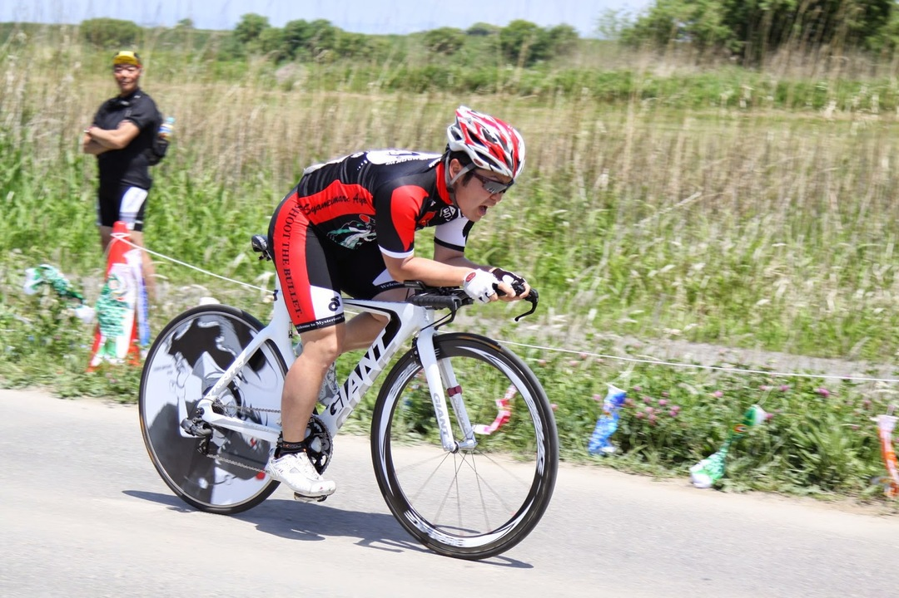

昨年、TT バイクを組んだ。そんなところに舞い降りた

「タイムトライアルジャパン」のお知らせ。

ファンライド主催のタイムトライアルシリーズ戦で、3 戦の平均速度が 40km/h を越えたら記念品がでるとか。

TT バイクを組んだ翌年にこれは好機と今年はタイムトライアルに注力してました。

参加したレースは

・TOKYO エンデューロ River ステージ（兼タイムトライアルジャパンプロローグ）

・榛名山ヒルクライム＋タイムトライアル

・さいたま TT（利根川）

・タイムトライアルジャパン　 1st（渡良瀬）

・タイムトライアルジャパン　 2nd（利根川）→ さいたま TT と同じコース

・タイムトライアルジャパン　 3rd（袖ヶ浦）

以上 6 レース。

機材は基本的に一緒です。

レースごとにポジションを煮詰めていたので振り返ってみます。

### TOKYO エンデューロ

借り物のパワーメーターで一番パワーが出てる感じの位置をチェックして我流で設定。

上体がかなり高いのとロード的な後ろ乗りポジションになっています。

6km ほどのコースで平均速度は 37.7km/h

（エアロヘルメットは借り物）

### 埼玉 TT

アルパカさんのアドバイスでロード（トライアスロン？）ぽかったポジションを TT 用に改造。

前回に比べて前乗り＋ハンドル下げてます。

11km で 39km/h

### ハルヒル TT

調子乗ってかなりハンドルを下げた（ステム 45 度設定）

肩が痛くなったり呼吸が苦しかったりでポジションとしては失敗。

ただし距離は短かったのでなんとかごまかして 39.52km/h という登りがキツイ中で好記録

### タイムトライアルジャパン 1st ステージ

公式カメラマンが無能すぎて TT ポジションを撮らない…

エアロヘルメットを導入、ポジションをステム 30 度で固定して望んで結構いい感じに。

20km で平均 39km/h

### TTJ 2nd ステージ

エアロヘルメットをさらなる本気ブツに変更。

筋肉がついてフォームも上体の安定感が出てきた。

15km で 41.4km/h。さいたま TT からヘルメット効果とフォームの効果でかなり速度 UP

ここらへんで装備の重要性がわかってくる。

最も効果のあるスーツを持っていないことに絶望を感じ始める。

### TTJ 3rd ステージ

頭がすっぽり体の前に来るフォームが出来上がる。

テクニカルな上雨が降るなか平均 39.8km/h でクラス 4 位。

3 位と 0.9 秒差で表彰台を逃す。

スーツやシューズカバーがあったら逆転できていたかもしれない…と思うと悔やみきれない。

ヒルクラで重量を削る必要があるように TT もエアロ投資が重要であることを思い知らされる。

個人的にはポジションは固まったので後は脚を鍛えてエアロ投資をするだけ…

来年はメイドさん実業団に入る予定なので怪物にヘコまされても泣かないようにしたい
