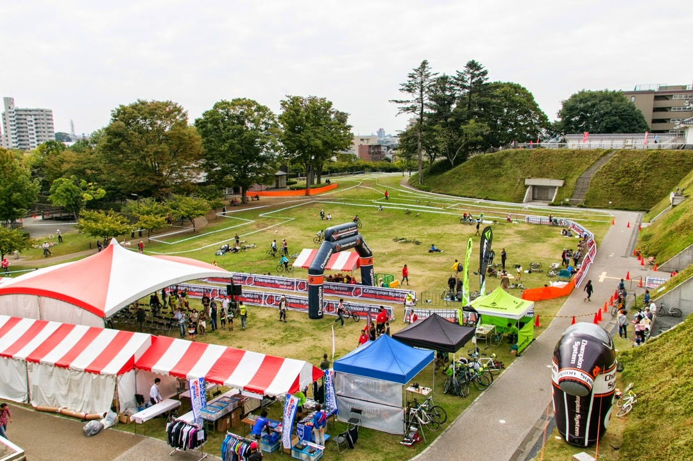

## ジャパンカップ CX

前日夜に宇都宮入り。

コストカットのため南大門をスルーして 4 時まで営業の極楽湯へ。

しかし夜 2 時に無情にも「畳ゾーン閉鎖」のアナウンス…　ネカフェに赴くもフラットシートはなく眠れぬ夜に。

朝はデニーズでパスタとヨーグルトを食らって会場へ。

シクロクロスとは思えない会場の豪華さ！

コースは舗装路多め・芝は浅く路面滑らか・階段シケイン 2 箇所・逆バンクコーナー多めという高速に見せかけてスキルを問われるいい感じのショートコース。アップダウンはほぼなし。

途中にある砂利シケインが厄介でランで抜けるとき足を取られる。

ジャパンカップの名前を冠するだけあって活気がすごい。

スタートは 2 列目でホールショット争いヤル気満々。

号砲と同時にスタート！と思いきや前の人がクリートキャッチしそこねて前に出られず派手に出遅れる。

この時点で 15 番手あたりだったのでコツコツ順位を上げる方針にシフト。

シケイン処理で横をすり抜けたりタレた人をパスしつつ丁寧に走る。

1 回ヘッドスライディングしたけどね！

最終周回にはなんとか 5 番手まで持ってくる。

トップは完全に独走していて見えない。

2 位争いの 3 人パックが 5 秒位前にいて「どうやって追い付くか…」とか考えてたら

周回後半に 2 人が吹っ飛んで棚ボタで 3 番手までジャンプアップ。

降って湧いた昇格のチャンスを逃してはならぬとガンガン踏むも、前の人のほうが脚を残していた。

3 位でフィニッシュして 3 位クラブ 2 回目。

表彰台では実況のお兄さんに明日茨城での昇格を目指すと宣言して退場。

C1 までゆっくり観戦して茨城に備えて知人の家へ移動。

寝不足と疲れで 8 時半に泥のように眠る。

### 茨城 CX

4 時半起床。

<a
  href="https://www.facebook.com/ibarakicyclocross/posts/685873051520748"
  target="_blank"
>
  水没していた会場
</a>
もなんとか回復していた。

コースは昨日と打って変わってガッタガタだが長いストレートが 2 箇所あり、

厄介な泥コーナーも設置済みとスキルと脚が両方問われるコース。

1 列目スタートで初コーナーを 5 番手で回る。

2 周目にはトップに躍り出て独走開始。2 位とは 10 秒くらいの差。

180 度コーナー後のすれ違いで後続との距離・順位関係を把握する。

2 位には 1Lap あたり 2~3 秒差を詰められていっているが、3 位の選手が 10 秒以上 1Lap で詰めてきており、最後に戦うのはこちらだと判断。

最終 Lap に入る前、2 位と 3 位の入れ替わりを確認。自分との差は 5 秒ほど？

必死に逃げるも最後のストレートでブロックする暇もなくパスされる。

周回遅れの選手処理に乗じて後ろに突き返すも抜き返す体力はなし…

念願の昇格だが勝利はついてこなかった。

優勝した方はなんとゼッケンほぼ最後尾、つまり出走も最後尾…

それで先頭まで出てくるのだから強いわけだ、脚で完敗。

幕張から C2 で走ります。

昇格 1 シーズン目は降格しないので、スピードに慣れつつ 50%以上でのゴールを目標に走る予定。

<LinkBox
  isAmazonLink
  url="http://www.amazon.co.jp/exec/obidos/ASIN/B00QHS8BQE/gensobunya-22/ref=nosim/"
/>
