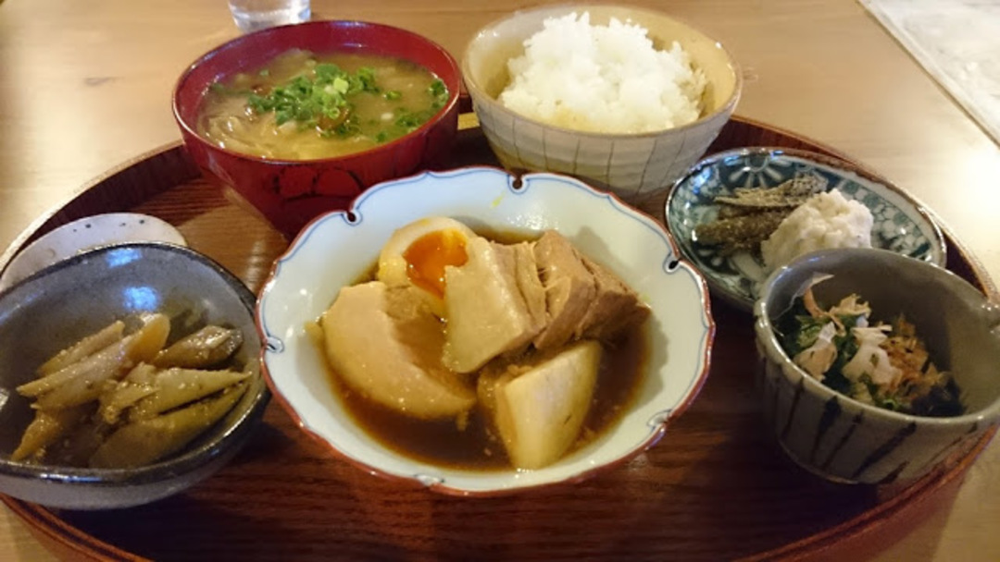

レースレポなんて需要がないという事に気がついたので、機材と飯にフォーカスしていくことにしました。

第一弾レース飯は陸の孤島こと群馬CSC。

赤谷湖付近まで降りてようやくコンビニがあり、温泉街の飯屋はほぼ無い上に夕方で店を閉めるというひどい環境。

そんな中、見つけた当たり店がこちら。

<h4 style="background-color: white; border: 0px; color: #aeb4b6; font-family: 'Helvetica Neue', Helvetica, Verdana, Arial, sans-serif; font-size: 15px; font-stretch: inherit; font-weight: normal; line-height: 20px; margin: 0px 60px 0px 0px; padding: 0px; vertical-align: baseline;">
  <strong style="border: 0px; color: #4e595d; font-family: inherit; font-size: inherit; font-stretch: inherit; font-style: inherit; font-variant: inherit; line-height: inherit; margin: 0px; padding: 0px; vertical-align: baseline;"><a href="https://www.facebook.com/pages/%E3%81%9F%E3%81%8F%E3%81%BF%E3%81%AE%E9%87%8C%E9%A3%9F%E5%A0%82/1374365642803533" style="border: 0px; color: #4e595d; cursor: pointer; font-family: inherit; font-size: inherit; font-stretch: inherit; font-style: inherit; font-variant: inherit; line-height: inherit; margin: 0px; padding: 0px; text-decoration: none; vertical-align: baseline;">たくみの里食堂</a></strong>
</h4>

  予約すれば18:00以降でも席を用意して頂けます。

  地元の食材をふんだんに利用した定食がウリ。角煮や豚のしょうが焼き等、肉が豊富で

  レース前後に最適です。ごはんもお代わりOK。

  写真は豚の角煮定食。

  

    
  

日替わり小鉢はその日仕入れた食材で変わるとのこと。  味噌汁は具だくさん。隠れてる味噌だけでご飯1杯いける旨さ。

  角煮はもちろんトロットロでレース後の体に染みわたる。  各メニュー1000円前後。

  デザートとして出来たてかりんとう饅頭を150円で頂けます。  コンビニ飯で素泊まりするならこちらへどうぞ。