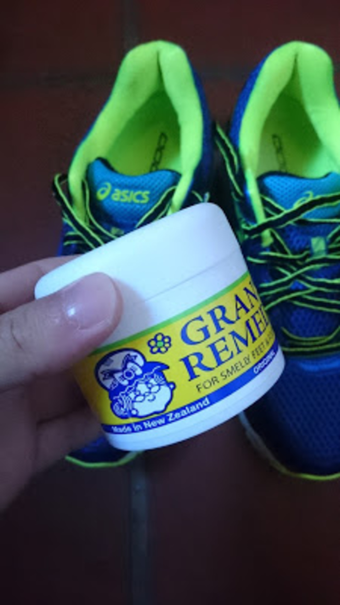

C2 のシングルリザルトが定位置になってしまって、昇格まであと 1 人というところで逃し続けている。

JCX 中井ではキッチリとペースを刻んで最後追い込んだのに差されて 4 位。

ペーシングとか技術ではなくベースの脚力や体力を改善しないといけないなと悟った。

レースの後、そのままスポーツショップへ向かってランシューを新調。

前のものが 5 年以上使ってボロボロであったため、クッション性が段違いにアップした。

お台場に向けてランを強化していく。自転車乗るよりランをやったほうが体も絞れる。

ランシューに限らずシューズに欠かせないのがこいつ、「グランズレメディ」

乾燥・消臭・除菌をこなしてくれる、オフィスで使う革靴もこれさえあれば臭いとおさらば。

欠点は靴下と中敷きが白い粉が付着することだが、シミになるわけでもないしそもそも見えないので問題なし。

<AmazonLinkBox url="http://www.amazon.co.jp/exec/obidos/ASIN/B008F4NV72/gensobunya-22/ref=nosim/" />
