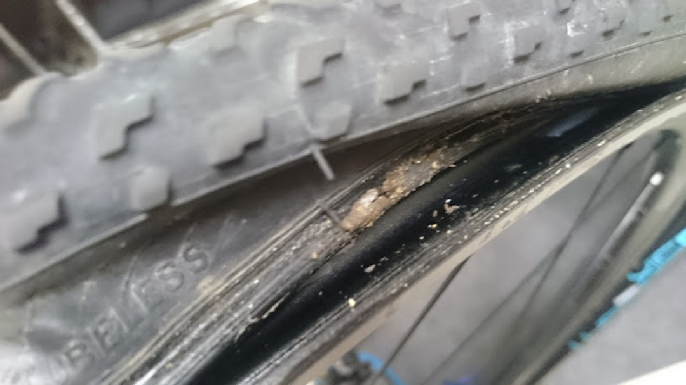

### チューブレスの宿命

ロード・CX・MTB に関わらず、チューブレスタイヤユーザーを悩ませるのが空気漏れだ。※パンクではない

シーラントが入っていても、空気を入れて走った日に問題なくとも数日後には空気が抜けている悲しい現象。  
特に CX だと、タイヤを使っていくごとに空気抜けのペースが早くなっていく。新しくタイヤを嵌めてビードを上げた時は空気が抜けづらい。だが、数レース経って気が付くとレース後の火曜日にタイヤがベコベコだったりする。

こういったタイヤをレースで使うと、レース中にグリップ感が変わったり、ロングライドの途中で空気圧が下がったりと何かとよろしくない。しかも、シーラントを入れても改善しなかったりする。タイヤを外してもシーラントは残ってるし。

タイヤの劣化と今までは諦めていたが、洗車の時にヒントを得て空気漏れが始まったタイヤを復活させるメンテ手順にたどり着いた。

### ノーモア空気漏れ

簡単に言うと、タイヤを外してリムとタイヤを水洗いするだけ。  
ビードとリムの密着する部分に泥やら草が結構詰まっているので、これを取り除くことで密着度を上げるのが目的。

ここはインナーシールより外側なので、シーラントが回り込みづらくなっていると思われる。  
タイヤを外すときは、<a href="http://www.amazon.co.jp/gp/product/B007PLDRAC/ref=as_li_ss_tl?ie=UTF8&camp=247&creative=7399&creativeASIN=B007PLDRAC&linkCode=as2&tag=gensobunya-22" rel="nofollow">防寒テムレス</a>

があると便利。裏起毛で暖かいのでレース会場で洗車する際にも役に立つ。そして滑り止めのおかげでレバーを使わずチューブレスタイヤを簡単に脱着できる。

**リムウォールの内側**を<a href="http://www.amazon.co.jp/gp/product/B002TKLMM4/ref=as_li_ss_tl?ie=UTF8&camp=247&creative=7399&creativeASIN=B002TKLMM4&linkCode=as2&tag=gensobunya-22" rel="nofollow">マイクロファイバータオル</a>

で拭ったところ。

普通のウエスだとなかなか取りきれないので。  
泥が固まっているので、水で流すだけでは取れない。

自分の場合、タイヤのビード外側も念のため拭っている。ここも泥が固まってこびりつくので水を当てるだけでは取れない。綺麗にした後、またシーラントを封入してビードを上げれば、空気圧が簡単に落ちることはなくなる。正直、リム掃除と嵌め直しのどちらが効いているかはわからない。

ひとまずこの対応で空気漏れ症状が収まるので満足している。チューブラーより手間はかかってない。きっと。

<LinkBox isAmazonLink url="https://www.amazon.co.jp/dp/B007PLDRAC/" />

<LinkBox isAmazonLink url="https://www.amazon.co.jp/dp/B002TKLMM4/" />
