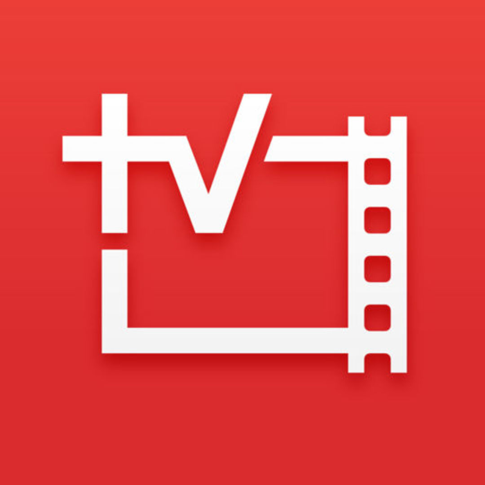

[][1]

### ロードレースシーズン開幕

参加が主な活動となるシクロクロスシーズンから、TV観戦も主な活動になるロードレースシーズンに移行する季節になりました。
ただ、生放送は深夜となり、何かと見逃すことが多いので、合法的に録画・出先視聴の環境を整える方法でも記しておこうかと思います。

TVではなく、PCとスマートフォンがメインの視聴機器となります。

### nasneはいいぞ

本記事は、Jsportsを「録画」「リモート視聴」することを目的とします。  
外出先でも自宅で撮りためたロードレースを見たり、ストリーミング環境でライブ視聴を実現します。

上記実現のためにキモとなるのが、SONY製のTVチューナー兼NAS「nasne」です。PS3のオプションみたいな扱いですが、単体で使用できます。  
自宅のルーターに接続することで、TV番組をネットワーク内と外出先で視聴可能にしてくれるスグレモノです。

正直、この要件を満たすためならば、<a href="http://front.jsports-ondemand.com/" target="_blank">Jsportsオンデマンド</a>を利用するのが一番シンプルです。  
ただ、モバイル回線ですと通信量の問題が出てきますし、固定回線でも混雑していると毎日ストリーミングが綺麗に流れるか微妙なラインですし、何より画質が低いという問題がつきまといます。

なので衛星放送クオリティで可能な限りリアルタイムで視聴したいという人向けの記事です。

### 手順

1. nasneに入っているB-CASカードでスカパー！を契約する（もしくはスカパー！契約済みのB-CASカードをnasneに入れる）
1. PCに「PC TV with nasne」をインストールする（有料）
1. スマートフォンには「nasne access（一部機能有料）」をインストールする

nasneのセットアップについては割愛します。

#### ①nasneに入っているB-CASカードでスカパー！を契約する

まずは、Jsports1+2+3+4を契約します、ロードレース観戦の基本セットですね。  
契約はB-CASカード単位なので、PCでもTVでも見たい方は複数契約か、chromecastとかでゴニョゴニョすることとなります。

nasneに保存した動画を再生するためには、DLNAという機能を持ち、かつDTCP-IPに対応した動画再生ソフトを利用する必要があります。
このままでは録画するだけで視聴できませんので②～③に続きます。

#### ②PC TV with nasneをインストールする

DTCP-IP対応のソフトはそこまでラインナップがない他、日本のガラパゴス規格ということも有りサードパーティ製だと相性問題が多発します。（昔泣かされました）

予約録画やnasne内HDDからPCへの転送にも対応する<a href="http://www.sony.jp/playstation/store/products/nasne/pcnasne-dl/" target="_blank">PC TV with nasne</a>以外ほぼ選択する理由がありません。  
3000円ですが、14日間の試用期間があるのでまずはトライアルからでいいと思います。この時点でPCでのライブ視聴・録画・録画視聴が可能となります。

もちろん一般地上・BS波放送も同様に視聴可能です。

####
③スマートフォン側のアプリをインストールする

    

  

    

nasne™ ACCESS

    

開発元:<a href="https://play.google.com/store/apps/developer?id=Sony+Computer+Entertainment" id="appreach-developerurl" rel="nofollow" target="_blank">Sony Computer Entertainment</a>

    

無料

    

posted with <a href="https://nabettu.github.io/appreach/" rel="nofollow" target="_blank" title="アプリーチ">アプリーチ</a>

    

  <a href="https://play.google.com/store/apps/details?id=com.playstation.nasneaccess" id="appreach-gplay" rel="nofollow" target="_blank">    </a>

  

  

  

スマートフォン側に、リモート視聴するアプリを導入します。

ホームネットワーク内（nasneの繋がっているルーターに接続している状態）でnasneの動画を視聴できるソフトはかなりあるのですが、「nasne access」ならば、事前にnasneを家の中で接続しておけば、外部でもインターネット経由でnasneに録画されている動画と現在放送されている番組を視聴できます。

iPhoneの人はTV sidevewを使えばいいらしいです

    

  

    

リモコン&テレビ番組表: Video & TV SideView by ソニー

    

開発元:<a href="https://itunes.apple.com/jp/developer/sony-corporation/id371425038?uo=4" id="appreach-developerurl" rel="nofollow" target="_blank">Sony Corporation</a>

    

無料

    

posted with <a href="https://nabettu.github.io/appreach/" rel="nofollow" target="_blank" title="アプリーチ">アプリーチ</a>

    

  <a href="https://itunes.apple.com/jp/app/rimokon-terebi-fan-zu-biao/id594171390?mt=8&uo=4&at=11lHd9" id="appreach-itunes" rel="nofollow" target="_blank">    </a>

  

  

  

### 構成図

文章だけで、ダラダラ書いてしまったので構成図だけ置いておきます。  
出てくる機器全てでnasneに録画・保存してある動画と、視聴可能な番組をストリーミング視聴できます。

とても特殊な人向けの記事ですが、何人かには役に立つでしょう…

  

    
  

  

    

<a href="http://www.amazon.co.jp/exec/obidos/ASIN/B00UBS2OIC/gensobunya-22/ref=nosim/" name="amazletlink" target="_blank">nasne 1TBモデル (CECH-ZNR2J01)</a>

  posted with <a href="http://www.amazlet.com/" target="_blank" title="amazlet">amazlet</a> at 16.03.12

ソニー・コンピュータエンタテインメント (2015-03-05)  売り上げランキング: 88

  <a href="http://www.amazon.co.jp/exec/obidos/ASIN/B00UBS2OIC/gensobunya-22/ref=nosim/" name="amazletlink" target="_blank">Amazon.co.jpで詳細を見る</a>

  

  

  

 [1]: http://www.amazon.co.jp/gp/product/B00UBS2OIC/ref=as_li_ss_il?ie=UTF8&camp=247&creative=7399&creativeASIN=B00UBS2OIC&linkCode=as2&tag=gensobunya-22