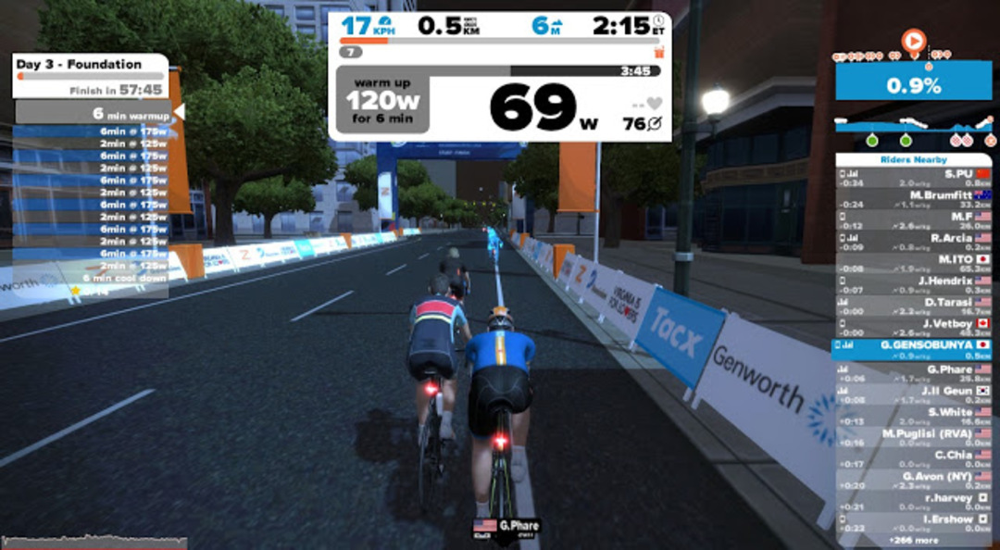
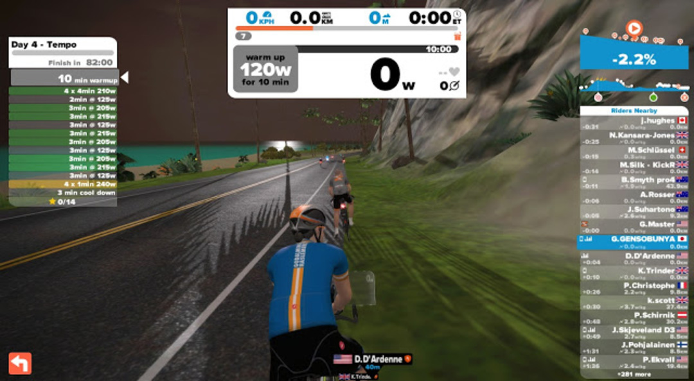

  

### Week 2 Day 3rd

すっかり更新をサボってしまったので一気に3日分を。

第2週3日目はすっかりお馴染みのFoundation。もう特筆するところないですね…

シクロクロス東京が近いのでラントレを夜の日課に混ぜてるが、自転車が本業の脚には負荷が高いので翌日もバイク追い込むというわけには行かない分、丁度いい負荷とも言える。

単にFTP向上だとそこまでハードなメニューではない分効果が怪しいが…

### Week 2 Day 4th &#8211; Tempo

  

先週も出てきたテンポ走…だけどなんかメニュー量が多い！

ワークアウト時間は今までで最長の82分。

200Wオーバーの時間も多いし、見ただけで過去最高負荷となることが伝わってくる。

いきなり210W\*4min\*4とか入ってるし…

  

キツイと思ったら、思ってたより休憩が長かったでござる。

薄々感づいてはいたものの、やっぱり初心者用のメニューっぽい。

ローラーはローラーなので、1時間越えると尻が痛くなる。

### Week 2 Day 5th &#8211; Option

  

先週は休みだった5日目ですが、2週目はメニューあり。

とはいえ完全にポタリング。Foundationに輪をかけて楽になったメニュー。

### ウェア解禁コード

お気づきの方がいるかもしれませんが、アバターの着ているウェアが途中から変わっています。

ギア類は経験値を溜めてレベルアップしないといけないのですが、ウェア類はプロモコード入力で解禁されます。

ゲーム画面で「P」を押すとプロモコード入力画面になりますので、各種プロモコードを入力するとジャージがゲットできます。

プロモコードは以下のフォーラムで有志が共有しています。

<http://www.titaniumgeek.com/cycling/zwift-promo-code-2/>

<a href="http://www.amazon.co.jp/exec/obidos/ASIN/4583103778/gensobunya-22/ref=nosim/" name="amazletlink" target="_blank">バイシクルトレーニングブック</a>
posted with <a href="http://www.amazlet.com/" title="amazlet" target="_blank">amazlet</a> at 19.04.15

竹谷 賢二  ベースボールマガジン社  売り上げランキング: 297,983 

<a href="http://www.amazon.co.jp/exec/obidos/ASIN/4583103778/gensobunya-22/ref=nosim/" name="amazletlink" target="_blank">Amazon.co.jpで詳細を見る</a>

