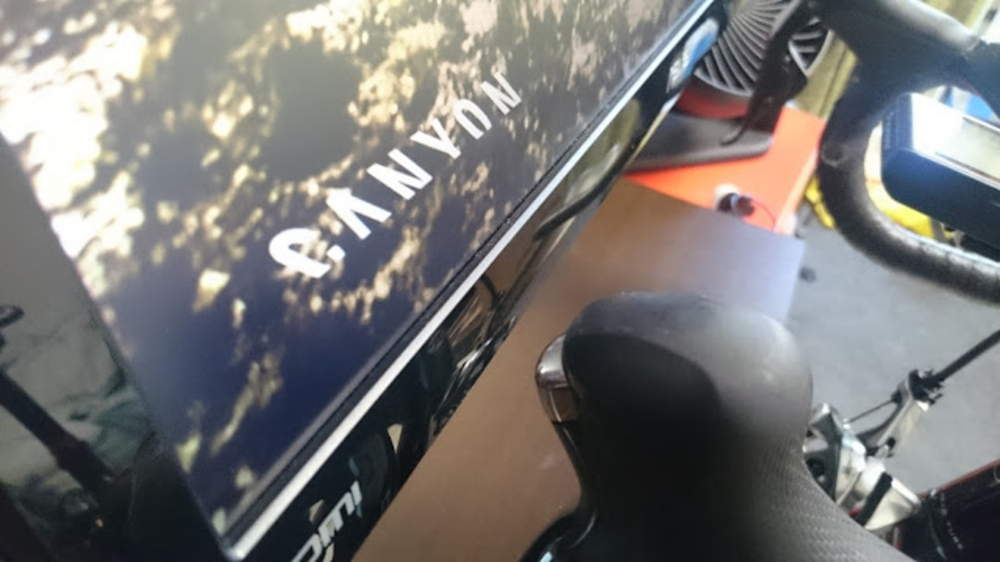

### MORE Zwift

山岳コースも設定され、ますます熱くなる Zwift をもっと楽しむために。

バーチャルライドにどうのめり込むか、バーチャルライドのメリットをどう活かすか。

という話です。

基本的な Zwift の設定については以下の記事を参照。

> [Zwift がすごくすごくてヤバい](/post/2015/10/01/zwif-3.html)

もう古いですが、当時のモバイルアプリ利用法

> [Zwift Mobile link の使い方](/post/2016/01/25/zwift-mobile-link.html)

### まずはデュアルディスプレイ

ローラーの前にディスプレイを移動する作業、面倒じゃないですか？

思い切ってディスプレイをもう 1 枚買いましょう。

Zwift をディスプレイモードで起動してサブモニタに移動すれば、メインモニタは固定したままでよくなります。

PC とローラーが離れているなら、[EZCast の無線 HDMI ドングル][1]を使ってメイン画面と離れたモニタの画像をリンクすることも可能です。

Zwift は走行中の BGM がどうにも寂しいので、自分はメイン画面で好きな音楽を流してます。

[ワイヤレストラックボール][2]

を使っているので、持ち上げた状態でも比較的操作できます。

<LinkBox isAmazonLink url="https://amzn.to/2ZbDNUA" />

### 没入感を求めて

自分はトップ画像の通り、基本的に没入感の高い「一人称視点」で Zwift をプレイしています。

斜度やパワーで景色が変わってくれるのですが、どうにもモニタが遠くて没入感に乏しい…そこでモニタとバイクを限界まで近づけるためにデュアルモニターアームを導入しました。

オムニウムトレーナーで前輪が無いのも相まって、バイクモニター間の距離を 1cm まで詰められました。

モニターアームには大きく分けてネジ式とガスショック式があるのですが、コストパフォーマンスを考えて[グリーンハウスの 2 アーム 4 軸モデル][3]を購入しました。

最高級の[エルゴトロン][4]製アームには流石に手が出ませんでしたが、グリーンハウス製でもほぼ同じ機能（高さのみガスショック式・4 軸）となっていたので妥協しました。

エルゴトロンのアームだともっと高級感に溢れた見た目と簡単な位置調整が出来るのでしょう…

セットアップは 6 角レンチとドライバーだけで終わるので楽ちんです。

手持ちのモニタが VESA マウントに対応しているかだけ確認しましょう。（背面に 4 つネジ穴があるか）

取り付けとガス圧調整が終わればあとは手だけで位置調整ができます。

机もかなり広くなるので特に何も目的がなくてもモニターアームはおすすめです。

<LinkBox isAmazonLink url="http://amzn.to/1XG6oZa" />

[1]: http://www.amazon.co.jp/gp/product/B00IJBCAXC/ref=as_li_ss_tl?ie=UTF8&camp=247&creative=7399&creativeASIN=B00IJBCAXC&linkCode=as2&tag=gensobunya-22
[2]: http://www.amazon.co.jp/gp/product/B00E19UYO8/ref=as_li_ss_tl?ie=UTF8&camp=247&creative=7399&creativeASIN=B00E19UYO8&linkCode=as2&tag=gensobunya-22
[3]: http://www.amazon.co.jp/gp/product/B00NFELXSQ/ref=as_li_ss_tl?ie=UTF8&camp=247&creative=7399&creativeASIN=B00NFELXSQ&linkCode=as2&tag=gensobunya-22
[4]: http://www.amazon.co.jp/gp/product/B00358RIRC/ref=as_li_ss_tl?ie=UTF8&camp=247&creative=7399&creativeASIN=B00358RIRC&linkCode=as2&tag=gensobunya-22
