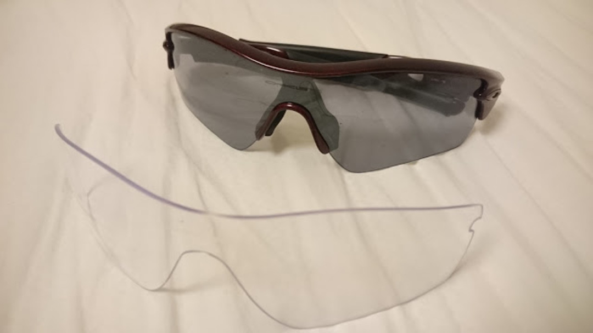

### Prizm!

たまたま安売りしているのを見かけたので衝動的に買ってしまった。

今までの RADAR は地味めのカラーだっただけに、ド派手な赤系ミラーレンズがかなりやんちゃに感じる。

Prizm Trail は知人の物を借りて走ったことがあるので、Prizm レンズ自体の良さに異論はない。

100km のライドに持って行ったところ、この Prizm Road も期待に沿った働きをしてくれた。

赤系のレンズの特徴である、コントラストを強調する効果が強く、かけるとかなり暗く感じるが、

その実トンネルの中でも白線や路面の濡れ・凸凹をハッキリ見分けることが出来るので、ライドに安心感が出る。下りでの路面状況確認がとても楽。

欠点としては、外した瞬間に世界が緑がかって見えること。

脳が無意識に赤の逆色である緑色のフィルターをかけているらしく、外した瞬間は緑で景色が補正されたままとなってしまう。

景色を楽しむライドの場合、Slate レンズなどの黒系レンズがオススメ。

レースなら文句なく Prizm を使うべき。

### RADAR との比較

こちらが今まで使っていた RADAR。

同じ RADAR の名を冠しているが RADAR EV のフィット感は無印 RADAR とはかなり異なるものだった。

まず、同じ Path でもレンズがかなり大きい。自分の場合 RADAR Path だと頬にレンズは接触しないが、EV は下にレンズが張り出しているので顔の角度次第だが接触している状態が続く。

ノーズパッドは、どちらも大小付属しているが、EV は大を選んでもレンズが眼にかなり近い。

その分風の巻き込みは EV のほうが少なくなっている。

にも関わらず、小さなベンチレーションが開いている EV のほうが適当な量の空気の循環が起きて、蒸れず眼に当たらずのいい感じの状態を保ってくれる。

たまたま空気が循環する RADAR と違って、RADAR EV は計算して穴を開けているようだ。

### まとめ

同シリーズだがフィット感が変わるので、要試着。

Prizm レンズはいいぞ。CX シーズンまでに Trail も購入したい。

<AmazonLinkBox url="http://www.amazon.co.jp/exec/obidos/ASIN/B01BBJC0SI/gensobunya-22/ref=nosim/" />
