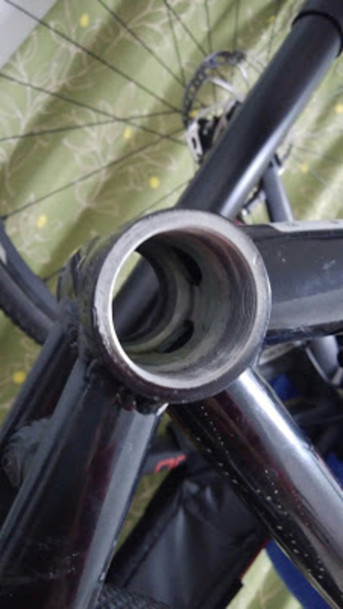

### ワイヤー撲滅委員会

ランニングコストの低減と絶対的な性能アップのため、手持ちのバイクを全て Di2（or SS）、油圧ブレーキ化するべく動き出しました。
ロードは既に Di2、TCX は SS の油圧ブレーキ、Kinesis Crosslight はワイヤーディスク＋紐変速…
ロードディスクは 2017 モデル TCR 待ちなので、まずは CX から近代化改修を実施することに。

しかし、持っている Crosslight PRO6 は Di2 非対応。CX だと洗車やら障害物でケーブルが外れることが想定されるので、なるべくケーブルは内装にしておきたい…

そうだ。ドリル、うならせよう。

### ひとまずプランニング

まずは手持ちの CX をバラして内装のための穴をチェックする。
クポイントは「ダウンチューブ →BB」「BB→ 右チェーンステー」の穴。

確認したところ、ダウンチューブはそこその大きさ（ジャンクション B がギリギリ通るくらい）の穴が、右チェーンステーに向けては E-tube のコネクタがギリギリ通る大きさの穴があった。

そこで、下図のケーブル図面を引く。

フロントシングルの CX なのでシートチューブは今回出番なし。

担ぎのしやすさや重心の最適化・メンテナンス性 UP のため外装バッテリーを前三角のなるべく下側に配置する。

BB のスペース内にジャンクションは配置できないので、ダウンチューブ側にいれることにする。
BB が JIS のため、作業野が狭い上にケーブルを通す穴もかなり小さいことがわかっているので、ヘッドチューブから接続したジャンクションを放り込む方法で行くことに。定番ですね。

STI は R785 を調達し、TT バイクをバラして RD-6770 と各種 Di2 パーツをゲット。
ブレーキはコスト上の問題で新 SLX をチョイスして機材的な準備は万端。
※シマノ油圧ディスクブレーキはロードも MTB も同じ引き量

プランはここまで。実践編に続く。

<LinkBox
  isAmazonLink
  url="http://www.amazon.co.jp/exec/obidos/ASIN/B001EEIOJA/gensobunya-22/ref=nosim/"
/>
