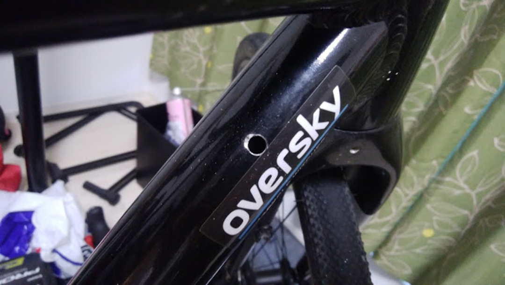
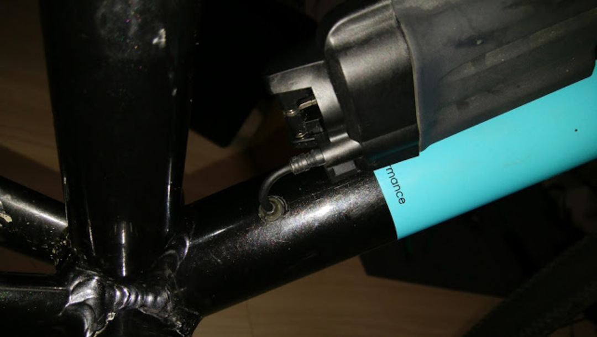

  

### ドリルがうなる！

のむ○ボさんリスペクト。

計画編は<a href="/2016/08/di2.html" target="_blank">こちら！</a>

1回しか使わない工具なので、ホームセンターでドライバードリルを借りてきました。

1日500円。刃は自前で準備しなきゃならないので480円払って金属向けの6mmドリルを購入。

他にインパクトドライバーという選択肢もあったのですが、フレームが薄いと押し付けた時に割れる恐れがあったので通常のドライバードリルを選択。

ドリル以外使用した工具は元々持っていたヤスリのみ。意外と安く上がりました、金額だけは。

なお、フレームの寿命を極端に縮める行為であることは間違いないので真似する人は自己責任でお願いします。

  

  

自転車は作業野が狭いので、ショート刃を購入。

あとは勇気だけ！

### マーキング

勢いだけで穴開けして失敗したくないので、市販のDi2モデルがどこに穴を開けているか観察しながら黒マジックでポイントを決定。

唯一チェーンステーだけ、末端に穴を開けるか上部に穴を開けるか迷ったが、末端に穴を開けた際グロメットを嵌められる自信がなかったので上部を選択した。

見づらくて申し訳ない。

### いざ貫通

チューブに対して目測で直角にドリルを当てて丁寧に押し付けてドリリング…

本当は作業中の写真も撮りたかったのだけど両手でしっかり支えないと滑るので写真を取ることができずorz

意外とチューブは肉厚で、1mmほどの厚みがあった。

ダウンチューブの2箇所はチューブ直径が大きなこともあり、あまり滑らずに済んだ。

それでも少し余計に削ってますね…

チェーンステーは何度も滑ったり途中芯がズレたりしたのでやや不格好に。

このフレームが逝くときはずっとここから。

ちゃんとE-tubeが通る大きさになりました。

### ケーブルとの格闘

山場の穴開けは終わったけれども、Di2内装における本当の戦いはこれからだ…！

右下の作戦に従ってヘッドチューブから接続したジャンクションを投入するべく、まずはフォークを外す。

(´・ω・｀)＜穴、小さいんですけど

(´・ω・｀)＜ジャンクションはいらないんですけど

6mmにギリギリはいるサイズのケーブルを、BB内部の7mmの穴に手探りで誘導していたら日が暮れるので人間の叡智を使います。

まずはシマノホイール用のケイデンスマグネットをバラし…

ガムテープでコネクタの先端にくっつける

そして外側からネオジム磁石で誘導、大勝利。

これを3回繰り返してジャンクションに接続し、ダウンチューブに押しこむ。

水没防止の為、FDケーブルが入るはずの場所にはダミープラグを挿入。

これにて完了！

JISBBのフレームなので、BBを入れるのが大変でしたがBBの樹脂カップ部分をゴニョゴニョ削ってクランク軸と接触しないようにケーブルを逃がすことに成功しました。

これにて内装化完了。見た目が最高にスッキリして満足。あとは油圧ブレーキの組み付けだけすれば今期のCX準備が完全に終了。

関西シクロクロスにほぼ全参戦していくつもりです。RDモゲラーだけには注意して生きていきたい。

  

    
  

  

    

<a href="http://www.amazon.co.jp/exec/obidos/ASIN/B003EII2ZA/gensobunya-22/ref=nosim/" name="amazletlink" target="_blank">SK11(エスケー11) 六角軸 3倍スピード ドリル 6.5mm</a>

  posted with <a href="http://www.amazlet.com/" target="_blank" title="amazlet">amazlet</a> at 16.08.24

SK11(エスケー11)   売り上げランキング: 49,525

  <a href="http://www.amazon.co.jp/exec/obidos/ASIN/B003EII2ZA/gensobunya-22/ref=nosim/" name="amazletlink" target="_blank">Amazon.co.jpで詳細を見る</a>

  

  

  

