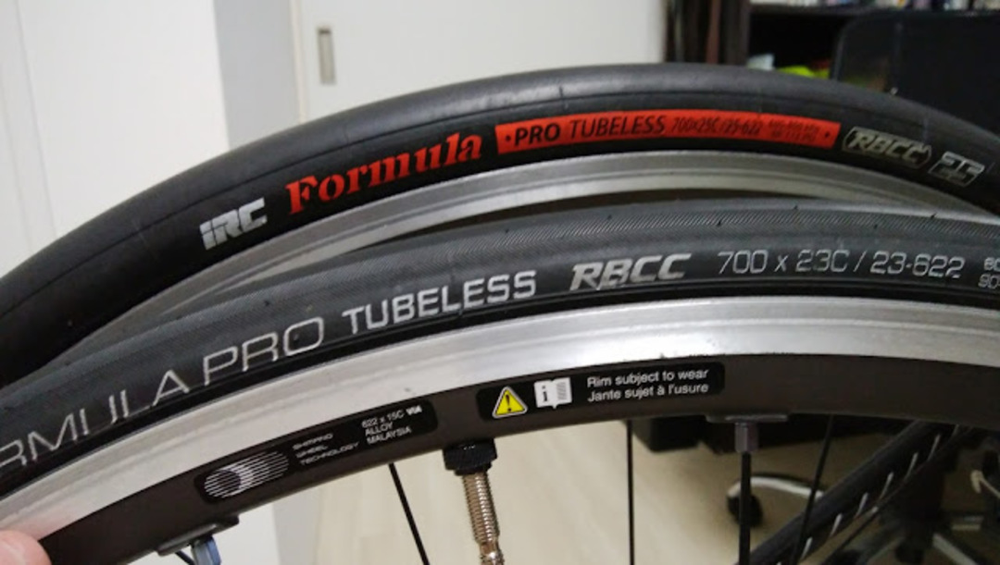

### 長い長いチューブレス歴

自分のチューブレスタイヤ歴は長い。自転車趣味を始めて 8 年目になるが、2 年目に WH-6700 と FUSION2 でロードチューブレスデビューしてから、チューブラーホイールを使うとき以外は基本的にずっとチューブレスタイヤを使ってきた。

オフロードでも勿論チューブレス、MTB も CX もチューブレスタイヤ以外は使ったことがない。たまにチューブ交換するとミスしないか不安で不安で仕方ないくらい「チューブを使う」という体験が欠如している。

経験は長いが、タイヤの銘柄は余り変更がなく、オンロードオフロード合計しても 10 種類とすこし。

- HUTCHINSON FUSION2
- HUTCHINSON FUSION3
- HUTCHINSON Atom
- HUTCHINSON Piranha 2
- IRC Formula Pro RBCC(初代)23c/25c
- IRC Formula Pro RBCC(新型)23c
- IRC Serac CX
- IRC Serac CX sand
- IRC Serac CX mud
- Maxxixs ARDENT(UST)
- Maxxixs Crossmark(UST)
- Maxxixs Radiale TL

ちなみにチューブラーはコンチネンタル絶対主義者だった。

### IRC のロードチューブレスは？

円高の終わりと共に HUTCHINSON を使う理由が弱くなり、IRC にも手を出してみたのがきっかけ。  
まず最初に感じたのは圧倒的な嵌めやすさ。HUTCHISON のタイヤでも IRC のタイヤレバーを使って脱着していたが、IRC のロードチューブレスはタイヤレバー無しでも脱着できた。

気密性はまぁまぁ同じ程度、チューブレスらしく取り付け時の気密が不完全だと 3 日程度で空気が 4 気圧程度まで落ちてしまう感じ。  
上手く取り付けられれば 2 週間程度は空気圧を持続できる。言うまでもなく重要なのは石鹸水とリム上のゴミ取りだった。  
X では低圧でも外れることもなくしっかり仕事をしてくれるし、装着は素手で簡単に可能というのが IRC のいいところだった。  
25c を試しに使ってみたら 28mm くらいの幅になってしまい、見た目にもかなり太い上にグリップも乗り心地も 23c で既に良いので余り変化を感じられず、25c を選ぶメリットは無いなという印象。

### 新型 Formula Pro の実力

なんだかんだで発売してからかなり経ってしまったが一応インプレを。  
大きく進歩した点は 2 つ。

- 嵌めやすさのさらなる向上
- 気密性の大幅 UP

メーカーの売り文句だと、パターンをつけたことによりグリップが感じられやすくなったとのことだが、公道でもレースでもそこまで攻めないし正直わからない…

ただ、初回の装着難易度と空気圧の落ちにくさは明らかに向上している。  
今までのロードチューブレスは、パッケージを開封してタイヤを広げて 1 日放置して「折りぐせ」を取らないと素手ではなかなか装着が難しかったが、新型は開封して素手であっさりはまった。

そして、この時はどうせハマらないと思っていたので、リムに石鹸水を塗らずに装着していた。このパターンだと普通は気密性が完全にならず、翌日タイヤがペシャンコになっているのだが新型はそれもなく普通に 1 週間そのまま走り出せるような空気圧を維持してくれた。

散々「メンテが面倒」「はめられない」だの言われてきたロードチューブレスだが、完全にその悪評を払拭できる製品だと言える。  
パンク時の対応が面倒だという意見もあるが、オンロードでチューブレスタイヤを使用中パンクに遭遇したことがない。

そもそもチューブレスタイヤがパンクという事態に陥る可能性を限りなく減らすための機材なので、いざパンクした時が面倒と言ってもピントのずれた意見である。  
仮にパンクを直す必要が出てきても、タイヤを外さずシーラントを入れて CO2 ボンベで一気に空気圧を上げれば完了なので、チューブドよりよっぽど楽である。

なかなか普及の芽が出てこないロードチューブレスだが、今までの課題を払拭した新型 Formula Pro でもっと世の中に広がってほしい。

<a href="http://www.amazon.co.jp/exec/obidos/ASIN/B01E6IS6XY/gensobunya-22/ref=nosim/" name="amazletlink" target="_blank">IRC tire IRC FORMULA PRO TUBELESS RBCC 190129 HP-92 700X23c ブラック</a>
posted with <a href="http://www.amazlet.com/" title="amazlet" target="_blank">amazlet</a> at 17.10.07

IRC tire  

<a href="http://www.amazon.co.jp/exec/obidos/ASIN/B01E6IS6XY/gensobunya-22/ref=nosim/" name="amazletlink" target="_blank">Amazon.co.jpで詳細を見る</a>

