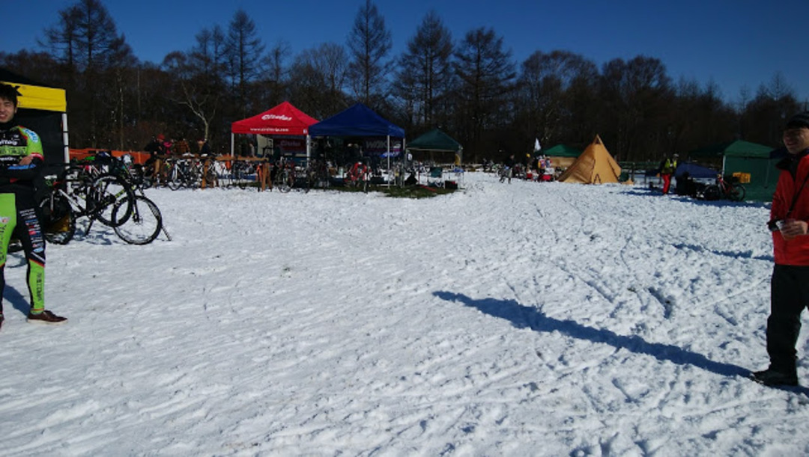

### シクロクロスは待ち時間が長い

2016 年の野辺山シクロクロスは自然との戦いだった、土曜早朝気温-10 度・一面の雪・雪解けに伴う泥、日曜の降雨と気温の急低下…

カテゴリによっては試走とレースの間は大きく開き、その間にゆっくり休む体制づくりもレースを楽しむ重要な要素。

今年は装備の反省点が多かったので、備忘も込めて「持っていってよかったもの」「持って行きたかったもの」を列挙しておきたい。

### 走るための装備

走行中の装備だが、実はそこまで工夫の余地がない。

レースを走る格好はほぼ決まっている…

ただ、試走や本番でウェアを汚さないために、以下の 2 つがあると非常に役に立つ。

<LinkBox
  isAmazonLink
  url="http://www.amazon.co.jp/exec/obidos/ASIN/B00762H9D6/gensobunya-22/ref=nosim/"
/>

<LinkBox
  isAmazonLink
  url="http://www.amazon.co.jp/exec/obidos/ASIN/B014ICSE12/gensobunya-22/ref=nosim/"
/>

試走中のレインコートと、泥レースの際の Velotoze である。  
レインコートは試走で上下着ておくと、ウェアを殆ど汚さずに済む。100 円ショップのものを使い捨てると洗濯も不要なので非常に低コスト。ヴェロトーゼはシューズがドロドロになることを防いでくれる。  
完全なゴムなので、防水・防汚性はバッチリな上洗いやすい。履き方にコツがいるので<a href="http://rbs.ta36.com/?p=28800" target="_blank">IT さんのブログ記事</a>などを要参照。

今回は導入しなかったが、これがあればレース後のシューズを洗う手間をかなり削減できるはず。ドロドロのシューズはレース中精神的にもつらいものがある。

### 待機中の装備

「シクロクロスは長靴で」

非常によく聞くフレーズではあるが、これを文字通り受け取ってホムセン長靴で野辺山のような極寒地獄に突入してはいけない。安物の長靴は容赦なく足裏から熱を奪っていくので、防寒使用の長靴をしっかりチョイスしよう。ウィンターブーツも可。

同様の理由で手袋も防水・保温を一番に考えた裏起毛のテムレスがあると洗車やタイヤ交換作業に一役買ってくれる。

<LinkBox
  isAmazonLink
  url="http://www.amazon.co.jp/exec/obidos/ASIN/B075STJVLB/gensobunya-22/ref=nosim/"
/>

<LinkBox
  isAmazonLink
  url="http://www.amazon.co.jp/exec/obidos/ASIN/B007PLDRAC/gensobunya-22/ref=nosim/"
/>

会場はいつも晴れとは限らないので、仲間内でタープが 1 つあると雨を凌ぐことが出来る。

駐車場が遠い場合は自分のブースを作ることができるので非常に便利。コース近くに陣取ればウォーミングアップも待機も応援も可能だ。

もちろん座り心地のいい椅子もセットで。

ヘリノックスを始めとするハンモックチェアは体に変な力をかけずに脱力できるので快適。

<LinkBox
  isAmazonLink
  url="http://www.amazon.co.jp/exec/obidos/ASIN/B00I0QA32G/gensobunya-22/ref=nosim/"
/>

<LinkBox
  isAmazonLink
  url="http://www.amazon.co.jp/exec/obidos/ASIN/B00U72QEFQ/gensobunya-22/ref=nosim/"
/>

シクロクロス会場といえばコーヒーだが、ここまでキャンプじみた装備があるのであれば自分で淹れられる環境を作ってしまいたい。

路面がドロドロだと歩いてフードブースへ向かうのも億劫になるが、お湯を沸かすことさえできれば「カレーメシ」「チルドおでん」「カップ麺」「コーヒー」「お茶」など色々手元で作ることが出来る。

ジェットボイル ZIP はお湯を沸かすことに特化した熱効率の良いクッカー。

炒め物などへの応用を割り切ってお湯だけで調理することにすればハイスピードで食べ物と飲み物を用意できる。

<LinkBox
  isAmazonLink
  url="http://www.amazon.co.jp/exec/obidos/ASIN/B07B2V1C62/gensobunya-22/ref=nosim/"
/>

<LinkBox
  isAmazonLink
  url="http://www.amazon.co.jp/exec/obidos/ASIN/B002WSIACI/gensobunya-22/ref=nosim/"
/>

最後に、ドロドロのウェアを掃除する際の工夫。  
野辺山のように 2days レースだと、1 日目のウェアを家ですぐに洗うことができない。

時間が経つと落ちにくくなってしまうので、当日中に出来る限りの対応をしておきたい。

ここで活躍させたいのが、小容量のドライバッグ。

<LinkBox
  isAmazonLink
  url="http://www.amazon.co.jp/exec/obidos/ASIN/B0799SK2YC/gensobunya-22/ref=nosim/"
/>

定番の<a href="http://amzn.to/2gBlhxM" target="_blank">ウタマロ石鹸</a>で若干ウェアに洗剤を含ませた状態で水と一緒にウェアを全て放り込む。もみ洗いや踏み洗いして下洗いをその場で済ませることが出来る。

完全防水なので水を切ったあとはそのまま閉じておけば周囲のものを濡らさずにウェアはウェットな状態を保つことが出来るので、帰ってからの労力が大幅に減る。

これ以外にも、ストーブやらアウトドアテーブルやら、工夫を上げればキリがない。

自分なりのスタンスを見つけてシクロクロスを楽しもう。
