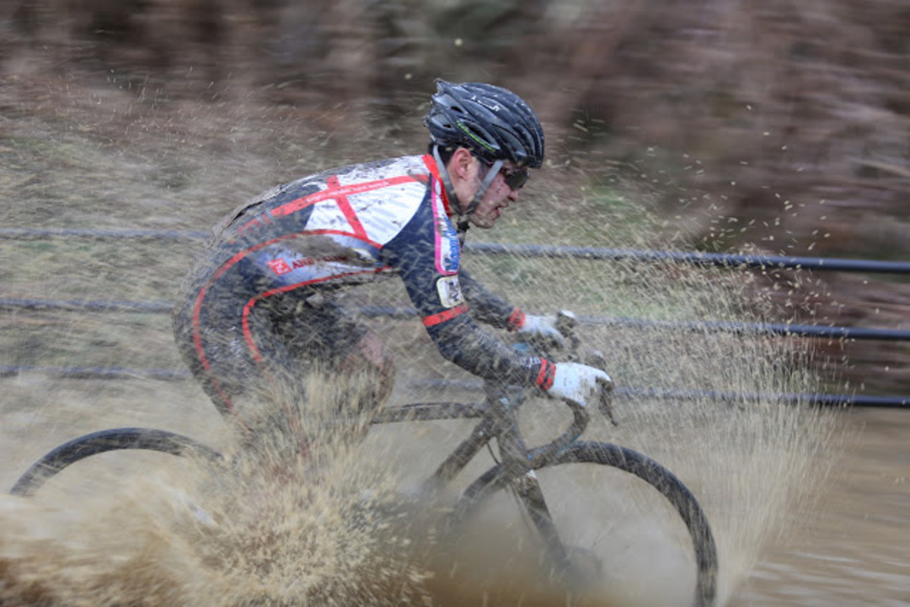

### セミスリックタイヤというスタイル

どんな路面でも Challenge のシケインだけあれば十分というおじさん達がいる。

この、「グリップはテクニックでカバー」というスタイルに憧れてセミスリックタイヤを使い続けています。

現実問題、自分の場合は参加しているクラスに於いては地脚が足りないため、グリップを得るためにノブの高いタイヤを使っても、転がりの悪さに脚を使わされて最終的に遅くなってしまうということもあります。

セミスリックタイヤで代表的なのは<a href="http://amzn.to/2lfp3BA" target="_blank">Challenge のシケイン</a>。

チューブレスの場合<a href="http://amzn.to/2l3TdWk" target="_blank">シラクサンド</a>や<a href="http://amzn.to/2lLjwQR" target="_blank">Maxxis Speed terrane</a>が当てはまります。

チューブレスではスピードテレーンが発売されるまでサイドノブのあるセミスリックタイヤが無かったので、待ち望んだものがようやく今シーズン出てきました。

### セミスリックタイヤ功罪

Speed terrane が出てくるまでの数年間、フロント：<a href="http://amzn.to/2kFSl94" target="_blank">Serac CX</a>, リア：<a href="http://amzn.to/2lfhsCK" target="_blank">Serac CX Sand</a>の組み合わせを愛用していました。

フロントはコーナーでグリップを稼ぎつつ漕ぎの軽さを稼ぐことが狙い。

野辺山のようなフルマッドの時だけはサイドグリップを重視して<a href="http://amzn.to/2lbyodO" target="_blank">Serac Mud</a>を使うというタイヤ選択。

ただ、サンドタイヤは急なキャンバーや濡れてスリッピーな路面ではグリップを失うことが多々発生しており、稼げるはずのテクニカルエリアで結構ナーバスな挙動となることも。

今年出てきた Speed terrane はシケイン同様に高めのサイドノブがあるので、これら欠点を克服する希望の星、希望が丘や美山での練習を通じて濡れた路面でも十分なサイドグリップを引き出せます。

セミスリックタイヤの共通した弱点は、漕ぎの軽さと引き換えにした縦のグリップの弱さ。

具体的にはブレーキングやトラクションの弱さにつながります。泥の登りや平坦では空転してまともに進まないので、リアだけシラクマッドに換装することを想定していました。

ちなみに泥沼と化した桂川は雨でドロッドロになりましたがスピードテレーンでの出走を決行。

泥路面で全く進まず普段のシングル順位から程遠い結果に…

### 路面に対するタイヤ選択肢

今まではなんとな～く、IRC のタイヤラインナップに合わせて、サンド・ドライ・ウェットの区分をしていたのですが、ドライはハードパック（剥き出し地面）と芝路面で具合が変わりますし、ウェットも滑りやすいだけのヌメっとしただけの路面からドロドロになってタイヤが埋もれるまで実際の路面は様々で、1 レースとして同じ路面ということはありません。

路面を「サンド」「ハードパック」「グラス（芝）」「ウェット」「マッド」まで区分すればなんとなく体系化できそうなので、これで今のタイヤ選択組み合わせを埋めてみます。

<table style="border: solid 1px black;">
  <tr style="background-color: darkgrey; font-weight: bold;">
    <td>
    </td>

<td style="text-align: center;">
サンド
    </td>

<td style="text-align: center;">
ハードパック
    </td>

<td style="text-align: center;">
グラス
    </td>

<td style="text-align: center;">
ウェット
    </td>

<td style="text-align: center;">
マッド
    </td>
  </tr>

  <tr>
<td style="background-color: darkgrey; font-weight: bold; text-align: center;">
フロント
    </td>

<td colspan="5" style="background-color: skyblue; text-align: center;">
Speed terrane
    </td>
  </tr>

  <tr>
<td style="background-color: darkgrey; font-weight: bold; text-align: center;">
リア
    </td>

<td colspan="4" style="background-color: skyblue; text-align: center;">
Speed terrane
    </td>

<td style="background-color: pink; text-align: center;">
Serac CX Mud
    </td>
  </tr>
</table>

あまりにも雑すぎる表。

これだけ長文を書いて最終的な結論がこれだとあまりにも酷いエントリーに見えるけれども、IRC オンリーの頃に比べればサイドノブの万能さがお分かりいただけるかと…

<table style="border: solid 1px black;">
  <tr style="background-color: darkgrey; font-weight: bold;">
    <td>
    </td>

<td style="text-align: center;">
サンド
    </td>

<td style="text-align: center;">
ハードパック
    </td>

<td style="text-align: center;">
グラス
    </td>

<td style="text-align: center;">
ウェット
    </td>

<td style="text-align: center;">
マッド
    </td>
  </tr>

  <tr>
<td style="background-color: darkgrey; font-weight: bold; text-align: center;">
フロント
    </td>

<td colspan="4" style="background-color: skyblue; text-align: center;">
SERAC CX
    </td>

<td style="background-color: pink; text-align: center;">
Serac CX Mud
    </td>
  </tr>

  <tr>
<td style="background-color: darkgrey; font-weight: bold; text-align: center;">
リア
    </td>

<td colspan="3" style="background-color: yellow; text-align: center;">
Serac CX sand
    </td>

<td colspan="1" style="background-color: skyblue; text-align: center;">
SERAC CX
    </td>

<td style="background-color: pink; text-align: center;">
Serac CX Mud
    </td>
  </tr>
</table>

空気圧はコースごとに千差万別なので割愛。

使うタイヤが少ないということは、レース会場や自宅での作業が減るということを意味するので、その分コース研究やウォームアップ、もしくはフードブース舌鼓を打つための時間に割くことが可能

シクロクロス会場では天気に次ぐ無難な話題であるところのタイヤチョイス、個々人のスキルにもよると思うが「こんな人もいるんだなぁ」くらいでネタにしてもらえれば幸いです。

<LinkBox isAmazonLink url="https://www.amazon.co.jp/dp/B079NS766M/" />
