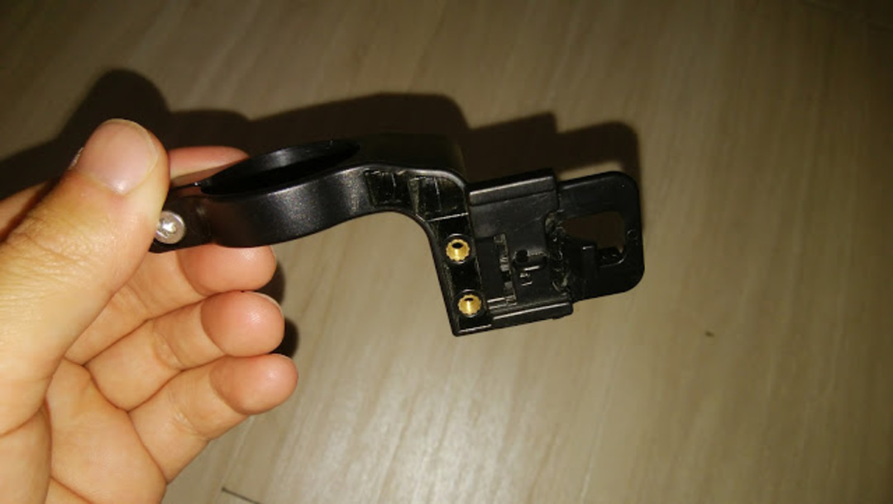
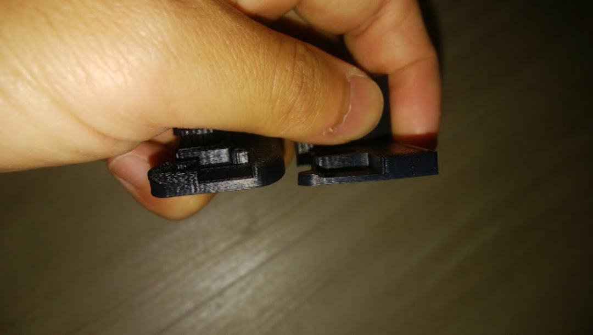

### 無ければ作れ

身長が低いときに悩む要素のひとつ。Di2 ジャンクションの配置。  
ステムが短いのでステム下にバンドで装着する基本的な方法は NG。<a href="http://amzn.to/2o3eCzL" target="_blank">スペーサーにマウントするタイプ</a>も、自分の場合はベタ付けしているので装着場所がない…

以前は<a href="/2013/11/bar-fly20.html" target="_blank">BARFLY 2.0 の下部に装着</a>してたが、ペダリングモニターの利用を始めてから、この方法は使えなくなった…  
こういう時頼りになるのは<a href="http://amzn.to/2ogb3pi" target="_blank">レックマウント</a>だが、パイオニア用のマウントを使う場合はジャンクションマウントを後方、つまりステム側に張り出させる必要がある。

実際にはジャンクションから後ろ向きにケーブルが出ていくので、ある程度の余裕を見なければいけない。現物合わせで確かめるしか無いのだが、正直言ってダメだったら諦められるほどレックマウントは安くない…  
こうなるともう自分で作るしか無い。この件をツイートしていたら 3D プリンター成形業者を紹介して頂けたので、これ幸いとやってみることに。

SGX-CA500 のマウント下部には謎のネジ穴があったので、これを使う形で簡単にイメージ図を作る。

サイコン自体の取り外しを考慮するため、下のクリアランスを多めに取る。

### 試作・完成

そんなこんなで試作したものがこちら。

ネジ穴の径とか、爪部分のサイズを調整した。ネジはジャンクションとの干渉を避けるために<a href="http://amzn.to/2nmMU2A" target="_blank">超低頭ネジ</a>を利用。  
ただ、これだと装着用の爪が 2~3 回の取り外しで折れてしまったため、強度 UP バージョンを作成して完成品とした。

左が完成版。

精度を出しながら素材の変更は難しかったので、単純に厚くした。  
これで、ハンドル周りをスッキリさせつつ Di2 ジャンクションをしっかり装着することができた。

ちなみに、これを作っている間に<a href="https://speedfil.com/accessories/pioneer-adapter-kit#1456026403398-87c3bace-faa6" target="_blank">こんなスマートなもの</a>が発表されていた。  
BARFLY と組み合わせれば似た感じにマウントできるが、ゴムバンドを使わない分自作マウントのほうが上だな！

  

    
  

  

    

<a href="http://www.amazon.co.jp/exec/obidos/ASIN/B01B0D7FBC/gensobunya-22/ref=nosim/" name="amazletlink" target="_blank">REC-MOUNTS(レックマウント) 下部アダプター用 シマノ Di2ジャンクション スペーサー Di2 Junction Spacer for lower Adapter 【 Di2-EW90-400Spacer</a>

  posted with <a href="http://www.amazlet.com/" title="amazlet" target="_blank">amazlet</a> at 17.03.25

REC-MOUNTS(レックマウント)

  <a href="http://www.amazon.co.jp/exec/obidos/ASIN/B01B0D7FBC/gensobunya-22/ref=nosim/" name="amazletlink" target="_blank">Amazon.co.jpで詳細を見る</a>

  

  

  

