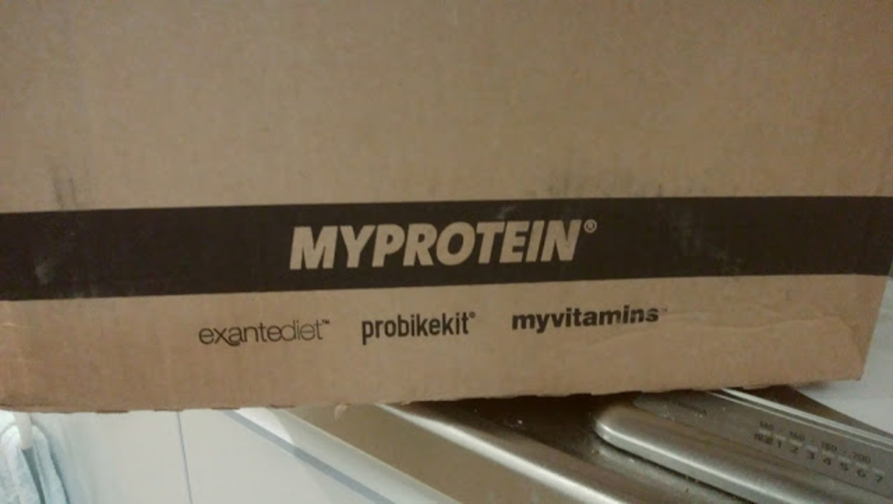

### 圧倒的コストパフォーマンス

今まで愛用してたバルクスポーツの<a href="http://amzn.to/2nttvKb" target="_blank">ソイプロ</a>が切れたのを契機に、身の回りで話題になっている<a href="https://www.myprotein.jp/referrals.list?applyCode=AJPC-R3&li" target="_blank">MYPROTEIN</a>のホエイプロテインを購入してみた。

上記リンクか、紹介コード「AJPC-R3」を使えば 25％オフになるようですので是非是非。

サイクリストにとってのプロテインの重要性については、<a href="/2016/02/blog-post.html" target="_blank">以前の記事</a>か<a href="http://genkibicycle.jp/" target="_blank">山本元喜選手のブログ</a>を参照して欲しい。

購入したのは、同サイト標準モデルのプロテインよりタンパク質含有率を高めた<a href="https://www.myprotein.jp/sports-nutrition/impact-whey-protein/10530943.html" target="_blank">IMPACT WHEY プロテイン</a>。ちょうどセール対象だった[ナチュラルバニラ味](https://item.rakuten.co.jp/myprotein/10530943_5000_other/)をチョイス。

ソイプロは 2kg で 6000 円程度かつ、タンパク質含有率 90%越えという高コストパフォーマンスだったが、こいつは 5kg で 9000 円程度だった。驚きの安さである。

サイト上での 100g あたりタンパク質は 82g だったが、フレーバーごとに ±10%変化があるとの表記。重要なところなので全部書いて欲しかったが…

実物の表記は 100g 中 Protein が 86g！

ソイプロほどではないが、中々に優秀。値段を考えれば 100 点に近い。

### レビュー

味はプロテインを飲むのに重要な要素。以前<a href="/2016/09/choice.html" target="_blank">プロテインの味に関する記事</a>も書いてます。

飲みきるために重要なモチベーションです。

以前のソイプロはプレーン味だったので、大豆粉末の味そのもの。

美味しくはないですが、変なクセはなく慣れれば毎日飲める感じでした。

今回のナチュラルバニラ味は、袋を空けた瞬間甘ったるい匂いが充満してきて思わずむせそうに。だが、湿気を入れないための三重ジップはナイス。

とりあえず 1 杯分をシェイカーで溶かす。溶けやすく、泡もすぐに消えるのでストレス無いですね。ソイプロはこの辺がよろしくなかったので…

そして 1 杯目をグイッといく。

甘。

めちゃくちゃ甘いぞこれ…しかし嫌な後味はないし、良い甘さ…なのか？

すごく甘いけど。今までのプレーンプロテインとの落差に加えて、バニラ臭のせいかひたすら甘く感じる。

口の中に甘さが残らないので、後味はスッキリ。

当然、甘味料を使っているのだとは思うが、よくできている。

5kg も買ってしまったので半年くらいはこれと付き合うことになるだろう。

プロテインとしての指標である含有率はとても良いので、次はプレーン味を狙おう…

### 発送の謎

このサイト、安さに加えて発送が遅いことで有名らしい。

海外通販なので 2 週間くらい待つのが標準だが、最近は発送の速いサイトが多いのでこれくらいだと遅く感じる人が多いのだろう。

そしてその答えは箱にあった。

PBK じゃん！！！！！！！！！！！！！！！

<LinkBox isAmazonLink url="http://www.amazon.co.jp/exec/obidos/ASIN/B004EI6G8E/gensobunya-22/ref=nosim/" />
