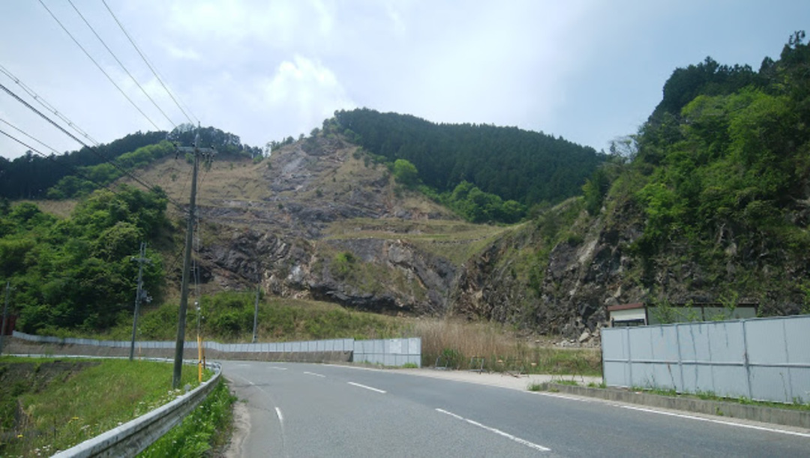

関東にいた頃からなんとなく気になっていた銘菓赤福の季節メニュー。

お土産の赤福は何度も食べたことがあるけれども、夏の赤福氷、冬の赤福ぜんざいは現地に行かないと食べることができない。

喫茶店舗はほぼ伊勢周辺のみなので、思いきれずにいたがようやく実行に移すことに。

### 前半戦

大阪北部からは約 160km。ルートラボ調べで 1500m UP とロングライドとしてはまぁまぁの負荷。

柏原から檜原に抜け、R165>R369>R368 と繋いでいくコース。柏原から奈良に抜ける峠がそこそこキツイ…

R165 が終わるまではほぼ市街地。

普段北摂方面ばかり走っているので信号にストレスを覚えつつも、R369 に入ってからは車も少なくなり中々快適になる。

R369 は曲がりくねっていないものの、長い直登の連続で心を折りにくる。

どこまで見渡しても坂。

ルートラボだと登りきればほとんど下り基調に見えるが、現実は厳しい。

後半の山岳地帯は怒涛の登り返しが待っている。Strava の実測高度がこちら。

中盤のハリネズミエリアがつらい。

3 回登り返したところの頂上で<a href="http://renone.jp/" target="_blank">Pizzeria e Trattoria renone</a>なるイタリア食堂に遭遇する。サイクルラック完備！

腹が減っていたこともあり、予定していたコケコッコー共和国ではなくこちらで昼食を取ることに。これが大当たり。

マルゲリータのサラダセットを注文。イタリア料理の基本要素が詰まっているので初めての店はとりあえずマルゲリータ。

タイミングがよかったのか数分で焼きあがり、提供される。

1000 円に届かない価格にも関わらず、30cm 近い大きさ、惜しげもなく盛り付けられたモッツァレラチーズが口の中で主張してくる。美味い！

### 後半戦

お腹も膨らんだところでゴールに向け走り出す、残り 60km ほど。

ここからは爽快なダウンヒルが続く。そして当然のように登り返す。

後半から景色のスケールが変わってきて、距離感がおかしくなるタイプの風景が多々見られるようになってくる。

そして、山岳エリアの締めくくりに仁柿峠なる峠を通る。

道幅に余裕のある二車線道路（しかも国道）を走っているにも関わらず、「この先全長 8m 以上の車両通行禁止」「幅員極少」という怪しげな雰囲気を醸し出す注意標識がこれでもかというほど出てくる。

ついでにこのあたりは神去村という地名らしい。お地蔵様が道端にあっても加護はありそうにない。

奈良側からはほぼ下るだけの峠なのだが、写真を取る余裕がないほどの悪路と狭さ。

車 1 台がやっとの幅員が延々続く。

国道なのでちょこちょこ対向車がいる上、先行する自動車に追いついてしまうのでブレーキをかけっぱなし。油圧ディスクブレーキでよかった。

後日ググったら酷道との評判がいっぱい出てきた。そりゃそうよね…

下りきって三重県の平野部に入った後は、コロコロ変わる風向きと戯れながら無心で伊勢方面への道路をひた走る。特に特筆するところ無し。

ぴったり 160km で赤福　五十鈴川店へ到着。

本店は狭いようなのでこちらをチョイス。あとから観光がてら本店を見たところ案の定行列していたが、五十鈴川店は並ばずオーダー完了。

風流な建物の中で念願の赤福氷をいただく。

シロップは甘みが強いが、抹茶の風味がしっかり感じられる。氷もふわっふわ。

この時点でそこらの海の家で売っているかき氷との明確な違いを感じる。

中に埋もれている餡と白玉で赤福成分を補給。甘さで満ちた口を熱いお茶でリフレッシュすることで無限に品のある甘さを堪能できる。来てよかった。

5 月の 15 時過ぎはかき氷にはちょっと涼しい時間帯だったが、自転車で火照った体には氷の冷たさが心地よく感じられる絶妙な気温。酷暑の中でもないので汗が再度吹き出すわけでもない。ごちそうさまでした。

五十鈴川を背景にパシャリ。

今回からサドルをスペシャの Power から<a href="http://amzn.to/2rmMmda" target="_blank">fabric の LINE</a>に変更。fabric の中では硬めらしいが、弾力性のあるサドルなので、体が疲れて筋肉のクッションがなくなっても尻が痛くならない。溝有りサドルが好みの自分がロングライドするにはちょうどよい感じ。

おかげ横丁は人混みで自転車に乗れる状況ではないので押し歩き。

つむりん推薦、<a href="http://www.okageyokocho.co.jp/tenpo.php?no=3" target="_blank">豚捨</a>の串かつを食べてタンパク質を補給。

シメに一風呂浴びた後、輪行で帰宅。

自分は輪行ライドにビニール袋に入れたズボンをジャージのポケットに突っ込んでおり、帰る前に銭湯でひとっ風呂浴びたあと着替えている。レーパンのパッドは電車内ではやや不快な上、汗疹の原因にもなってしまう。

また、目的地に駅があることも大切だが、乗り換え回数を考慮した目的地を選ぶとより快適。寝てるだけで OK というのは精神的に有り難い。乗り過ごしのリスクも無い。

この点、伊勢は近鉄で大阪中心部まで 1 本で帰ることができるので非常に優秀。（しかも安い）

近畿圏の鉄道はそこまで明るくないが、こういった楽ちんなグルメロングライドスポットを開拓していきたい。

<linkBox isAmazonLink url="http://www.amazon.co.jp/exec/obidos/ASIN/B01MZ9GYH7/gensobunya-22/ref=nosim/" />
