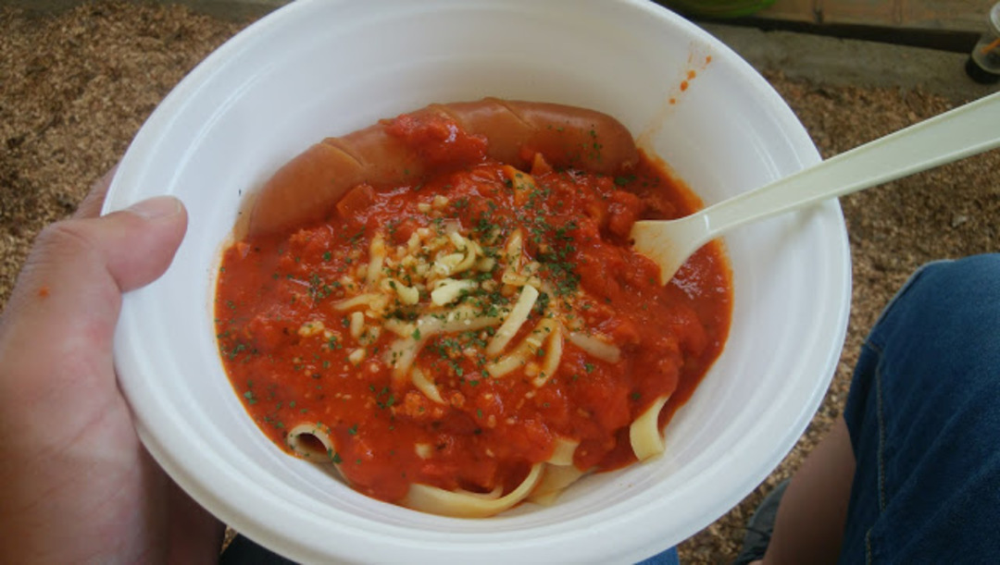

  

### 目標は7時間

人生で2回目の王滝100km。<a href="/2014/05/2014-sda.html" target="_blank">3年前に出場した際</a>は惜しくも7時間を越えてしまったので、今度こそ7時間切りを目標に参戦。

装備はボトルケージレスでハイドレーション・補給食・ツールボトルとチューブをバッグに、すぐに食べる補給食は背中に装備した。

今回の補給食はメインにSAVASの<a href="http://amzn.to/2rkSJRk" target="_blank">ピットインジェル</a>を準備。味よし、エネルギー量よし、カフェインも入っている上に値段もそこまで高くない優れもの。

サブとして<a href="http://amzn.to/2rYmfc7" target="_blank">アミノバイタルパーフェクトエネルギー</a>とゼビオ限定で売っている<a href="https://ssx.xebio-online.com/ec/srDispProductDetail/ItemId/A-10434437801" target="_blank">トリプルショット</a>を準備。こいつらはアミノ酸補給のため、筋肉が辛くなる中～後半に摂取。

勿論レース前は<a href="http://amzn.to/2rCT7uk" target="_blank">スーパーヴァーム</a>…のつもりが家に忘れてしまったので友人から譲ってもらう。

スタート前に顆粒のつもりで飲んだら粉タイプだったので盛大にむせてしまい、スタート前からまさかのリバース。そこらじゅうVAAM臭のする白く煙い空間を作り出す。

このハプニングのせいでスタート前から喉を痛めた。

装備はSLXとDeoreミックスで36T-11/36Tという王滝的には漢ギア。

前回の反省まったくなく、26インチから27.5インチに大径化したにも関わらずギア比そのまま。

タイヤは前後ともMaxxis ARDENT TLR 2.25&#8217;。日本非売の非EXOバージョンなので、軽いがサイドは弱い、トレッド面のパンクはシーラントで直るだろうが、サイドカットは祈る他無い。

### 前半戦

スタートして最初の登りは淡々と回してポジションを上げていく、前回は後半ブレーキがかかってしまったので若干抑えめ。

知り合いや池田選手が最初の登りで早くも脱落しており、登りでも何人かパンクを見かける。友人の1人も腰痛で大ブレーキ、もう1人体調不良で脱落と早くも王滝の怖さを思い知る。

下り系HTでなんとか登りきり、爽快なダウンヒルが始まる…と思いきやタイヤがかなり滑る。どうやら標高に加え、30度近い気温の影響でかなり空気圧が上がってしまったらしい。

たまたま小さい登りの頂点で一緒になった人はエアゲージ読みで0.4気圧ほど上がっていたとのこと。自分はゲージを持っていないので指センサーでいい感じになるまでエアを抜いて再スタート。

序盤はシクロクロスの体の使い方になっていたせいか、コーナーが遅かったが徐々にMTBの体の使い方を思い出し、スピードがどんどん上がっていく。

下りが本調子になってきたところで第1CP。

前回はこの時点で大分やられていたが、今回はDJではなくトレイルバイクを使っていることも合って振動で体が痺れることはなく、<a href="http://amzn.to/2rYoJXT" target="_blank">ESIグリップ</a>とTOGSでハンドル周りをバッチリ決めてきたおかげか握力も余力十分。

水だけ補給していざ出発！！！したところで腰が大爆発。

登りが全てインナーロー縛りになる地獄。第2CPまでの間、何度腰を伸ばしたかわからない。湖を回り込む平坦路すら上手く回せず腰のストレッチを入れる始末。

補給食とツールケースが意外と重く、腰の負担になっているかもしれないと思ったが後の祭り。30分毎に減っていく荷物と言い聞かせて第2CPまで淡々と走っていく。

この時点で半分ほど7時間切りを諦めていた。

### 後半戦

第2CPで補給食と塩タブ・カルパスを食べて、軽量化（）を行ってストレッチしていたところ、四股ポーズで肩を入れるポーズで股関節を伸ばしているときに背骨の**「パキッ」**という音とともになぜか腰痛が雲散霧消。

第2CPからゴールまでおよそ30kmで、ちょうど5時間が経過。

最後の10kmほどは下りなので30分程度として、望みありとしてガツガツ踏んで登っていく。

第2CP後の山はガレている難関なのだが、踏めているお陰でなんなくクリア。セカンドウィンドが吹いているうちにと大爆走。HTなので下りも完全な休みではないが、バイクの力もあり40km/hほど出しながらガンガン下っていける。

第3CPは当然スキップ。水は補給せずとも良い量を予め第2CPで補充している。

メチャクチャに暑いので、天然エイドで水遊びしたいが、立ち止まって腰痛がぶり返してしまっては元も子もないので脇目もふらずに踏んでいく。

最後の山に突入した時点で残り1時間15分ほどあり、トラブルさえ無ければ7時間切りをほぼ確信…そして王滝最高の楽しみである最後の下りに40分ほど残してダイブ。

リアブレーキだけで下っていると、後輪から嫌な感覚と音。

パンクーーーーーーーーーーーーー！

しかもここでハンドルにマウントしているEdge25Jのバッテリーが切れ、残り時間がわからなくなる。公称8時間持つのに使えないやつ。

傍目にはどこから漏れているかわからないので、とりあえずシーラントを注入してCO2で塞ごうとするが、完全なサイドカットであることが発覚。急いでチューブを入れている間に渡辺先生や知り合いCに抜かれていく。

再度パンクしないように空気圧高めのチューブドで再スタート。前輪と後輪のグリップ差がひどく、気持ち悪い。それでも秒単位の勝負になってしまっているかもしれないので、下り全力ペダリングで飛ばしていく。

傍目から見たら頭のネジを飛ばしながら走っているように見えただろう…

ゴール直前で6時間40分台であることまでは確認し、歓喜の声を上げながらゴール。

正式なリザルトは6h49min。パンクがなければ-10分か-15分いけていただろうに若干悔しい。

  

  

会場に戻って、プロテイン飲んで自転車洗ってブチョーコーヒーで一服、至福の時。

毎回、一生分MTBに乗った気分になる王滝だが、物忘れが激しいMTBerなので秋には120kmにエントリーしている可能性も否定できない。

補給食は30分ごとに淡々と食べていくスタイルだったので、前回と同じく特に問題はおこらなかった。最後の山で水がなくなってしまったのは計算外だったが、ギリギリ保ってくれたので結果オーライ。

フレームバッグを使って重いツールやチューブを入れておいたほうが腰のためには良さそうだ。

パンク対策はチューブレスでサイドカットにはチューブを突っ込む対応で十分だとわかったのも良い収穫。

あと…フロントギアは32Tか34Tが欲しかった。

翌日、有給が出張に化けたら体調最悪のまま3日間過ごすことになったので休みは死守、絶対。

  

    
  

  

    

<a href="http://www.amazon.co.jp/exec/obidos/ASIN/B00IWK4ULU/gensobunya-22/ref=nosim/" name="amazletlink" target="_blank">MAXXIS(マキシス) Ardent アーデント 27.5×2.25 フォルダブル EXO/TR TB85955100</a>

  posted with <a href="http://www.amazlet.com/" target="_blank" title="amazlet">amazlet</a> at 17.05.25

MAXXIS(マキシス)   売り上げランキング: 174,053

  <a href="http://www.amazon.co.jp/exec/obidos/ASIN/B00IWK4ULU/gensobunya-22/ref=nosim/" name="amazletlink" target="_blank">Amazon.co.jpで詳細を見る</a>

  

  

  

