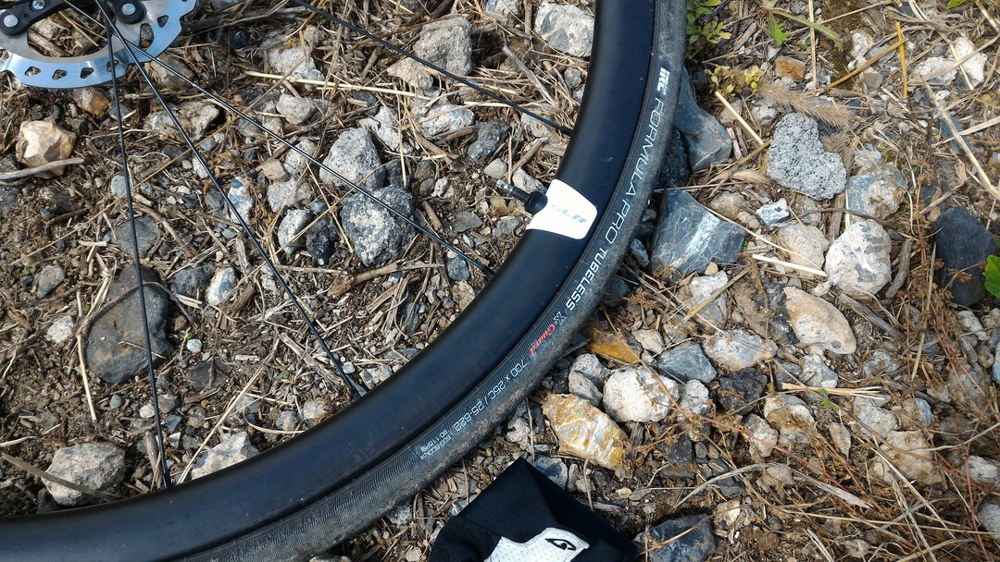

  

&nbsp;

### もうパンクしたくないです…

春のグラベルクリテで<a href="/2017/05/2017.html" target="_blank" rel="noopener">パンクの嵐に遭った</a>ことで基本のタイヤ幅を上げることに。ロードチューブレスに関しては安心と信頼のIRCから高耐久タイプ<a href="http://amzn.to/2fohzsh" target="_blank" rel="noopener">Formula Pro X-Guard</a>の25cをチョイス。

こいつはモデルチェンジ前25cなのに27mm近く膨らむというタイヤだったが、新型はそうでもないということで25cをチョイスした。おそらくTCRのクリアランスは28cタイヤが限界だと思うのでやや安全策。

  

新型、25mmもありませんでした…

秋のグラベルクリテはパンクせず保って欲しい…

前回使った<a href="http://amzn.to/2ycgwTI" target="_blank" rel="noopener">Formula Pro RBCC 23c</a>に比べてビードがかなり固く。装着には比較的難儀した。

IRCチューブレスの中で一番簡単に装着できる<a href="http://amzn.to/2ybpjFz" target="_blank" rel="noopener">SERAC CX</a>シリーズの硬さを1とするとRBCCは3、こいつは10といったところ。

それでも何日もかかるということはなく、30分あれば前後交換出来る程度だが前腕が棒のようになったので楽に装着をしつつ、エアボリュームを稼ぐために次回は<a href="http://amzn.to/2ybj057" target="_blank" rel="noopener">RBCCの28c</a>をチョイスしようと思う。

高耐久タイヤをいつ使い潰すのかと考えるとだいぶ憂鬱…積極的にグラベルコースに飛び込んで摩耗させるしかないか。

### 追記：グラベルクリテ秋の陣で実戦インプレ

X-Guardを買う最も高いモチベーションだったグラベルクリテ秋の陣にいきなり投入。

尖った小石混じりのコースは試走のスピードでも容赦なく参加者のタイヤを貫いていく、パンク地獄のコース。大抵のレースではパンクとラップアウトで7~8割がリタイヤに追い込まれるまさにサバイバルレース。

春に痛い目を見た反省から、空気圧は7BARに設定。かなりゴツゴツくるが、パンクでレースを失っては元も子もない。

一周800mほぼ全域グラベルのコースで、参加したのはインターミディエイトクラス（20周）。前回パンクの憂き目を見たが、今回はノーパンクで見事完走。最後に差されたものの3位をもぎ取ることができた。

数限りない小石を弾き飛ばしたが、タイヤは完全に無傷。素晴らしい耐久性だ。

通常のライドで通るグラベルはここまでひどくないだろうし、平均スピードが30km/hに迫ることもないので、リム打ちさえしなければそうそう穴が空くことは無さそうだ。

&nbsp;

  

    
  

  

    

<a href="http://www.amazon.co.jp/exec/obidos/ASIN/B01DOZESKK/gensobunya-22/ref=nosim/" target="_blank" rel="noopener" name="amazletlink">IRC tire IRC FORMULA PRO TUBELESS X-Guard 190132 HP-92 700X25c ブラック</a>

  posted with <a title="amazlet" href="http://www.amazlet.com/" target="_blank" rel="noopener">amazlet</a> at 17.09.15

IRC tire   売り上げランキング: 128,168

  <a href="http://www.amazon.co.jp/exec/obidos/ASIN/B01DOZESKK/gensobunya-22/ref=nosim/" target="_blank" rel="noopener" name="amazletlink">Amazon.co.jpで詳細を見る</a>

  

  

     
  

