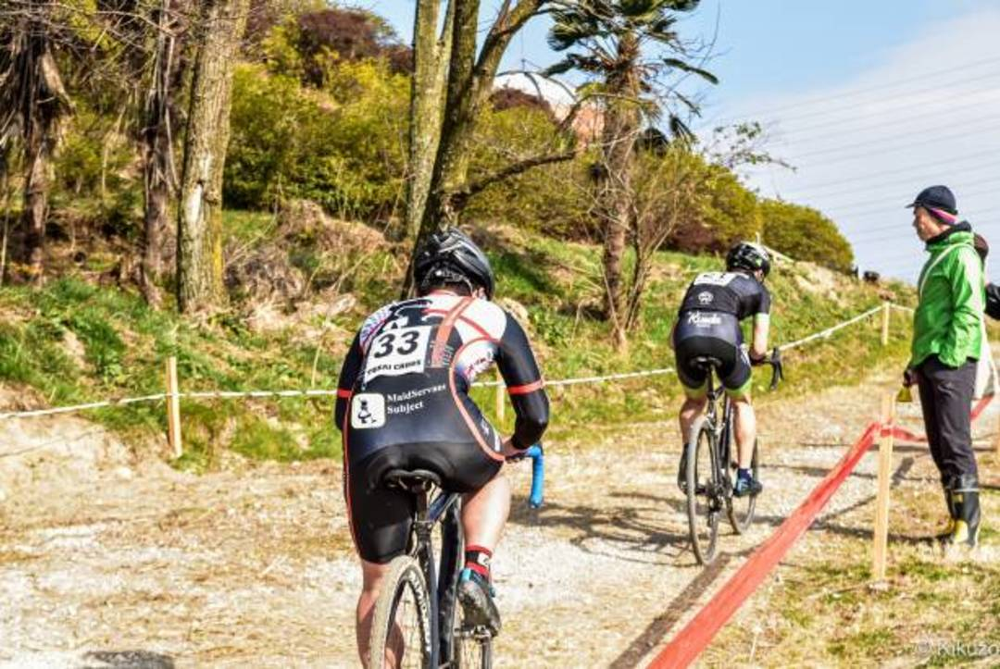

## メカトラメカトラまたメカトラ

C1 に昇格してから 1 度たりともノートラブルでレースを走り終えられていないのだが、今週末も不名誉な記録を継続してしまった。
レースの方は苦手な登りにやられて 1 日目は 100％、2 日目は 97%順位という体たらく。メカトラを差し引いても高速コーナーを処理して稼いだタイムを全て登りで吐き出してさらにマイナスを積み上げる展開。\
低いシケインをレースでギリギリ使えるスピードでクリアできたことが数少ないプラスポイントだろうか…

土曜日のメカトラは RD 絡み。フルラップに浮かれて集中力を欠いた際に膨らみすぎて BOA ダイヤルと RD を杭にぶつける。プーリーからチェーンが外れていることに気が付かず走行していたら Di2 がエマージェンシーモードに。

日曜日は速度の乗った下りで前輪のビードが外れた。上手く轍に嵌めたと思っていたがその影響で派手に前転。直前の周回で小ミスを挽回した後タイヤが振れている異常に気が付きながら無視したツケを払った形。土曜日と違い上手く後半落ちてきた選手をキャッチできていたにも関わらずこれで失速してしまったので完全に戦意喪失。\
ランニングしたり歩いたりしながら-1Lap で 5pt だけ JCX ポイントをもらった。

希望が丘と合わせてスピードテレーンは 2 度外れたことになるので、ここらで退役してもらい烏丸半島の昇格時に頂いた KENDA タイヤを装着する予定。

バームやコーナーの処理、階段などのランニングで「CX 特化」スキルはかなり持っている自覚があるものの、根本的な脚力が全く足りていないことを思い知らされた。\
40-28T のローギアも脚にあっていなくて、降りてランニングしたほうが速い登りがある始末。

来年度の全日本出場を当面の目標に据えているが、JCX はマキノ・野辺山・広島と登りのきついレイアウトが多いので、夏は盛大な肉体改造が必要になりそう。

### 機材

Bike: TCX SLR('14) Ultegra Di2\
Tyre: Maxxis SpeedTerrane 1.7Bar(F,R)\
Wheel: (Front)SHIMANO XT M785,(Rear)PAX PROJECT 24mm TL

<AmazonLinkBox url="http://www.amazon.co.jp/exec/obidos/ASIN/B01M8LR2G6/gensobunya-22/ref=nosim/" />
