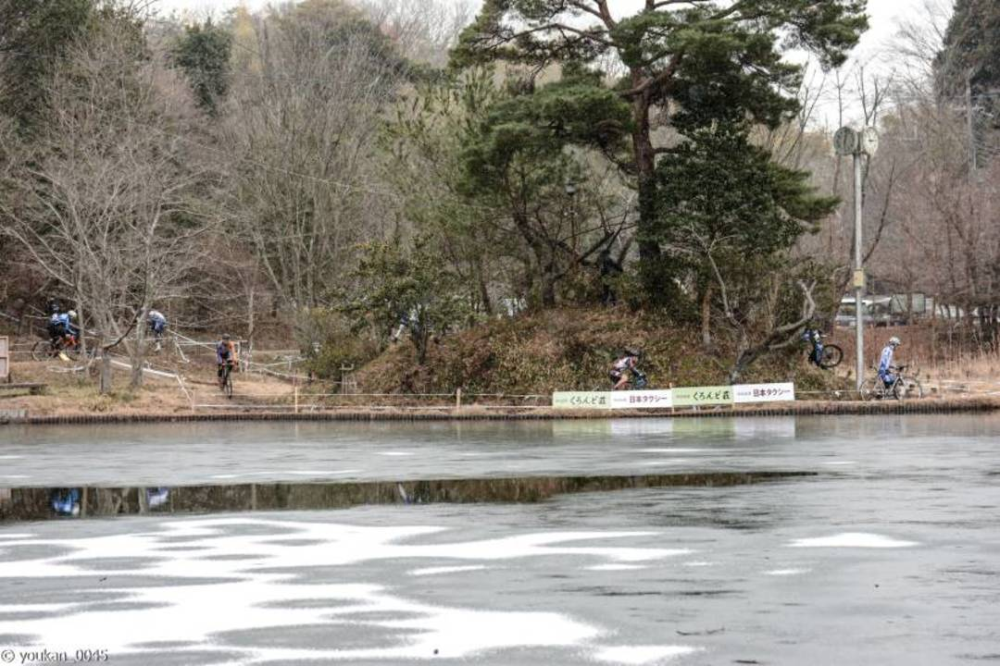

## 念願のノントラブル！

レース結果：12/25位　46%

ついにノントラブルで1時間走りきって順位も50％より上に！\
細かい登りと階段という好みのレイアウトと、スピードを殺さずにうまく走りきれたことが合わさってC1はじまって以来の会心の走り。

高速域になると素直に潰れてくれるSERACの良さが光ることがわかってきた。反対にノブで引っ掛ける走りは芝以外ではやりにくいかも。信頼性や手持ちホイールとの相性も良いし、来シーズンはSERACメインで走ることになりそう。

低気温と雪ということもあって、チャンピオンシステムのシクロクロススーツを初投入。太ももと体回りが裏起毛のスキンスーツ。\
裏起毛で生地が厚いせいか伸縮性が少ない…ちょっと着づらいが暖かさは無類。0度近辺でも運動していればこれ1枚で済むので本当に寒いときには価値ある一品。今回は14:45スタートと普段より遅い時間もあって、シクロクロススーツでもほとんど汗をかかなかった。\
生足なのはご愛嬌。

くろんどCX特有の完全ランダムくじ引きスタートにより…いつも通りの後方スタート。\
スタートと同時に最後尾のスク水さんが凄まじい勢いで前に出ていくのでその後ろのスペースを使ってガンガン前に上げていく。棚ぼたでシングル順位まで上がるも実力で10位ちょっとの位置まで落ちる。

平坦は楽しすぎないように、林間とコーナーはスピードを殺さないように丁寧にラインを選んで走る。昼試走ではかなりの場所が凍って固く締まった路面だったのが、C2ライダーやC1の面々が踏み荒らしてだいぶドロドロになっていた。直前にかなり雪が降ったので水も含んでいてよく滑るがフロントのSERACがいい仕事をして滑りをコントロールしながら曲がることができた。\
ダウンヒルでは逆にSPEED TERRANEのグリップの薄さを利用してリアを滑らせながらターン。グリップ力の高いタイヤではやりづらいので、下りのタイトコーナーでこういった使い方ができるのはありがたい。\
あとは階段で観客の「速い速い」という言葉を聞きながら前走者を階段外を走ってパス。たぶんこのセクションが一番ポジションを上げられたと思う。

ランダムスタートでも1時間レースがあると落ち着くべきところに皆落ち着くらしく、前後に人がいなくなってくる。最後の2周はトラブルを起こさないよう丁寧に走ってゴール。
12位という見栄えのする数字に大満足。仮想残留チケット2枚目。

来週は苦手な桂川だが来シーズンのスタート位置に関わるので頑張りたい。昨年はリアをシラクサンドで挑んで爆死したので今年はリアマッドフロントノーマルで挑む予定。

### 機材
Bike: TCX SLR('14) Ultegra Di2\
Tyre: IRC SERAC CX 1.8Bar(F),Maxxis SpeedTerrane 1.8Bar(R)\
Wheel: (Front)SHIMANO XT M785,(Rear)PAX PROJECT 24mm TL

<a href="http://www.amazon.co.jp/exec/obidos/ASIN/B00DKUM0AA/gensobunya-22/ref=nosim/" name="amazletlink" target="_blank">IRC SERACCX TUBELESS 700×32c 19048J</a>
posted with <a href="http://www.amazlet.com/" title="amazlet" target="_blank">amazlet</a> at 18.01.28

IRC tire  売り上げランキング: 52,683 

<a href="http://www.amazon.co.jp/exec/obidos/ASIN/B00DKUM0AA/gensobunya-22/ref=nosim/" name="amazletlink" target="_blank">Amazon.co.jpで詳細を見る</a>

