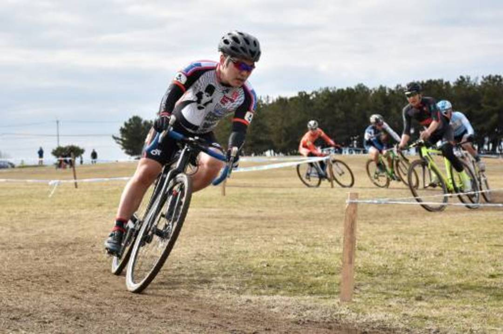

## 関西シクロクロス#8 堺

ド平坦コースサカイセンシュケン。前週の希望が丘で C1 でやっていける自信が怪しくなっていたので、この週だけ平日練習を増やしてみた。

タイヤは当然[Maxxis SpeedTerrane](http://amzn.to/2Fd1SiG)を前後に装着。レース中のコースはちょっとぬかるんでいたけれども滑ることを前提に走っていれば特に問題はなかった。セミスリックの扱いも慣れたもの。\
コースは昨年にも滑らかになっており腰へのダメージが少なかったので高めの 1.9BAR に設定した。

スピードコースだけあって序盤まったくポジションを上げられなかったが、シケインやステップでダッシュを繰り返したり自信のある砂エリアでコツコツ稼ぐことができた。\
だが、30 分ほど経ったところでまさかの Di2 バッテリー切れ…\
朝の変速不調はお前のせいか。

SS バイクへの乗りかえを余儀なくされる。幸いピットに近いところだったのでスムーズに乗り換え。久しぶりのシラクの感触にちょっと戸惑いながら曲がり方を思い出す。

SS の場合はライン取りがギアードと変わってくる。踏み直しで削られる脚が多くなるのでやや大回りになってもスピードを殺さずに済むラインを選んで走っていく。砂エリアは 3 つ目のイージーな箇所以外はクリアできなくなったのでスピードが乗っているうちに降りてクリア。\
ド平坦なので SS のデメリットは少なかったが、昨年比でコーナーが多くなっていたこともありスタミナを大幅に消耗して後半スピードが遅くなってしまった。

それでも 66%を維持してフルラップ完走でゴール！
横山航太がいる中でフルラップできるとは思っていなかった。もちろん彼が最後尾スタートだったことも大きいがフルラップはフルラップ。仮想残留チケットも手に入れられることがわかったので来シーズンの安心度が少しだけ増えた。

来週は JCX を含む愛知牧場 2 連戦。残留を気にすることがない初年度の特権を活かして JCX ポイントを稼ぐ算段。

Photo by [Toru Tanabe](https://flic.kr/p/JxfDce)

### 機材

Bike: TCX SLR('14) Ultegra Di2\
Tyre: Maxxis SpeedTerrane 1.9Bar(F,R)\
Wheel: (Front)SHIMANO XT M785,(Rear)PAX PROJECT 24mm TL

Bike: TCX SLR SS\
Tyre: IRC Serac CX TL(F),Maxxis SpeedTerrane(R)\
Wheel: Velocity A23 & PAZ original HUB
