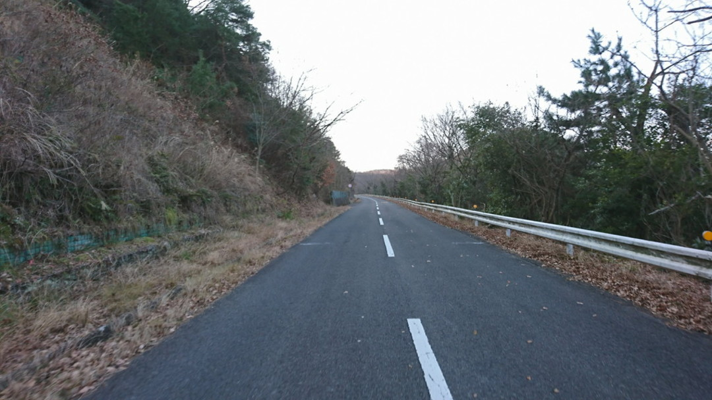
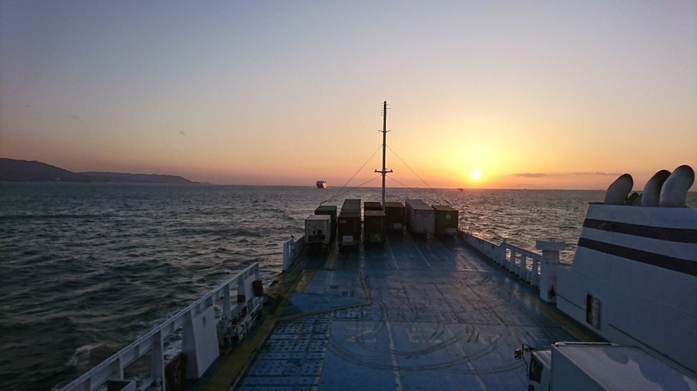

## 休息の週

さぬき CX に出走予定だったものの、シクロクロス東京 → 柏原 CX の連戦でまったくペダルを踏めなくなっていたので、潔く DNS することにした。
ハムストリングスと臀筋が突っ張って平日ずっと腰が痛み、[イナーメ棒](http://amzn.to/2CA76ml)と整体でなんとか動ける体を維持できる体たらく。

全く体を動かさないのも回復を遅めるので、ロードで回復イベントをこなすことに決定。\
関西から適度な距離で、楽しみながらツーリングできる場所…つまりジャンボフェリーでうどんツーリング！

かの有名な[つむりブログ](http://tsumuri5.com/blog-entry-476.html)を参考に装備とコースをを選定。出発便が金曜 25:00 発土曜 5:15 着ということがわかれば十分。\
讃岐うどん屋は概ね日曜定休かつ、昼過ぎには閉店することが多いので早朝入り昼終了がベスト。関東から来る場合はサンライズ瀬戸を使うと朝 7 時に高松駅着となるベストスケジュールを組むことができる。

金曜日は Rapha Osaka でのシクロクロスエンドオブシーズンパーティーに出席してから自走の予定だったが、予想外に長引いたので車で神戸港まで向かうことにした。

神戸港ジャンボフェリー乗り場に無料駐車場はないものの、24h700 円のタイムズがあったのでこれ幸いと駐車。自転車を引っ張り出して慌ただしく予約していたチケットを発券する。\
クレジットカード払いができるので現金を持たない人間にはありがたい、現金はうどん屋で使うための貴重なツーリング資源だ。

夜中でもギラギラと光を反射する 9000 クランク。出た当時はダサいダサい言われてたけど磨けば光るシルバー塗装は当初からお気に入り。

軽量キャンプツーリング装備などないので、学生時代からの由緒正しい輪行袋枕ソリューションで雑魚寝。\
予報では高松市の気温は 4 度～ 10 度ということだったので、装備はシマノのウィンタージャケットと CS のフリースジャージを冬インナーと合わせるだけ。ジャケットがそのまま布団になる。

フェリー内では普段着で、バックパックにサイクルウェア類を投入。着替えた後、高松港のコインロッカーに財布とスマホ意外を放り込めば身軽にツーリングを楽しめるという寸法。\
完璧だ。

## さか枝

朝 5 時頃から開店している高松市最速の店、うどんツーリング鉄板のスタート場所。

早朝にも関わらず既にレジには列ができるほどの盛況。朝早いこともあってシンプルにぶっかけをいただく。麺のコシと小麦の香りがたまらない。
かけうどんの場合は自分でうどんを湯がいて出汁をかける讃岐うどんの正統スタイルであることも見逃せない。

価格もうどん 100~200 円台、揚げ物 100 円という標準ラインを示してくれる。いつも思うがうどん屋の採算はどうなっているんだ…

<LinkBox url="https://goo.gl/maps/gzn6UYrMdBPotSyP7" />

---

## うどんバカ一代

噂の釜バターうどんをいただく。こちらも朝 6 時から開店している早朝対応の店。

バターと溶き卵で釜玉うどんを頂くというシンプルと言えばシンプルな一品なのだが、超粗挽きの黒胡椒がかけたことでさながらカルボナーラの如き風味を生み出す釜玉うどん界に一石を投じたメニュー。トドメの特性出汁醤油が完璧な調和を作り出す。400 円台でこの味がいただけるのだから香川はおそろしい。

<LinkBox url="https://g.page/udonbakaichidai?share" />

## 五色台

食べるだけでは罪悪感に苛まれる。
そして次の目的地である「がもううどん」の開店時間は 8 時なので、若干間が空いてしまうこともあり 6 時から 7 時台はヒルクライムのお時間。高松市の西に位置する五色台を目指す。

県道 16 号をひたすら西に走って 161 号のトンネルに入らないよう気をつけつつ、大崎の鼻を目指す。
瀬戸内を臨む最高のロケーションがお待ちかね。強烈な向かい風だが景色で苦しみが吹っ飛んだ。

大崎の鼻から五色台スカイラインに入るといきなり直登。2~3km 走ると寂れた展望台広場まで到着。
500m 山を登れば一番上まで行けるらしいが、SPD-SL シューズではやや厳しい道程だったので広場で妥協する。

景色を堪能した後はスカイラインのアップダウンをひたすらこなしながら山を降りていく。思ったより登り返しが多く心を折られる…

何名か地元のサイクリストとすれ違ったところを見ると、安定の練習コースなんだと推測できる。

<LinkBox url="https://goo.gl/maps/xbNLW7ZbjCwdmxPMA" />

## がもううどん

農地と住宅街の中に突如出現する名店。この日は 8 時半頃到着したが既に行列していた。
寒いがうどんのコシを存分に味わいたい…という欲求に対応してくれる「ひやあつ」をオーダー（麺が冷たく、温かい出汁をかける）、名物の「あげ」も合せて頂く。

この店の特徴は出汁。いりこと醤油のバランスが素晴らしい。
もちろんうどんも素晴らしいのだが、揚げのタレとうどんのダシが絡み合って他にはない味を作り出している。おかわりしたい欲求に駆られるが、胃袋と時間の都合があるので我慢ガマン…

<LinkBox url="https://goo.gl/maps/3Qe36zRcXXcJsNF19" />

## 山下うどん店

がもううどんのすぐ近くにある店。
民家の雰囲気を醸し出しているが立派なうどん屋。後払い自己申告制なので頼んだものを忘れないようにしたい。

あきらかに美味しいかき揚げが目の前にあったのだが、満腹になってしまうリスクが…！ちくわ天で妥協。

通常なら坂出方面に向かうところだが、ここであえて善通寺方面に足を延ばす。
昨年のさぬき CX で使った会場近くの店が当たりだったので、そちらを優先！

<LinkBox url="https://goo.gl/maps/VNWdJv7LL7kv3GPL9" />

## 山下うどん

本日 2 回目の「山下」だが別物。
さぬき CX の会場である鉢伏ふれあい公園のすぐ近く。昨年は試走後に会場を抜け出してうどんを頂いた思い出ある店。

ダシの旨味が強い店で。卓上に生姜そのままとおろし金が置いてあり自分ですり下ろす珍しい？システムとなっている。
おろしたての生姜は香りが強いので少量で十分。

胃の調子をととのえるために蓮根天を追加。

<LinkBox url="https://goo.gl/maps/E37SzVm1Y3JyvxHa9" />

## 綿谷　高松店

そろそろ昼が迫ってきたので、国道 32 号で高松まで折り返す。
これまで牙を向いてきた向かい風が全て追い風に変わり凄まじいスピードで走ることができた。

綿谷で食べるべきは肉うどん。
もともとは丸亀市の港湾地区まで行かないと行けなかったのだが、高松店の開店によりグッとアクセスしやすくなった。

大きな丼いっぱいに麺が入っているが、これでも「小」なので量には気をつけないとヤラれる。甘辛く似た豚肉 or 牛肉がうどんを引き立てる。
甘辛い具は出汁と喧嘩することもままあるが、この店は見事に味を合せている。

<LinkBox url="https://goo.gl/maps/VzsibdtEjNLpxhhF9" />

## フェリー

綿谷でパンパンになった腹を引っ張りながら港へ引き返す。
フェリーに待ち受けるは「オリーブうどん」…！と言いたいところだが胃袋が許してくれなかったので次回に回すことに。

おおよそこの行程で 100km となり、いい感じのカロリー消費に。
差し引きで言うとプラスだが、これだけ走れば十分！

14 時の便で帰ると 18 時ごろには神戸に戻ることができ、まだ日曜日が残っているという贅沢な週末。
朝入りうどんツーリング是非おすすめです。

<LinkBox url="https://www.strava.com/activities/1411117008/embed/d47d0732e75a8dc95988b0cf0696cb662873aa16" />

<LinkBox isAmazonLink url="https://www.amazon.co.jp/dp/B007A9DRH2/" />
