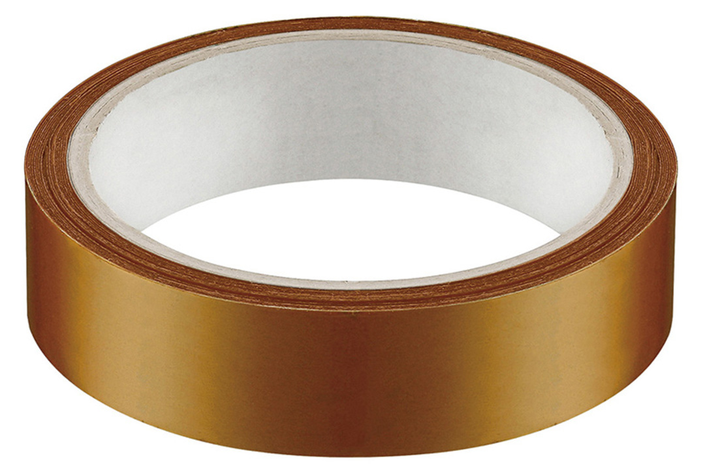

## チューブレスタイヤはいいぞ

チューブレスタイヤのメリットはいまさら言うまでもない。\
（低圧での）転がり抵抗軽減・エアボリュームによる乗り心地の良さ・リム打ちパンクの軽減と、走行性能自体はクリンチャーより数段優れている（と思う）。

転がり抵抗は超軽量チューブ＋クリンチャータイヤの組み合わせを利用したほうが低くなるらしいが、チューブレスになれるとクリンチャーの乗り心地は硬い…

## チューブレスレディシステムはクソ

チューブレスタイヤの欠点…それは走行性能以外の部分。
タイヤは（組み合わせ次第で）嵌めづらいし、ビードは上がらないし、サイドカットしたらチューブを入れるしかなくなるがチューブを中へ入れるようにチューブレスタイヤはできていない。

[Hutchinson](https://amzn.to/2GYeyLO)と[IRC](https://amzn.to/2pLOP0O)しかロード用チューブレスタイヤがなかった、所謂「RoadTubeless」ロゴだけだった時代は、リム側も試験する相手が少なくリムテープも不要のスポークホールレスリムがメインだったため、「ビードが上がらない」ことは殆ど無く、タイヤを嵌めることだけ考えていればどうにかなった。

しかし、現代はチューブレスレディの時代。

リム側はチューブレステープ（[Notubes の黄色いアイツ](https://amzn.to/2pQnx9H)とか）が必須だし、タイヤのシール性はシーラント前提で適当だ。シーラントが足りなければタイヤサイドからプクプクと気泡がコンニチワする始末。\
MTB 技術の転用である以上、MTB 界のトレンドからは逃れられないので我々チューブレス派はこの状況下で最善手を見つける必要がある。

家に予備チューブなんてもう無いし。

## タイヤとリムの相性

実はロードチューブレスには 2 種類か 3 種類の規格があるらしい。\
表には出てこないが、こいつが相性の元凶になっているとのこと。

大分すると、ETRTO 規格に沿ったリム径・タイヤ内径（シマノ・IRC etc）と BST-R(Notubes, Maxxis)という Notubes がメインになっている規格の 2 種類があるらしい。ついでに MAVIC が提唱しだしたロード UST も含めて 3 種類だ。

お察し頂いた方もいるだろうが、ロードチューブレス黎明期にあったものが前者で最近出てきた TLR 達が後者という括りで大凡あっているらしい。\
他にも、北米マーケットで強く MTB タイヤでシェアを持っていると後者である可能性も高いなど、ある程度の基準を自分の中では（確定できるものではないが）持っている。

因みに ETRTO はリム径が小さく、BST-R はほんの少しそれより大きいらしい。ETRTO 基準のリムに BST-R 基準で作られたタイヤを入れる場合はチューブレステープ 1 周で調整できる。逆は硬いタイヤだとだいぶ辛い。
CX タイヤだと特に顕著で 29er の XT ホイールに Maxxis の TLR タイヤを入れたりすると、新品でもだいぶガバガバになる。リムテープレスのリムでもテープを貼ることになって面倒なことこの上ない。

2019 年追記  
ETRTO(ISO5775)規格が改定されて、ホイールとリムの規格がお互いを考慮するようになったので、以降の製造は相性問題が解決している可能性があります

## テープがあるゆえの悲しみ

チューブレステープは劣化する。\
空気圧でスポークホール部分が凹むのだが、今時の非対称リムの場合はタイヤ装着時に問題となることがある。凹んだ所から空気が漏れてビードが一切上がらないのだ。

この場合はテープを交換するしか無いが、この耐久度がテープ銘柄によって結構異なる。

### Notubes Yellow Tape

<a href="http://www.amazon.co.jp/exec/obidos/ASIN/B0044BAAME/gensobunya-22/ref=nosim/" name="amazletlink" target="_blank">NoTubes YELLOW RIM TAPE 25mm幅/10Yd（約9.14m）（AS0033）</a>
posted with <a href="http://www.amazlet.com/" title="amazlet" target="_blank">amazlet</a> at 18.03.29

NoTubes  売り上げランキング: 6,033 

<a href="http://www.amazon.co.jp/exec/obidos/ASIN/B0044BAAME/gensobunya-22/ref=nosim/" name="amazletlink" target="_blank">Amazon.co.jpで詳細を見る</a>

基本中の基本、元祖チューブレステープ。\
MTB 向けに作られた製品だったので、ロードの空気圧に耐えきれるほどの耐久性は無いようで 3~4 ヶ月 CX の空気圧で運用すると次は交換。

ロードの空気圧だと使い捨て？非対称リムでなければそこまで気にしなくても良いかもしれない

### ダクトテープ類

<a href="http://www.amazon.co.jp/exec/obidos/ASIN/B004JLGARI/gensobunya-22/ref=nosim/" name="amazletlink" target="_blank">ニトムズ 気密・防水クロステープ 片面粘着 KZ-7 50mm×20m G0010</a>
posted with <a href="http://www.amazlet.com/" title="amazlet" target="_blank">amazlet</a> at 18.03.29

ニトムズ(Nitoms)  売り上げランキング: 772 

<a href="http://www.amazon.co.jp/exec/obidos/ASIN/B004JLGARI/gensobunya-22/ref=nosim/" name="amazletlink" target="_blank">Amazon.co.jpで詳細を見る</a>

通称ダクトテープと呼ばれる高耐久の粘着テープ。\
粘着性能は悪くないものの、テープ自体の剛性は最弱。当然の用に 1 発の使い捨てになるが、コストを考えると悪くはない。

[過去記事](/2017/08/blog-post.html)参照。

### 3M 仮固定用テープ

<a href="http://www.amazon.co.jp/exec/obidos/ASIN/B000SPHL4U/gensobunya-22/ref=nosim/" name="amazletlink" target="_blank">3M 仮固定用テープ 8898 24mmx55M 8898 24X55</a>
posted with <a href="http://www.amazlet.com/" title="amazlet" target="_blank">amazlet</a> at 18.03.29

3M(スリーエム)  売り上げランキング: 5,021 

<a href="http://www.amazon.co.jp/exec/obidos/ASIN/B000SPHL4U/gensobunya-22/ref=nosim/" name="amazletlink" target="_blank">Amazon.co.jpで詳細を見る</a>

ダクトテープと同じく使い捨て前提だが、幅が揃っている分ダクトテープより便利らしい。（使ったことはない）

### GIANT TUBELESS TAPE (THICK)

[TUBELESS TAPE (THICK)](https://www.giant.co.jp/giant21/acc_datail.php?p_id=A0000134)

ものぐさな自分が最終的にたどり着いた製品がこいつ。\
THICK と名乗るだけあって、分厚い上にロードの空気圧にもそこそこ耐える耐久性。2017 年までは Onroad Tubeless Tape と呼ばれていた。リムブレーキの発熱に耐える製品らしいので、オンロードはこちらを使ったほうがいいらしい。

CX シーズンの後半はこれを投入したところ、4 ヶ月経ってもタイヤ交換時にテープを替える必要性はなかった実績あり。\
中身は厚くオーダーした[ポリイミドテープ](https://amzn.to/2IzziZP)と思われる。

### (2020/12 追記) チューブレス時代に伴うリムテープ販売増加

2020 年では、かなり多くのメーカーがチューブレスに力を入れ始め、それにともないリムテープもかなりの種類から選択できるようになった。安いものからプラスワンの性能を持つものまで。

18mm と 22mm という少ないバリエーションだが BBB のリムテープは安い。ただ 18mm はリム幅の都合でほぼ出番はないと思われる。

<a href="https://www.amazon.co.jp/dp/B079JXZFM3/?tag=gensobunya-22" name="amachazllink" rel="nofollow" target="_blank">BBB リムテープ リムテープ 22MMX4M チューブレス BTI-150 703044 703044</a>
posted with <a href="https://creazy.net/amazon_quick_affiliate/" title="BBB リムテープ リムテープ 22MMX4M チューブレス BTI-150 703044 703044" rel="nofollow" target="_blank">Amaquick</a> at 2020-12-14

<a href="https://www.amazon.co.jp/dp/B079JXZFM3/?tag=gensobunya-22" name="amachazllink" rel="nofollow" target="_blank">Amazon.co.jpで詳細を見る</a>

WTB の大ロールは非常にコストパフォーマンスが高い。5 巻き分の長さで値段あ 2 巻き分の GIANT テープとほぼ変わらない。

<a href="https://www.amazon.co.jp/dp/B01I2YCP8U/?tag=gensobunya-22" name="amachazllink" rel="nofollow" target="_blank">WTB(ダブルティービー) TCS リムテープ イエロー 24mm×11m Roll (for 5 wheels)-i19</a>
posted with <a href="https://creazy.net/amazon_quick_affiliate/" title="WTB(ダブルティービー) TCS リムテープ イエロー 24mm×11m Roll (for 5 wheels)-i19" rel="nofollow" target="_blank">Amaquick</a> at 2020-12-14

<a href="https://www.amazon.co.jp/dp/B01I2YCP8U/?tag=gensobunya-22" name="amachazllink" rel="nofollow" target="_blank">Amazon.co.jpで詳細を見る</a>

パナレーサーも[チューブレステープ](https://store.shopping.yahoo.co.jp/worldcycle/PAN-O-TLT-21.html)を出しており、幅のバリエーションが広く取られていながら値段は 1500 円と抑えられている。

## シーラント性能

シーラントもモノによってかなり性能が違う。
みんな大好き[Notubes の無印シーラント](https://amzn.to/2GhELYy)、実はあまり経験上性能が良くない。

特に TLR タイヤだとサイドにシーラントが定着してくれないと、サイドウォールから空気が抜けてくる。\
泡になってタイヤ内側全体をコーティングしてくれる[Caffelatex](https://amzn.to/2IZgdRT)をおすすめしたい。特にロード系は外周の重さに効いてくるシーラントの量を減らしたいはずなので、なるべく少ない量で済ませたいのが自転車乗りの性。

無印 Notubes だと「多いな」と感じる量が必要になる CX タイヤでも CaffeLatex はそこそこの量で済む。\
安い所を頑張って探そう。

他に評判が良いのは Notubes の上位機種である[Race Sealant](https://amzn.to/2Ix0Yyu)や[Vittoria のシーラント](https://amzn.to/2HfhDHq)

ブログだと引用の都合上 Amazon リンクが多いが、自転車関連品は自動設定された価格が異常に高くなっていることが目につくため、<<a href="//ck.jp.ap.valuecommerce.com/servlet/referral?sid=3171302&pid=883104724" target="_blank" rel="nofollow">Wiggle</a>とか使ったほうが良さそう。

<a href="http://www.amazon.co.jp/exec/obidos/ASIN/B0171L294A/gensobunya-22/ref=nosim/" name="amazletlink" target="_blank">3M 耐熱性ポリイミドテープ 7413D 21mm幅x33m</a>
posted with <a href="http://www.amazlet.com/" title="amazlet" target="_blank">amazlet</a> at 18.04.06

3M(スリーエム)  売り上げランキング: 228,859 

<a href="http://www.amazon.co.jp/exec/obidos/ASIN/B0171L294A/gensobunya-22/ref=nosim/" name="amazletlink" target="_blank">Amazon.co.jpで詳細を見る</a>

