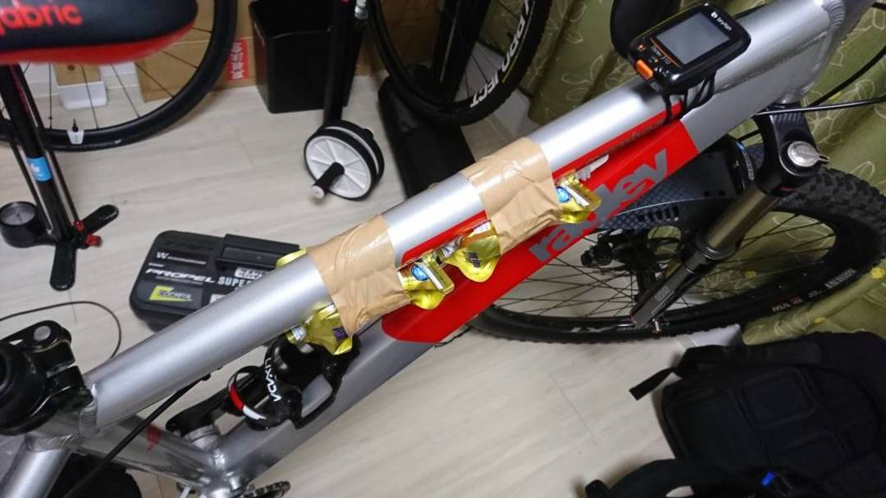

## 2018春王滝、持ち物の工夫

今年の春王滝はコース変更によって難易度が下がったので、6時間半を切るタイムで完走できた。
昨年は工具・補給食・ハイドレーションすべてを背負って腰が崩壊してしまったので、今年はその反省で補給食（バイク上）とツールボックスに重量を分散。

2000kcalを目安に所持している補給食は、バイクに貼り付けるだけでは量が足りないので[R250のステムバッグ](https://amzn.to/2LNFMXe)を導入。
ここにお気に入りの補給食、[SAVAS ピットインジェル](https://amzn.to/2HaftqI)を入るだけ投入。脇のネットにゴミが入れられるので合理的に運用できた。

SAVASの補給食は数ある補給食の中でトップクラスに美味しい方だと思う。特にウメ味は甘すぎず酸っぱさで目が覚める効果もある。ついでに安い。
食べ物の味は安心の国産。

ステムバッグの代償に、ただでさえ少ないステム上のスペースが無くなってしまったため、サイコンはトップチューブ上に移植された。
その分トップチューブに貼り付けられるジェルの量が減ってしまったが仕方がない。

### 追記
[Bryton用の格安マウント](http://s.click.aliexpress.com/e/bCpA5B7S)をAliExpressで購入した。これでステム上にサイコンを配置しながらトップチューブバッグのベルトをステムに通すことができる。
アウトフロントマウントはコケたときに折れることがあるらしいので不採用。

ツールなどと合わせて約1kgほどを背中から削減。
昨年ひどい腰痛に見舞われた第1CP→第2CPでもなんとか調子を維持することができた。それでも「ややマシになった」程度であることは否めないので、秋はバイクにハイドレーションを搭載することを検討しようと思う。

## トレイルバイクを王滝で運用する

トレイルではアウトフロントマウントが折れることがあると聞いて以来利用していないのだが、王滝では少しのスペースも勿体無いので、王滝に限り使っても良いと感じた。　
それほどまでにバイクにマウントすることは重要。

その他、ドロッパーポストを装備していたが1回も動作させなかった。
こちらもノーマルポストに交換することで、サドルバッグも利用していくべき。カーボンなら衝撃吸収も期待できる。

<a href="http://www.amazon.co.jp/exec/obidos/ASIN/B06XPW1TTN/gensobunya-22/ref=nosim/" name="amazletlink" target="_blank">R250(アールニーゴーマル) フロントポーチ レギュラー ブラック WWW-L-FPOUCHR-BK ブラック レギュラー</a>
posted with <a href="http://www.amazlet.com/" title="amazlet" target="_blank">amazlet</a> at 18.06.01

R250(アールニーゴーマル)  売り上げランキング: 12,077 

<a href="http://www.amazon.co.jp/exec/obidos/ASIN/B06XPW1TTN/gensobunya-22/ref=nosim/" name="amazletlink" target="_blank">Amazon.co.jpで詳細を見る</a>

