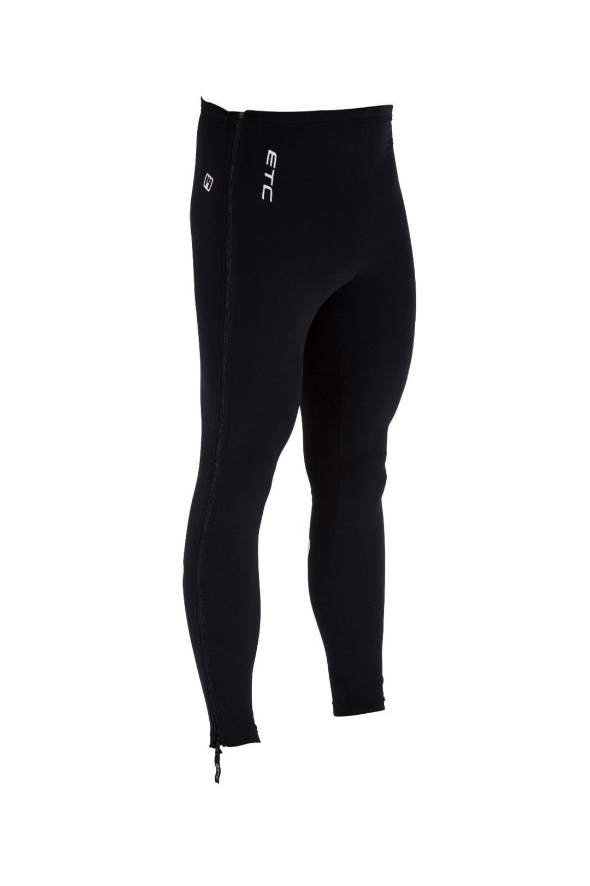

## スタートグリッドの防寒

これがあると"イケてる"装備のうちの 1 つであるフルジップウォームアップタイツ。  
スタートグリッドまで暖めた脚を維持できて、なおかつスマートに脱着できる、問題はお値段。値段に定評のあるチャンピオンシステムでも[2 万円](https://champ-sys.jp/collections/%E3%82%BF%E3%82%A4%E3%83%84-%E3%83%8B%E3%83%83%E3%82%AB%E3%83%BC/products/%E3%82%B7%E3%82%AF%E3%83%AD%E3%82%AF%E3%83%AD%E3%82%B9%E3%82%A6%E3%82%A9%E3%83%BC%E3%83%A0%E3%82%A2%E3%83%83%E3%83%97%E3%83%91%E3%83%B3%E3%83%84)ほどである。

カペルミュールでもやや安く売っていたが今年のラインナップからは消滅していた。ニッチなので仕方ないと言えば仕方ない…  
冬のランニングなどでも使えるはずなのだがそもそも作っているメーカーが非常に少ない。

## 困ったときの ebay

ebay 愛してる。

ETC というメーカーが[Warm up Full Zip tights](https://www.ebay.com/sch/177854/i.html?_from=R40&_nkw=ETC+tights&_sop=15)という名称で販売しているのを発見！

160cm,72cm のホビットサイズにも余裕で対応していて助かる。  
届くまで 2 週間ほど？標準的な ebay 納期だし、SOLD 履歴もかなり多いので信頼できた。

## アップもそのまま

ウォームアップタイツは長ズボンと違ってギアに巻き込む心配がないため、名前通り試走やウォームアップ時にも使えてそのままスタートグリッドへ行くことができる。  
これは地味に重要なことで、レースの忙しいタイミングでいちいち着替えたりしなくてよいのは精神的に非常に楽。なによりそれっぽい。

2019 年頃からサンボルトでも発売されたが、ETC のほうが安い。
