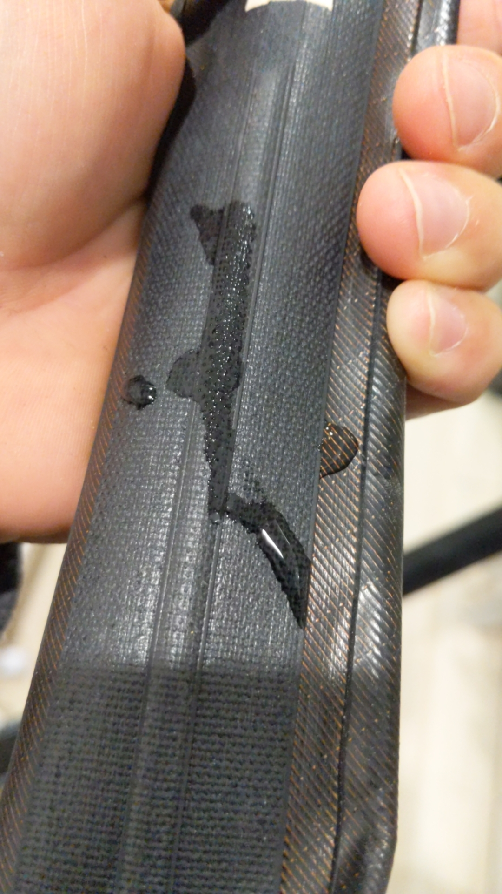
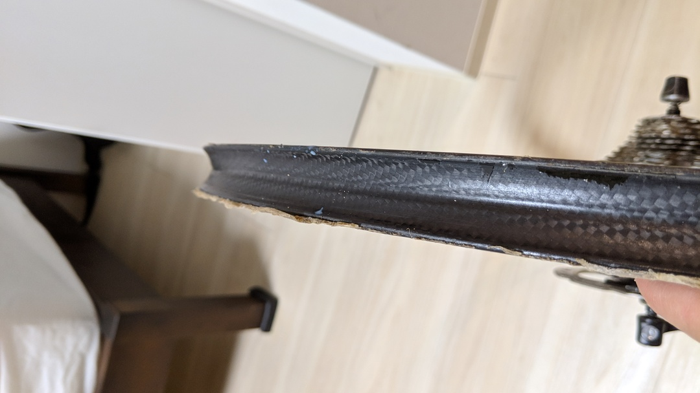

## リムセメント絶対使いたくないマン！

チューブラーは使いたい、でも面倒なタイヤ貼りはしたくない…。
リムセメントを何重にも塗るだの、ベッドを作るだの、CX テープ使うだのなんだの不確定要素を可能な限り排除したシンプルな運用をしたい。

つまり、労力をかけずに CX チューブラーを使うにはテープで運用するしかない！CX チューブラー貼りにおける課題は下記の 2 点。

- 水分の侵入
- 低圧横 G

水分の侵入は接着剤の劣化を招き、低圧の横 G はミヤタのチューブラーテープを想像すればわかると思うが「チューブラーを外すときの要件」であるとともに「CX チューブラーでよく発生するシチュエーション」でもある。キャンバーとかコーナーとか。  
これら 2 つを解決するべく、属人的でない手段を探す。

## テープでなんとかする CX チューブラーの要件

水分の侵入は主にスポーク穴から侵入した水分と、タイヤサイドからの侵入の二通りがある。

まず、スポーク穴の方はスポークホールレスのホイールを使って解決する。ニッチ過ぎてほぼ市販されていないが、[PAXCYCLE](http://www.paxcycle.com/)や一部の AliExpress セラー([FARSports](https://www.aliexpress.com/store/all-wholesale-products/103713.html)で扱っている。さらに、防水効果のある接着剤である[ボンド G17](https://amzn.to/2JeDVs9)をタイヤのふんどしに予め塗布しておく。  
Tufo のように、最初から黒いふんどしで若干の防水力があると推測されるものもあるが、念の為塗布しておく。

サイヤサイドからの侵入は[シリコンコーキング剤](https://amzn.to/2Sgj7tN)を使って隙間を埋めることで防ぐ。防カビ剤も入っているのでデュガス等の腐るタイヤサイドに対しても有効なはず。アクアシールとしても利用する。

加工後はこの様になる。

コーキング剤は余分な液体を除去するのが面倒なので、マスキングを推奨。リムブレーキの場合は必須。

<AmazonLinkBox url="http://www.amazon.co.jp/exec/obidos/ASIN/B000TGLPM2/gensobunya-22/ref=nosim/" />

テープは[シクロクロスでも問題なく使えるという触れ込み](https://www.cyclowired.jp/lifenews/node/191669)の Effetto Mariposa の[チューブラーテープ](https://amzn.to/2u8o89K)を利用。このテープ自体も防水性があるらしいが、過信せずに上記の加工をしている。

## 半シーズン運用してみた

今シーズン投入したデュガスは、希望が丘でコンクリートの角に当てた際あえなくご臨終したので、剥がす羽目になった。  
チューブラーテープの真価が問われるのはこの時で、ライドでは剥がれずメンテンスでは用意に剥がせるという相反する性能を追求されるほど良いテープということになる。

リムセメントはこれが本当に面倒で、剥がす時はもちろん残ったセメントを削るか、薬品で溶かす必要がある。時間も手間もかかって面倒。

そしてこちらが Carogna テープを剥がした直後。

なんと素晴らしい。リム上にはほぼ汚れがなく、カーボンリムも破損させていない。むしろサイドを塞ぐために使ったボンド類の残処理のほうが多いくらい。水もほぼ侵入を防いでいた。  
今シーズンは雨レースが少なかったので、あまり過酷な環境とは言えなかったが、優秀さを伺わせる。

また、このシーズンは JCX を渡り歩き 1.5 気圧程度で高速レースを走りまくったにもかかわらず、全く接着力のムラが無かった＝弱くなっている箇所がなかったことから横 G に対する体制もおそらく十分。

## さらなる妥協へ

サブバイクの SSCX は、Tufo ＋ CX22 リム＋ Carogna テープ＋上記の加工で施工してみた。

CX22 リムはもちろんスポークホールが空いている、つまり水の侵入を用意に許す。こちらのタイヤ交換がいつになるかはわからないが、何シーズン持つか絶賛実験中。テープを「CX に使えるとは言われていないが実は使える」ものにする案もあったが、1 度に 2 箇所冒険するのは検証的にもよろしくなく、そこまでの度胸もなかったので見送った。

ちなみに現状の組み合わせだと 4000 円のリムに 2000 円のテープを使って 2000 円のタイヤを貼っている状態。コストめっちゃ安い。デュガスだとタイヤが 8000 ～ 15000 円になるが、空気抜けやリム打ち、ビード外れのリスクを考えるとむしろコスパが良いのでは…？

<AmazonLinkBox url="http://www.amazon.co.jp/exec/obidos/ASIN/B00SYZFCGU/gensobunya-22/ref=nosim/" />
