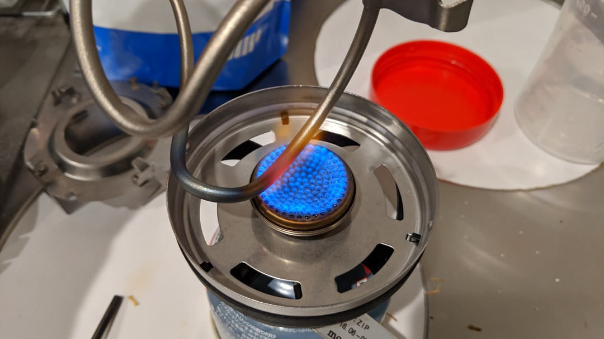

## ボトルケージはちょっとくらい信頼性が低くても…

ボトルケージはちょっと壊れてもボトルが脱落して無くなる程度で、ホイールやハンドルと違ってすぐに命にかかわる事故が起きるわけでもないので、信頼性がやや低めでも構わないと考えている。  
買い替え前も中華カーボンの製品を使っていましたが、ガバガバになってきたので交換を検討し、定期的に来るチタン欲を満たすためにチタンボトルケージを買うことに。
※大集団だと保持力が低いケージを使うのは考えものなので、レースを頻繁にやる場合はちゃんとしたものを使ったほうが無難

せっかくだし、ボルトもチタンにするべく、[やや信頼性がありそうなセラー](http://s.click.aliexpress.com/e/ccF7RFx2)からボルト単体も購入。

そしてチタンは電位差で腐食してしまうので、ロックタイトのアンチシーズカッパーも購入。FINISH LINEのチタンプレップ割高だし…

<a href="http://www.amazon.co.jp/exec/obidos/ASIN/B001HW6QA8/gensobunya-22/ref=nosim/" name="amazletlink" target="_blank">ロックタイト アンチシーズカッパー C-5A 1oz(28g) 234192</a>
posted with <a href="http://www.amazlet.com/" title="amazlet" target="_blank">amazlet</a> at 19.03.02

ヘンケルジャパン  売り上げランキング: 4,477 

<a href="http://www.amazon.co.jp/exec/obidos/ASIN/B001HW6QA8/gensobunya-22/ref=nosim/" name="amazletlink" target="_blank">Amazon.co.jpで詳細を見る</a>

## 用意

AliExpressは、商品が届くのは良いが商品そのもののクオリティはアレなことも多い。今回も2つ注文して片方は精度が悪く取り付け不可能。  
こんな場合は粛々と申請すると返金されるので、ドライなクレームシステムを導入しているAlibabaのありがたさを感じる。

精度は見た目で分かるが、素材が本当にチタンかどうかは当然不明、要検証。  
5分ほど手段を募集した結果、出てきた以下の3種類の手段を検討。

1. 質量を測る
1. 陽極酸化してみる
1. 酸化皮膜を作ってみる（要するに焼く）

質量…は中空パイプなのでアルキメデス法でもわかりづらい。そもそもの質量が小さいので、別素材の場合でも差が小さすぎる。

陽極酸化…設備用意が面倒なのと、電流を扱う自信がない

焼く…簡単だしこれに決定

**焼きます**

ちゃんと焼き色が付きました。ついでにガリガリとダイヤモンドヤスリで削ってみたが、チタン粉末を吹き付けたわけでもないようでしっかりしていたので、きっと本物のチタン。良かった。

自分が購入したあと、レビューに「これは偽物！メタル塗装だ！」というレビューがあったが軽くてプラみたいな触感というだけで判断したのだろう。

カーボンフレームに似合うかはちょっとビミョー。

<a href="http://www.amazon.co.jp/exec/obidos/ASIN/B001HW6QA8/gensobunya-22/ref=nosim/" name="amazletlink" target="_blank">ロックタイト アンチシーズカッパー C-5A 1oz(28g) 234192</a>
posted with <a href="http://www.amazlet.com/" title="amazlet" target="_blank">amazlet</a> at 19.03.02

ヘンケルジャパン  売り上げランキング: 4,477 

<a href="http://www.amazon.co.jp/exec/obidos/ASIN/B001HW6QA8/gensobunya-22/ref=nosim/" name="amazletlink" target="_blank">Amazon.co.jpで詳細を見る</a>

