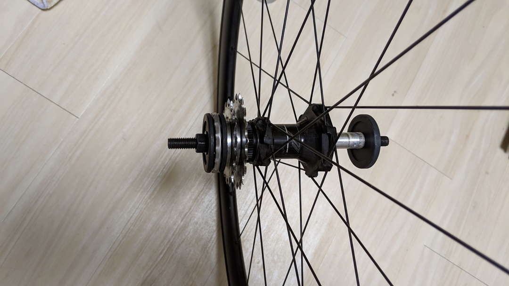
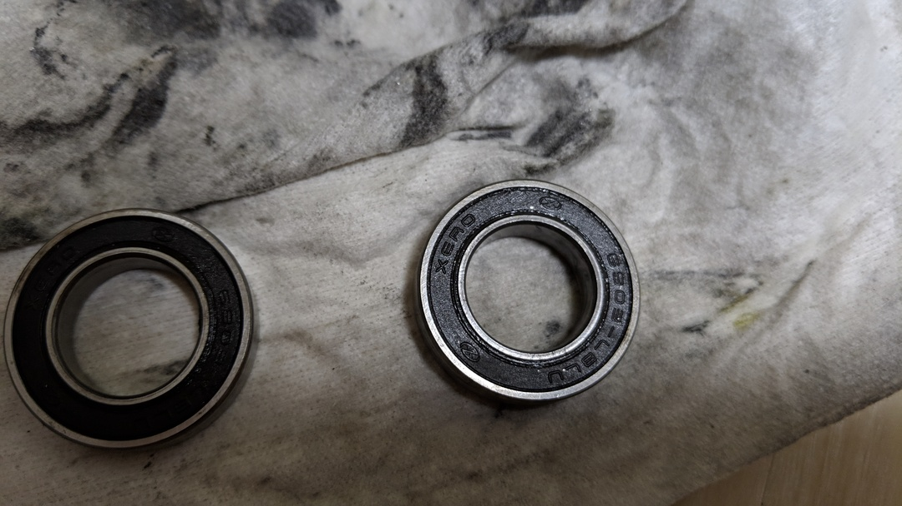

## ハブ、ゴリゴリ

ディスクロードの油圧周りのメンテを納車（3年？）ぶりに出したら、無情なる「ベアリング死んでるよ」とのお言葉を頂いた。

普段乗る時は全く気が付かなかったが、メカニックはすごいなぁと思いながらサドル持ってホイールを空転させたらゴリゴリの振動が手に伝わるレベル…なぜわからなかったし…  
TCRに付属していたSLR1 DISCホイールは汎用ベアリングを使っているため、自分で打ち直すことにした。おそらくDT製なので簡単だろうという読み（結果的にはDT製ではなかったが）

一縷の望みをかけて、切り分けのために[シマノのフリーグリス](https://amzn.to/2TyhJmY)でグリスアップしてみたものの、ゴリゴリ感が消えなかったので原因がベアリングだと確定した。

## まずは情報収集

ベアリング調達のために規格をチェックする必要がある。ググったら良いものが出てきたので一発でわかった。  
<http://www.sykkel.com/teknisk/MY17%20Wheel%20Service%20Part%20Catalogue__1611%20(1).pdf>

SLR1 discの12mm…ハブの型番は`1520-CL1608-701`、ハブベアリングは…`SB-6903 HUB BEARING`と記載されているので6903ベアリングを買えば良さそう。安心の[NTN製ベアリング](https://amzn.to/2TMuABg)を注文しておく。  
この手のシールドベアリングは接触型と非接触型のものがあり、後者のほうが抵抗が少ない。しかし、ロードバイクはメンテナンス頻度も少ないため接触型の防水性が高いもの…6903LLUをチョイス。

展開図を見る限り、力いっぱい叩けばベアリングが抜けそうなので手持ちの工具でいけそうだと判断。

## 抜けない、シャフト

ベアリングが届いてから作業開始。まずは半フリー側スルーアクスルのキャップを外す、滑り止め付き手袋さえあれば素手でスポっと抜ける。

洗ってもすぐに墨汁が滲んでくるひどい状態。シャフトに穴が空いており、ここに細い棒を通せば固定できる。そしてドライブ側は**逆ネジ**のキャップとなっているので、六角レンチをノンドライブ側の穴に通してハブレンチでクルクルと回せばすぐに外れた。最初に間違えて順ネジの緩め方をしたせいで六角レンチが曲げてしまい悲しい。

フリーボディは引っ張ればスポっと抜ける。作業のために一旦掃除したが、シャフトを回しているとみるみるうちに墨汁が滲んでくる。

これはひどい…  
このあとシャフトを打ち出すのだが、全力でぶっ叩いても全く抜けない。びくともしない。識者に相談したところシールドベアリングの打ち出しはご近所づきあいを放棄するレベルでぶん殴る必要があるらしい。ただ、自分の家では台座を作る材料も今はないので、[こちらのブログ記事](https://ameblo.jp/toincyclefactory/entry-12126294218.html)を参考にネジで押し出すことにした。

## 人類はハンマーがなくとも文明的に圧入できる

原理的には[UNIORのBB外し工具](http://www.dirtfreak.co.jp/cycle/unior/bb-tool-bb30%E7%94%A8%E3%80%81bb90%E7%94%A8/)とほぼ一緒。余談だが圧入BBを一瞬で安全に静かに外せるスグレモノ。

[ebayで買った適当BBツール](https://www.ebay.com/itm/MTB-RD-Bicycle-Headset-BB86-90-91-92-Bottom-Bracket-Cup-Press-Install-Tools/123617918917)と、いい具合にスペーサーになる手持ちのスプロケットを間に挟んでネジを回していくと、クッとした手応えとともにベアリングが押し出された。反対側もシャフトを逆向きにして押し出して摘出完了。

片方のベアリングが粉々？になっていた。

入っていたのはXEROというメーカーの片側非接触ベアリング。どうやらFormula系らしい。  
両側接触式に交換するのでもうちょっと長持ちするかな…

嵌めるときも、BBツールと適当なスペーサー・元々入っていたベアリングを駆使してしっかり奥まで圧入。フリー側はハブグリス、反フリー側はデュラグリスで防水してキャップ類を締めて作業完了。別物のようにヌルヌル動くようになった！

<a href="http://www.amazon.co.jp/exec/obidos/ASIN/B001NMTIX4/gensobunya-22/ref=nosim/" name="amazletlink" target="_blank">シマノ  FH-7800/FH-7801/FH-M800/FH-M805用 フリーハブボディグリス(50g) Y3B980000</a>
posted with <a href="http://www.amazlet.com/" title="amazlet" target="_blank">amazlet</a> at 19.03.13

シマノ(SHIMANO)  売り上げランキング: 98,987 

<a href="http://www.amazon.co.jp/exec/obidos/ASIN/B001NMTIX4/gensobunya-22/ref=nosim/" name="amazletlink" target="_blank">Amazon.co.jpで詳細を見る</a>

