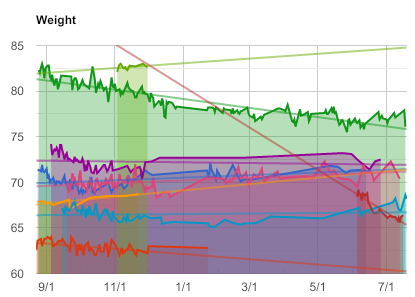

## ものぐさレコーディングダイエット

減量できたことないけど、いろんな事を記録して可視化するのはいいこと。  
そして、体重の崩壊を防ぐ仲間内 Slack では、このように post した体重と体脂肪率をグラフ化してくれるスクリプトがすでに動いています。




post した username を自動的に取得して、それぞれの人の記録をトレンド含め表示してくれています。  
今までは、愛用していた[TANITA の体組成計](https://amzn.to/2Lv42AS)から手動でメモしていたのですが、いかんせん朝にメモ作業するのは結構面倒。目も疲れるし。

そこで、Wi-Fi 対応の体組成計を購入して、乗ったら自動的に Slack に体重と体脂肪率を飛ばすシステムを作りました。  
白羽の矢がたった機種がこちら。

体重の計測は 200g 刻みと、21 世紀の体重計とは思えない精度ですが計測結果が 100g 程度変動していたところで一喜一憂するものでもなし、インターネット直結という点を重視しました。

<AmazonLinkBox url="http://www.amazon.co.jp/exec/obidos/ASIN/B071LNJTVH/gensobunya-22/ref=nosim/" />

## とりあえず IFTTT

計測した内容は[Withings Health Mate](https://www.withings.com/jp/ja/health-mate)という WEB サービスにアップロードされ、モバイルアプリでも閲覧できます。  
本体の設定はすべてモバイルアプリ経由なので楽ちん。このサービス自体が IFTTT に対応しているので、まずは直接 IFTTT を使って Slack に連携してみます。


骨量や筋肉量、水分量も計測できるのですが API で取得できるのは「体重」「前回体重差」「体脂肪量」「前回体脂肪量差」「体脂肪率」「計測日時」の 6 点のみでした。  
こちらの IFTTT アプレットの起動結果がこちら。


連携はできましたが、一つ思い出してください。

> post した username を自動的に取得して、それぞれの人の記録をトレンド含め表示してくれています。

IFTTT の bot アカウントが post するだけだとグラフ化の方の bot が正常に動いてくれません。自分のアカウントが post したことにしないと…  
ちなみにコードを書かなくても MyfitnessPal 経由で GARMIN CONNECT や STRAVA に体重を連携できるので単体でも結構便利です。

## Slack API を直接叩こう

[Slack API の仕様](https://api.slack.com/methods/chat.postMessage)によると、`chat.postMessage`の`as_user`オプションを`true`にして POST すればいいようです  
IFTTT のオプションにはないので直接何かしらのスクリプトを起動することにします。


どこで実行するかが問題ですが、データの受け皿を用意しつつ無料でスクリプトを動かせるとなると、やっぱり Google SpreadSheet と Apps Script がシンプルで簡単です。
token の取得やアプリの登録に関しては割愛します。

一回、IFTTT でスプレッドシートにデータを飛ばしてカラムを確認した後に以下のスクリプトを、編集をトリガーに設定して実行します。
Date,Weight,Weight w/o fat,Fat weight,Fat Percent の順に 4 カラム IFTTT で入力しています。

```JavaScript
function getLatestWeightData(){
  const sheet = SpreadsheetApp.getActiveSpreadsheet().getActiveSheet();
  const lastRawNum = sheet.getLastRow();
  const dataRange = sheet.getRange(lastRawNum, 1, 1, 5) //Date,Weight,Weight w/o fat,Fat weight,Fat Percent
  const postData = {
    "weightKg": dataRange.getValues()[0][1],
    "fatPercent": dataRange.getValues()[0][4]
  }
  Logger.log(postData)
  return postData
}


function postMeasureDataToSlack() {
  //Get latest row data
  const data = getLatestWeightData();
  const postMessage =　data.weightKg+"kg "+data.fatPercent+"%";

  //POST to Slack channel
  const baseURL = "https://slack.com/api/chat.postMessage";
  const postData = {
    "channel": "<your channel name>",
    "as_user": true,
    "text": postMessage
  };
  const options = {
    "method": "post",
    "contentType": "application/json; charset=utf-8",
    "headers":{
      "Authorization": "Bearer <!!your access token!!>"
    },
    "payload": JSON.stringify(postData)
  }

  const response = UrlFetchApp.fetch(baseURL, options);
  Logger.log(response)
  return
}
```

Slack グループの設定がありませんが、トークンがグループごとに発行されるのでそこで認識されています。  
`"as_user": true`を設定したので、あたかも自分が発言したかのようにチャンネルにポストされます。


仲間内で牽制し合うコミュニティでは IFTTT よりこちらのほうがより便利かと思います。  
他にも自動で有給連絡したり、`as_user`オプションの使い道は結構ありそうですね。

アプリ連携体重計だとその後の広がりがあまり良くないのですが、WEB サービスだと連携も簡単です。タニタもオムロンも、WEB サービス連携する体重計は結構高いので 1 万円程度で買える Withings はかなりコスパ良い買い物でした。

<AmazonLinkBox url="http://www.amazon.co.jp/exec/obidos/ASIN/B071LNJTVH/gensobunya-22/ref=nosim/" />
