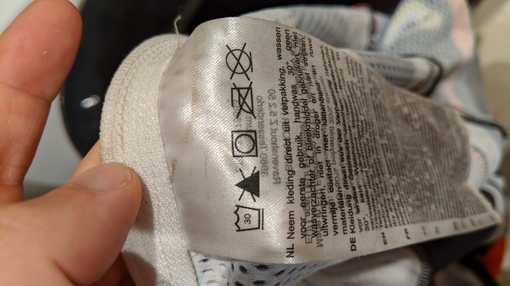

## 今シーズン初投入機材

- Bioracer PRO シクロクロススキンスーツ長袖

以上！

## 使い心地

関西 CX#2 富田林で投入しました。  
この日は最高気温 20 度と昼間は非常に暑いので、インナーなしで着用。汗が目にダラダラ入るほどの暑いレースでしたが、袖や肩は完全にドライ。素晴らしい速乾能力。

かなり伸縮性と姿勢サポート力が高いので、着るだけでも一苦労です。肩甲骨周りの柔軟性が必要…  
レースの直前に着ないと色々不便かと…  
姿勢のサポートは立っていると自然と猫背になる程の強さ。ただ、かなりピッチリしているにも関わらず、姿勢以外の締め付けは殆ど感じません。太い体の自分でも自転車に乗っていれば快適そのものです。

ちなみに、我が家では洗濯乾燥機を使っているので、乾燥機可かどうかは非常に重要なのですが…（チャンピオンシステムは基本乾燥機可）

乾燥機可でした！素晴らしい！  
柔軟剤を使わないように注意書きで書いてありますね。おそらく速乾のための細かい穴を塞いでしまうのかと…

なかなかお高い買い物ですが、本気でレース参戦しているならウェアは機材の一部として非常に良い働きをしてくれるので、奮発するのもおすすめです。

Bioracer の撥水素材はレベルが高く、泥がつきにくいのでシクロクロスには最適です。  
特にジャケットは 1 度お借りして着てみたことがあるのですが、積雪の氷点下でも汗冷えせずしっかり体を温めてくれるので真冬にぴったり。
