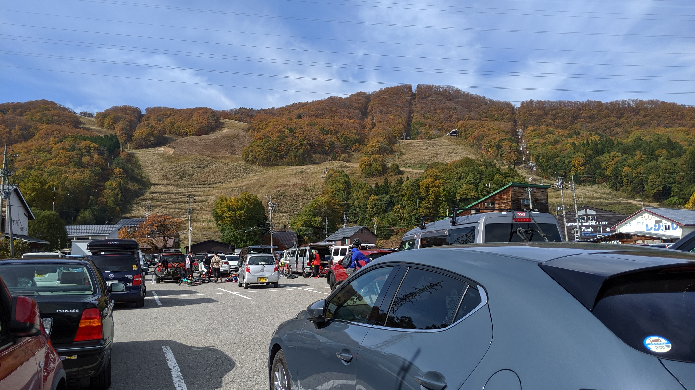
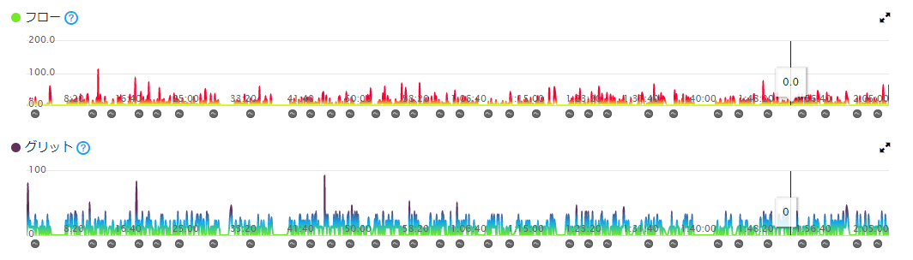
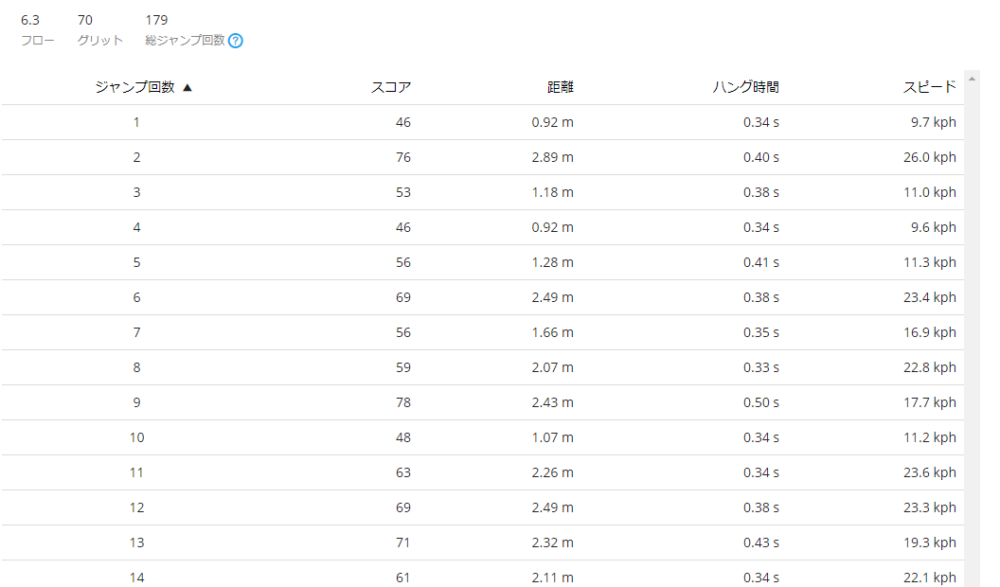
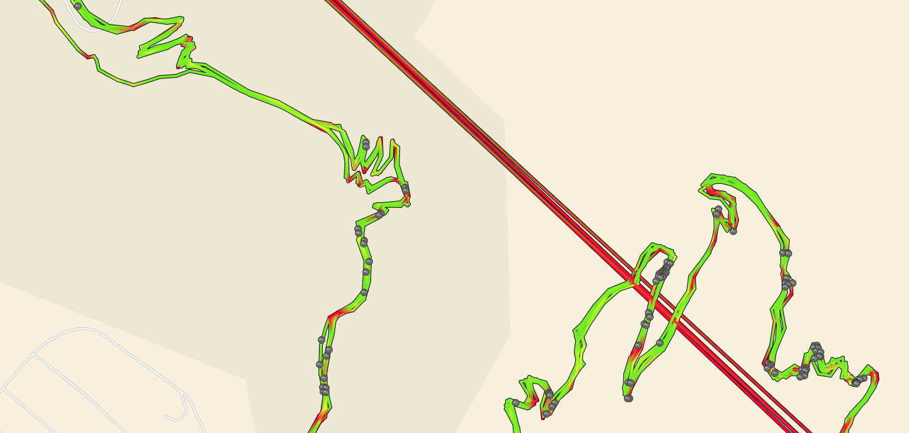

## MTB ダイナミクスがすごい

Edge530/830/1050 のあまり日本で語られない機能、「MTB ダイナミクス」。マーケット上仕方がないが、結論から言うとかなり面白い機能である。  
本体のモーションセンサー（加速度？）によって MTB のジャンプ回数や、トレイルの難易度・走行のスムーズさを計測してくれるというもの。

ジャンプはわかりやすいワードだが、その他に"グリッド","フロー"という指標を表示してくれる。  
じっさいに走ったログと照らし合わせてどんな機能なのか紹介していく。

ちなみに MTB ダイナミクスはアクティビティタイプを MTB にしないとロギングされないので注意。

## MTB ダイナミクスの定義

岩岳コースを６本ほど走った際のログがこちら

### フロー

フローの定義は以下の通り。  
そのまま読むと、ライドのスムーズさを表す指標。

個人が別のコースを走った場合、フローが小さい方が快適なコース。複数人でフローを比較した場合低いほうがスムーズな上手い走りという解釈が妥当だろうか。

> フローは、マウンテンバイクライドでスピードをどの程度維持できたかを測定します。ライド全体で登り降りやカーブの角度などの要因が考慮されます。フローチャートは次のように評価します。  
> スムーズ：0-1  
> 中強度：1-20  
> ラフ：20+  
> フローはトレイルでのライドパフォーマンスを分析するのに有用な指標です。たとえば、同じトレイルでの 2 回のライドのフロースコアを比較して、ライドのスムーズさが向上したり低下したエリアを探すことができます。
>
> **Garmin Connect でのフロー**  
> 全体のフロースコアは、Garmin デバイスで蓄積された平均スコアです。ライドでは、継続的にフローが算出されています。同期したとき、ライド全体のフロースコアチャートとライド全体の平均フロースコアを Garmin Connect で受信します。フロースコアが低いほど、ライドの変化に波がなかったことがわかります。スコアが高くなると、ライドでスピードの変化や停車があったことがわかります。

### グリット

その名の通り難易度。  
こちらも加減速を考慮しているように見えるが、ライダー本人というよりコースの性質を GPS ログと合わせて計測している感じ。人による誤差をなくしたバージョンで、より客観的な指標になるようだ。

> グリットは、マウンテンバイクライドの難易度を測定します。ライド全体で登り降りのスピードやカーブの角度などの要因が考慮されます。グリットチャートは次のように評価します。  
> イージー：0-20  
> 中強度：20-40  
> ハード：40+  
> 同じトレイルの場合、グリットスコアはライダー間でかなり共通性があるはずです。これは走行するさまざまなトレイルの難易度を比較するのに有用な指標になります。
>
> **Garmin Connect でのグリット**  
> 全体のグリットスコアは、Garmin デバイスで蓄積された合計です。ライドでは、継続的にグリットが算出されています。同期したとき、ライド全体でグリットスコアのチャートとその合計スコアを Garmin Connect で受信します。また、アクティビティマップでトレイルでのグリットレーティングを表示することもできます。ライドの難易度が高いほど、グリットスコアが高くなります。

### ジャンプ

その名の通りジャンプを検知する。検知すると「ﾋﾟﾛｯ」と Edge がアラートを出すので小さな達成感を感じられる ← 重要  
その他、滞空時間や距離・速度を記録している。

ちなみにガレ場でもジャンプ検知したり、パンプトラックではジャンプ祭り（実際には地面を舐めている）だったりするので、信頼性はイマイチ。長時間飛んでいるログを抽出すればちょっとはマシなデータになると思われる。

## 活用方法

正直なところまだ活用方法はわからないし、数値的な妥当性もあまり見えてこないだろう。

ただ、フローとジャンプに関しては全てマップ上で確認できる。

赤い部分が加減速の激しい部分で、黒いマークが付いている部分がジャンプ。  
他人にどんなコースか紹介するときには使えるかもしれない。

とりあえずログを取っているという事実や、ジャンプの検知音はライド中のいいアクセントになるので、Edge530 みんな買いましょう！

<LinkBox isAmazonLink url="https://www.amazon.co.jp/dp/B07TVPYCTV/" />
