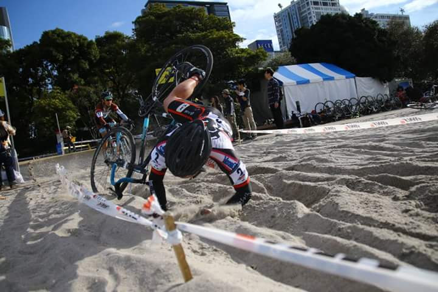

この記事は[ロードバイクアドベントカレンダー](https://adventar.org/calendars/4172)19日目の記事です。  
本記事はひたすらポエムであり、普段の本ブログとの趣とは異なります。

23日目には幻想サイクルっぽい記事を予定しています。

## シクロクロスブーム収束の感

ここ5年程度、野辺山シクロクロスとお台場シクロクロスを皮切りに関西でそこそこ盛んだったシクロクロスの流れが全国に波及し、それなりのブームになったと認識しています。  
UCIレースもアジア圏屈指の開催数となり、実にブームと言うべき環境でした。

去年辺りから新規参入が落ち着いてきてブームは収束に向かっているようです。収束というよりはマーケットの限界に近づいたという言い方が正しそうですが。

え？シクロクロスをまだ見たことがない？今すぐこの[公式サイト](https://www.cyclocross.jp/)にアクセスして次の週末の予定をおさえてそのロードバイクで観戦に向かいましょう。  
情報の集約されっぷりと都市部との近さが日本のシクロクロスの魅力。とりあえずAJOCCの公式サイトに行けば参戦・観戦に必要な情報は手に入ります。

## What cross?

シクロクロスは何がクロスしているのか？

コースは確かにオンロードとオフロードの中間ですが、それだけではなくライダーの出身多様性もあり、人もCrossしていると言えるでしょう。  
もともとのルーツはロードレースのウィンタートレーニングですが、オフロード競技であるが故にクロスカントリーのオフシーズンに参戦する人もいれば、BMXが本業のライダー、ダートジャンパー、ストリート、大学のツーリング部など、様々な文化と人が入り混じっています。

自転車もウェアも様々、下位クラスは固定ギアでも参加OKです。Tシャツジーパンでレースを走っても構いません。  
よく見たら明らかにデイキャンプのおまけにレース参戦してる人もいれば、コース脇で酒飲んで応援してるだけの人もいます。

## 頭おかしいよ…

細いタイヤでオフロード走って、パンクして、ランニングして、パンクしなくても砂でランニングしてるし頭おかしいとか言われたりします。

僕らは真面目です。

リザルトを眺めれば、ロードレースでは絶対に勝てない人に対してシクロクロスでは競ったり競らなかったりすることもあって結構楽しい。コースは毎年同じ様に見えて変わっており、レース直前の天気によって様々な顔を見せてくれます。毎週競ってたアイツは今年すごく速くなってたり、あのBMX出身のライダーみたいにバニーホップでバリアを越えてみたり、C1ライダーみたいに急坂を駆け上がりたいという欲望は尽きません。

そう、シクロクロスは中々飽きが来ません。無限に楽しめます。

そろそろレースに飽きてきた？ところでレース以外の時間地べたに座ってない？椅子とテーブルを買って優雅に観戦しようよ、ほらあのへんのNUCCみたいに。

うまくコーナーでグリップできない？このタイヤいいよ、チューブラー買っちゃいないよ、いやいやスリックタイヤで大丈夫だって…

最近関西ではKUCCが強いね、まぁあのサークルは自転車乗るより、担いで山登ってるイメージあるしシクロクロス速いのはわかるよ。

## シクロクロスやろうよ

自転車生活マンネリ化してませんか？シクロクロスやりませんか？最低10年は楽しめますよ、みんなやってるから大丈夫大丈夫！

<LinkBox isAmazonLink url="https://www.amazon.co.jp/dp/B07TSF99PD/" />

---

## 宣伝

C97にサークル参加します。

### 【新刊】週末洗車部

自宅でできる洗車方法を、フルサービス洗車から水無し洗車までバリエーション深く解説しつつ、汚れの質に応じた洗い方をおすすめする本です。  
アパートぐらしにも関わらず毎週の洗車を運命づけられたシクロクロッサーによるノウハウを大公開します。

家人に宅内洗車を禁止された男に取材を敢行した「闇洗車」についてもコラムを書いています。必見！

#### 通販・電子版

委託通販は[メロンブックス](https://www.melonbooks.co.jp/detail/detail.php?product_id=595340)様、電子版は[Kindle](https://amzn.to/34jEM5w)でそれぞれ予約受付中です。
