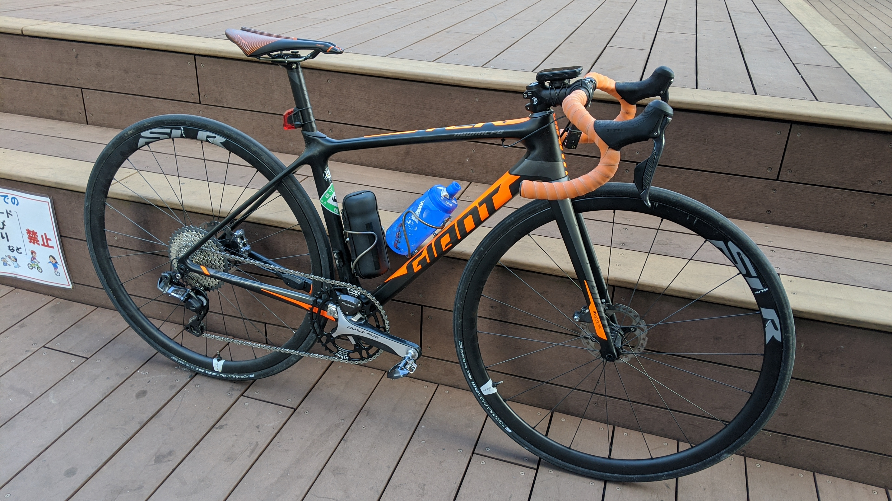

先日の[記事](/post/2020/01/tcr_allroadize/)の通り、ロードバイクを SPD ペダルで乗るようになり、これに合わせてシューズも XC 系シューズを常用することになりました。

## 最軽量ロード SPD ペダル PD-ES600

ボディが小さいだけあり、ロードバイクに合わせた際の違和感の無さはさすがです。SPD-SL ペダルと同じく前が長く後ろはテンション調整機構のみになっているせいもあって先代軽量ペダルである[A600](https://amzn.to/3aWAbKM)よりロードっぽい印象です。重量もちょっと軽くなっており、最軽量という枕詞をつけられる良さも合わさってロード SPD ではファーストチョイスと言ってもいいでしょう。

軸や表面の見た目はだいたい、アルテグラグレード相当です。ローグレードのスチール軸と違って六角レンチをかけたときの素材の硬さも感じます。  
シマノペダルらしく手でくるくる回るわかりやすい回転の軽さがあるわけではありませんが、しっかり前部のつま先が上を向いて止まってくれるので、クリート嵌めが失敗することは稀です。

裏側を踏んでいてもわかりづらいのはご愛嬌。SPD は表も裏も出っ張りがあるので裏面との足の裏感覚の差がありませんね。

## リーズナブルな SPD シューズ SH-XC501(XC5)

<a href="http://www.amazon.co.jp/exec/obidos/ASIN/B07XNX5RLG/gensobunya-22/ref=nosim/" name="amazletlink" target="_blank">SHIMANO(シマノ) XC5(SH-XC501) MTBシューズ [ブラック 43.0(27.2cm)] ESHXC501MCL01S43000</a>
posted with <a href="http://www.amazlet.com/" title="amazlet" target="_blank">amazlet</a> at 20.01.30

SHIMANO(シマノ)  売り上げランキング: 148,489 

<a href="http://www.amazon.co.jp/exec/obidos/ASIN/B07XNX5RLG/gensobunya-22/ref=nosim/" name="amazletlink" target="_blank">Amazon.co.jpで詳細を見る</a>

このシューズの特筆する点は、1 万円半ばというプライスながら、非常に軽量な点です。  
最軽量 SPD シューズたるグラベルレーサーシューズである[RX8](https://bike.shimano.com/ja-JP/product/apparel-accessories/shimano-series-lsg-2020/SH-RX800.html)からの重量増はたったの 33g で、片側 300g を切る SPD シューズはこの 2 種類のみです。

上位モデルの[XC7](https://amzn.to/2SdZGiv)は BOA ダイヤルが 2 つあることで 300g を越えています。  
余談ですが、SHIMANO はほぼ全てのグレードごとにシューズの足型が若干異なる気がしますので、グレードよりフィットを優先したほうがいいかもしれません。

ロードシューズとして使う以上、剛性と軽量性が必要になってくるのですが、RX8 の価格で XC501 が 2 足買えてしまうので若干の妥協をすることにしました。何より、CX 用のシューズが壊れた際に予備として投入するという役割もこのシューズなら求めることができます（RX8 は完全なロードシューズ用途なので降りることが前提の CX には転用が難しい）  
青は実物がかなり綺麗でしたが、黒が Amazon でやすかったのでホイホイつられて黒を買いました…

### 耐久力最強のソール部分

普段シクロクロスで、前の世代の 1 グレード上にあたる XC7(SH-XC700)を利用していましたので、このソールを使うのは 2 足目となります。通常 2 ～ 3 シーズンでソールが剥がれてしまうシューズも多い中フル参戦で 3 年使ってもびくともしない頑丈なソールです。

XC7 はスパイクピン部分に合わせる別部品が付属していましたが、XC501 はネジのみです。グリップ力は若干（非常に若干）減るかもしれませんが、なくしてしまう人も多い部品なのでむしろシンプルになっていい感じというところでしょうか。

この通り、青パーツが XC501 ではありませんでした。

## 実走行インプレ

40km ほど山間部を走行しましたが、剛性不足は感じませんでした。SPD シューズで公道を長々走ったりコンビニに入ったりするのは実に 7 年以上ぶりでしたが、思いの外快適です。  
流石に踏面の広さの差は感じますが、CX で慣れているので違和感はありませんでした。  
なによりアパート玄関のタイルで滑る心配がいらない！意外にも一番のストレス軽減ポイントでした！

ペダルキャッチは上から嵌めるというよりも、上死点にあるペダルを蹴り出したままの脚の回転に合わせると、クリート面を合わせやすく簡単に嵌められます。この辺はシクロクロスですぐペダルキャッチする練習をしていた結果か…と思ってましたが SPD-SL のクリートを引っ掛ける動きとほぼ同じでした。

要するにロードと同じ感覚でペダルキャッチするとうまくいきます。意図した設計なのか偶々なのかはわかりません。

デュラエースや XTR ペダルほど高くなく、この軽さと感覚と、歩きやすさを考えるとツーリング派やオールロード用の鉄板選択肢になるのではないでしょうか。よく乗り降りをするのであれば XTR/XT の両面 SPD のほうがストレスは少ないと思います。

<a href="http://www.amazon.co.jp/exec/obidos/ASIN/B07BWC3Y1N/gensobunya-22/ref=nosim/" name="amazletlink" target="_blank">シマノ(SHIMANO) SPDロードツーリングペダル PD-ES600 SMSH51クリート付属 EPDES600</a>
posted with <a href="http://www.amazlet.com/" title="amazlet" target="_blank">amazlet</a> at 20.01.30

シマノ(SHIMANO)  売り上げランキング: 10,644 

<a href="http://www.amazon.co.jp/exec/obidos/ASIN/B07BWC3Y1N/gensobunya-22/ref=nosim/" name="amazletlink" target="_blank">Amazon.co.jpで詳細を見る</a>

