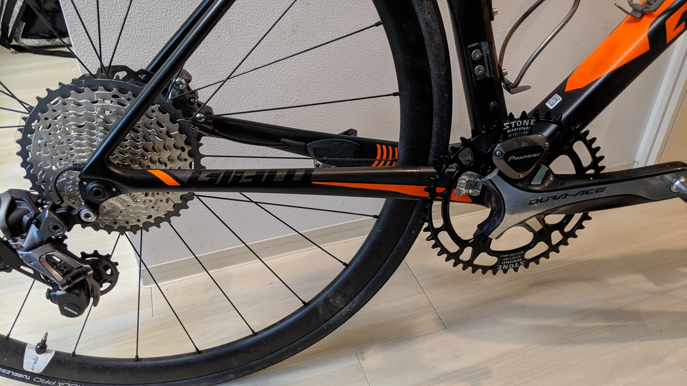
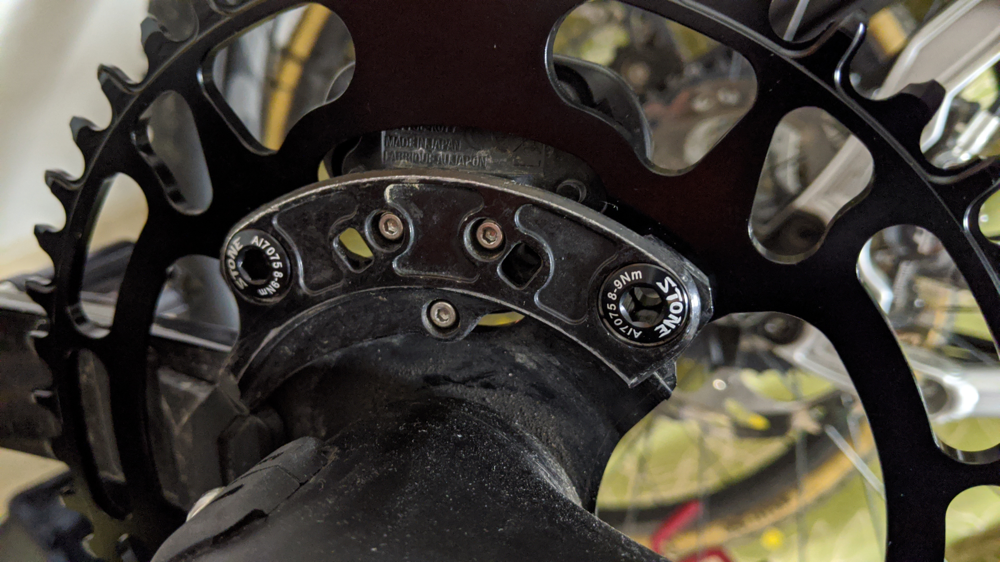
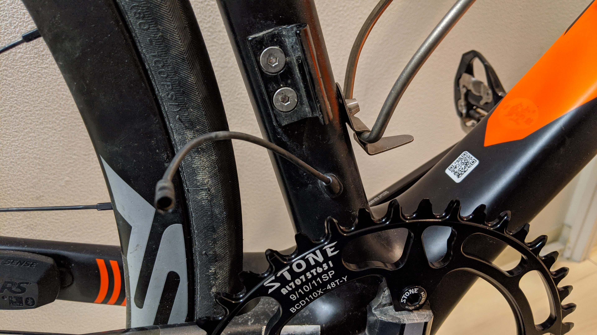
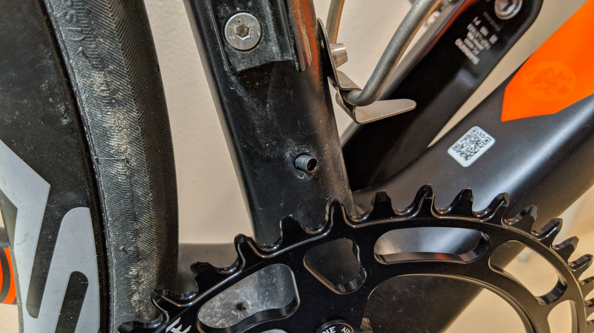
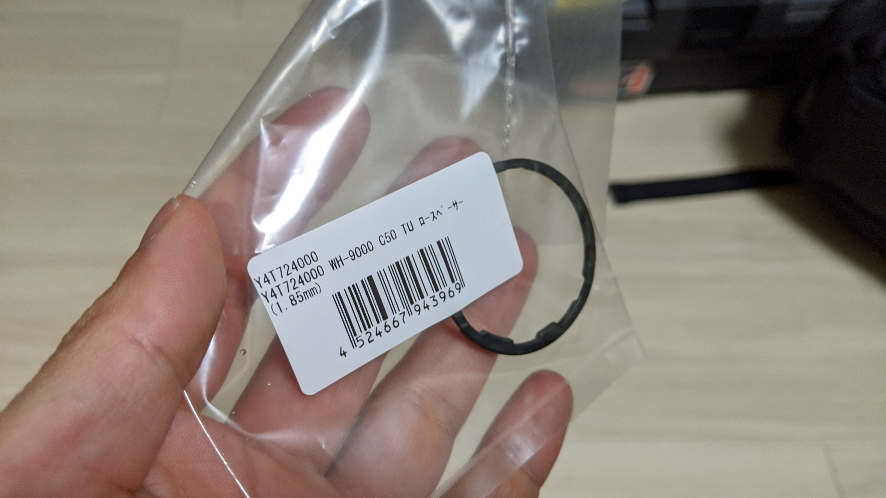

もともと、ロードレースにもガンガン出る想定で購入した TCR ADVANCED PRO DISC でしたが、当初の予想以上に活動の主軸をオフロードに移すことになったので、ロードバイクの位置付けをツーリング兼オフトレ用に設定しなおしました。

今後のロードバイク運用に合わせた形で、シクロクロスとの親和性や自分の嗜好に合わせる意味も含めてフロントシングルかつ SPD ペダルに交換することにしました。

## 考慮事項

摩耗限界に達してきた 9000 チェーンリングの交換に伴って、フロントシングルにしてランニングコスト削減。ロードシューズもベース部分を越えてシューズの革部分までカカト部分が摩耗してきたので CX シューズのスペアにできる SPD シューズに変更。  
ペダルの Q ファクターや踏み感覚に関しても、SPD-SL と SPD の間で差が出ていたので、共通化することで違和感なくバイクを乗り換えられるように。

上記を満たしつつ、必要な条件となる RD とスプロケを交換。

ギア比が最大の問題ですが、険しい峠を越えつつ下りもロードっぽく回していけることを考えて 4km/h ~ 55km/h をケイデンス最大 100 目安で使えることを考えて F48T - R11-42T の構成に決定。ギア比 4.36 ～ 1.14 ならかなり広いコースに対して万能に使えるはず。

リア 42T はほぼ使うことのない想定ですが、最大 40T か 34T と選択肢が飛んでしまう他、最大 40T だと抵抗の大きい上に耐久性の低い最大ギアを多く使ってしまいそうなので最大ギアを保険扱いしました。

## パーツ交換

今回交換したパーツは下記の通り。ペダルとシューズについては別途インプレ記事を書きます。

- FC-9000 純正チェーンリング => **[STONE 48T ナローワイドチェーンリング](https://www.ebay.com/itm/Circle-BCD110-Bicycle-Single-Chainring-Narrow-Wide-For-Shimano-5800-6800/254259238644)**
- FC-9000 左クランク w/ Pioneer ペダリングモニター => **[FC-9000 左クランク](https://amzn.to/37tVS30)**
- CS-6800 11-28T => **[CS-M8000 11-42T](https://amzn.to/2vnY4uH)**
- RD-9070 => **[GRX RD-RX817](https://amzn.to/2GliwhX)**
- PD-R7000 => **[PD-ES600](https://amzn.to/2TW85cP)**
- Lake CX233 => **[SHIMANO SH-XC501](https://amzn.to/2RtZbBL)**

まずは、チェーンリングとリアディレイラー・スプロケを交換します。  
STONE のチェーンリングはチェーンリングボルトが同梱されており、シングル用のチェーンリングボルトを手配する手間が省けました。パイオニアのおにぎりが装着された状態でも、社外チェーンリングは問題なく使うことができます（要校正）

ただ、パイオニアの固定パーツは純正ボルトを想定されているので、雄ネジ側のボルトしか入りません。なのでチェーンリングボルトは裏返して使いました。

フロントディレイラーは、外したあとに E-tube が余ってしまいますが…………

一旦グロメットを外して……

押し込んでグロメットで塞いで、 **ヨシ！**

ジャンクション B を BB から引っ張り出すのは最高に面倒なので、水が入る場所でもないことを考慮して雑に処理しておきます。

最後にチェーンを張ります。  
ロー側歯数が 28T より大きくなる場合は、プーリー位置ではなく、前後の最大ギアに最短で通した長さ＋ 1 コマがシマノマニュアルにおけるチェーン長の決め方です。

42-48T だとかなりの長さが必要になるので、当然新品を使います。

ほぼコマが余りませんでした。シマノのチェーンは最近 MTB/ロード兼用になりましたが、その前のロード専用はパッケージのコマ数が少なかったはず。もしロード専用チェーンだったら長さが足りなかったかもしれません。

クランクを逆回転させると…回転が激重！

それもそのはず、本来入れるべき [1.85mm スペーサー](https://amzn.to/30TYp43)を入れていないのでスプロケがロー側に寄っているためです。

MTB 11s はロードの 11s と違い、10s と同じフリー幅に合わせて設計されているため、10s フリーボディと 11s フリーボディの幅の差分になる 1.85mm スペーサーを噛ませないと正しい位置に組み付けできません。

スペーサーがない場合、本来はスカスカでロックリングが固定できないはずですが…なぜか GIANT ホイールでは固定できてしまいました。  
もちろん本来の場所ではないのでスペーサーが届いたあとスプロケを装着し直して完成。

### パイオニア　ペダリングモニターのシングルパワーメーターモード設定

[販売店向け PDF](http://pioneer-cyclesports.com/jp/support/products/manual/SGY-PM910H2HLHR_Manual_for_dealers_jp.pdf)に SGX-CAx00 を使わずに本体側だけでペダリングモニターモード ↔ デュアルパワーメーター ↔ シングルパワーメーター切り替え方法が載っていたので、手順に従って操作すれば簡単に変更できます。

## フロントシングル SPD ロードバイク所感

最近ほとんど CX とフラペの MTB に乗っていたせいもありますが、予想より違和感なく乗れてしまって拍子抜け。  
リアのギア比が飛ぶことだけは避けようがないので、ケイデンスの上げ下げや脚のトルク変化が大きくなりますが思っていたほどではなくダンシングの頻度がやや増えた程度でしょうか。

リア 42T まで幅をもたせているので、ロー側は手でクランクを回しているだけでも抵抗を感じます。レースのような出力にシビアな局面では使わないほうが吉…？  
STONE のチェーンリングは安物なので、[Wolftooth のロー側オフセットされているチェーンリング](https://amzn.to/2vht8Ms)が考え抜かれて作られていることを実感します。

クラッチ機能を使うことはなさそう…

## 裏コンセプト

パーツ群から何となく伝わるかと思いますが、いわゆるグラベルロードにそのまま一式移植しても機能するコンポ・パーツ構成となりました。

ゆくゆくはマルチに使える自転車としてグラベルフレームに載せ替えたいのですが、日本での運用を考えると、いいとこでも「オンロード：オフロード」＝ 8:2 程度の運用になってしまうので、アメリカンな 45mm まで入るグラベルフレームだとオンロード性能を犠牲にしすぎている…と考えています。

38mm 限界程度のダーティカンザ専用フレームみたいなチタンフレームが出たら購入して載せ替えたいところですね。オーダーしてもよいですが…

<a href="http://www.amazon.co.jp/exec/obidos/ASIN/B07RRPKB5D/gensobunya-22/ref=nosim/" name="amazletlink" target="_blank">シマノ(SHIMANO) RD-RX817 (Di2) 11S IRDRX817</a>
posted with <a href="http://www.amazlet.com/" title="amazlet" target="_blank">amazlet</a> at 20.01.25

シマノ(SHIMANO)  売り上げランキング: 476,959 

<a href="http://www.amazon.co.jp/exec/obidos/ASIN/B07RRPKB5D/gensobunya-22/ref=nosim/" name="amazletlink" target="_blank">Amazon.co.jpで詳細を見る</a>

