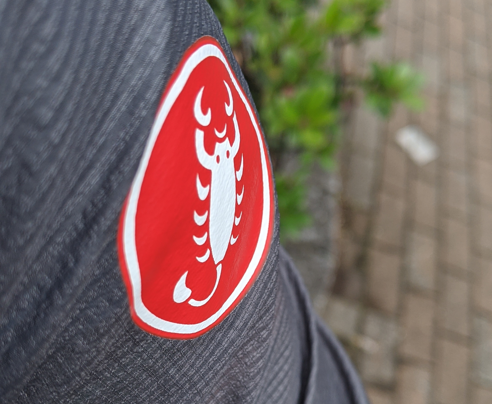
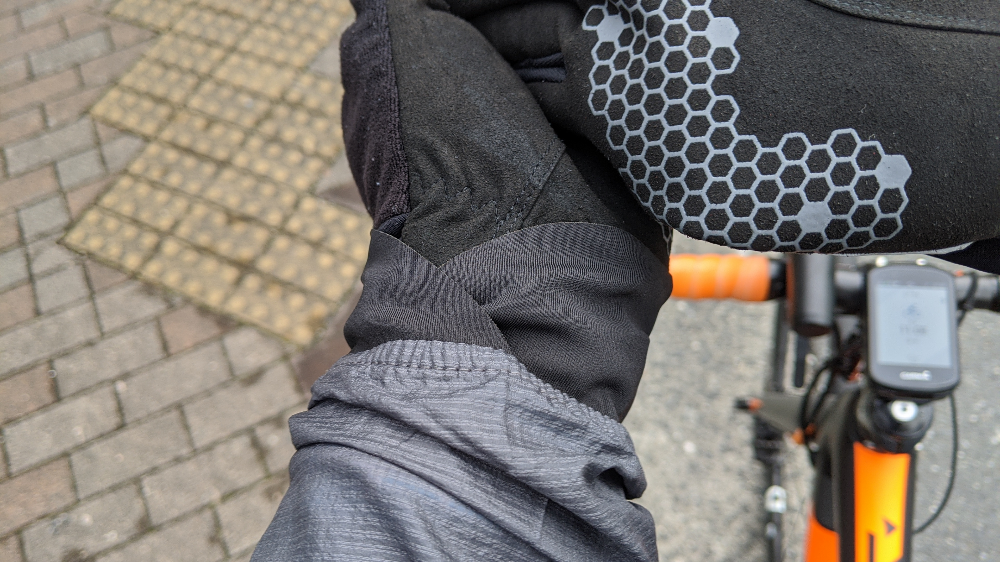
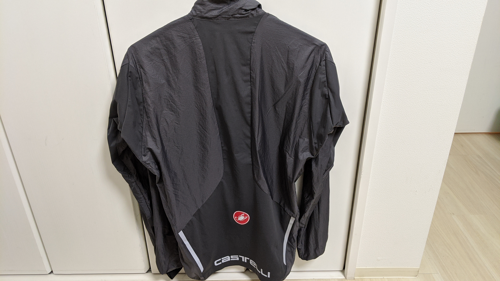
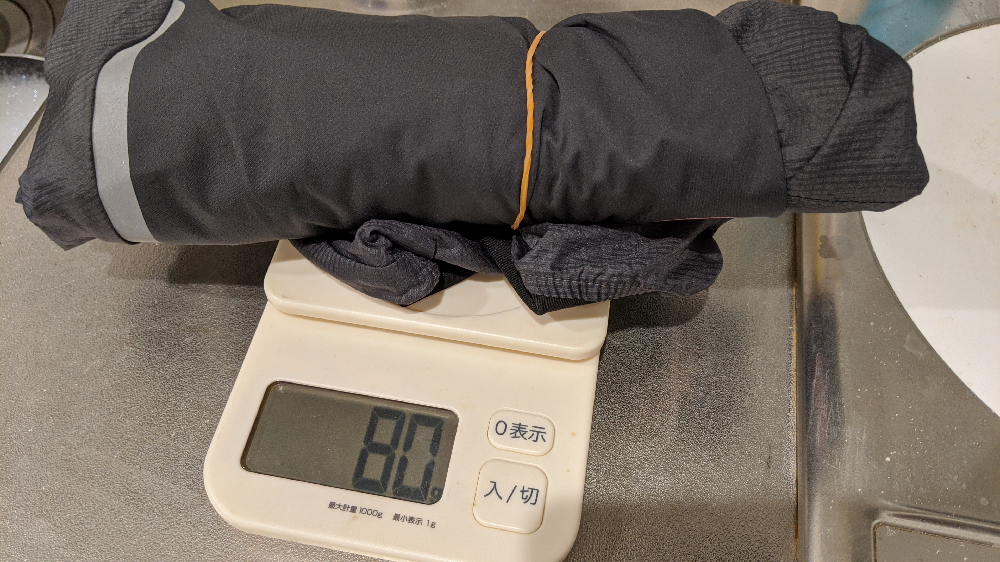
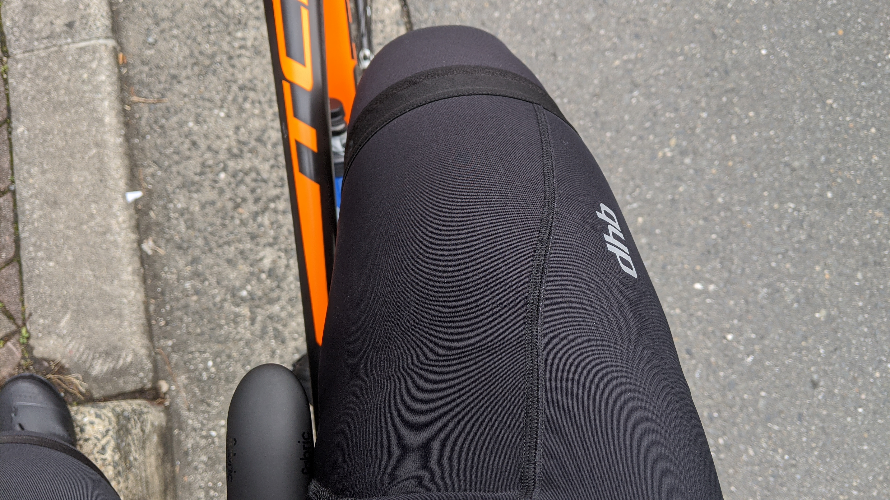

シクロクロスシーズンも終盤に近づき、ちょっと寒めの日も真面目にロードに乗るためのウェアをいくつかポチりました。

テーマは「変化に対応しつつ峠も快適に登れるウェアリング」

- [Castelli Superleggera jacket](https://www.chainreactioncycles.com/jp/ja/castelli-superleggera-%E3%82%B8%E3%83%A3%E3%82%B1%E3%83%83%E3%83%88-aw19/rp-prod153559)
- [Sportful No Rain Knee Warmers](https://www.chainreactioncycles.com/jp/ja/sportful-no-rain-knee-warmers/rp-prod110088)
- [dhb Classic Thermal Bib Shorts](https://www.chainreactioncycles.com/jp/ja/dhb-classic-thermal-bib-shorts/rp-prod175942)

以上 3 点。  
スタート時 6 度、山頂 5 度、最高 12 度ほどの 120km ライドの感想となります。（獲得標高 1100m）

## [Castelli Superleggera jacket](https://www.chainreactioncycles.com/jp/ja/castelli-superleggera-%E3%82%B8%E3%83%A3%E3%82%B1%E3%83%83%E3%83%88-aw19/rp-prod153559)

一言で言うと超性能の軽量ウィンドブレーカー。少しのストレッチ性を持ちながら撥水性能と防水性能を併せ持つので天気が崩れたときやダウンヒル、もしくは家を出る瞬間やコンビニ立ち寄りなど体が冷える後に着込んでおきます。

この手のウェアは体が温まってくるとすぐに脱ぎたくなるのが常なので、ポケッタブルである必要があります。その点こいつはとても薄い生地で乗っている間でも簡単に脱ぎ着してリアポケットに仕舞えるサイズまで折りたためます。

肝心の防風性も非常に Good で、この日は気温 5 度から 6 度のダウンヒルに、登って発熱した体で入りましたが全く風を通さず体の暖かさをキープしてくれました。下のレイヤーはチャンピオンシステムのフリースライトジャージ（現[PERFORMANCE インターミディエイトジャケット](https://champ-sys.jp/collections/performance-cycling/products/performance-intermediatejak))）とその下に[ドライレイヤー](https://amzn.to/2uN2n2G)を着ただけの簡単な装備です。

秘密は袖口にあり、グローブが下にあっても風が入ってこないような工夫がされています。これにより適当な着用でもしっかりと袖口から入る風をブロックしてくれるわけですね。

もちろん背中側は汗が抜けるよう、非防風生地を含んだカッティングです。重量はたったの 80g！

## [Sportful No Rain Knee Warmers](https://www.chainreactioncycles.com/jp/ja/sportful-no-rain-knee-warmers/rp-prod110088)

前段のジャケットと同じく、防風撥水のニーウォーマーです。

なぜニーウォーマーなのかというと、安…ではなく長い期間使えるためです。レッグウォーマーはもう少し暖かくなると使いづらくなってきますが、ニーウォーマーなら最高気温のみ 15 度を越えるような日でもそこまで暑くなく使うことができます。出ている部分は寒さに強いのでそれなりに我慢できるはず…

あと、海外製品が脚の長さに合わずに悲しい思いもせずに済みます…

防風性能が高いので太ももからふくらはぎにかけての主な脚の筋肉エリアを暖かく保ててパフォーマンスは一日良好でした。撥水性能は雨に降られなかったのでわからず。

## [dhb Classic Thermal Bib Shorts](https://www.chainreactioncycles.com/jp/ja/dhb-classic-thermal-bib-shorts/rp-prod175942)

冬はビブタイツより絶対にこれ！  
脚の長さ問題を気にせず（2 回目）、レイヤリングの幅を増やしてくれます。ビブタイツより長い期間使えるのもうれしいポイント。

夏用ビブを冬も使いまわしていた頃は走り終わると股間まわりだけが、しもやけのように赤くなったりしていましたが裏起毛なら暖かく維持できるので大丈夫。体のコア部分になるのでここは積極的に低体温化しないように保護したいのですがビブタイツは試着と価格が難しいので 10 年間手を出せずにいましたがついに解決しました。

## 総括

裏起毛ビブは最近いくつかのメーカーから出てきているので、必携アイテムです。今までは某激安ブランドで冬ウェアを揃えていましたが、大手のハイラインウェアはかなり進化してると実感しました。ゴワついていないのに暖かさは維持、やめられなくなりそうです。

<a href="http://www.amazon.co.jp/exec/obidos/ASIN/B084GT3L6V/gensobunya-22/ref=nosim/" name="amazletlink" target="_blank">Castelli(カステリ)メンズ ロングスリーブ サイクルジャケット Superleggera(Black) Size L (長袖 トップ 防水・防風 パッカブル 秋・冬) [並行輸入品]</a>
posted with <a href="http://www.amazlet.com/" title="amazlet" target="_blank">amazlet</a> at 20.02.15

  

<a href="http://www.amazon.co.jp/exec/obidos/ASIN/B084GT3L6V/gensobunya-22/ref=nosim/" name="amazletlink" target="_blank">Amazon.co.jpで詳細を見る</a>

