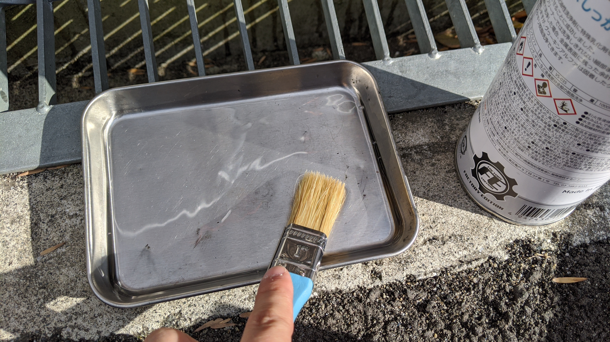
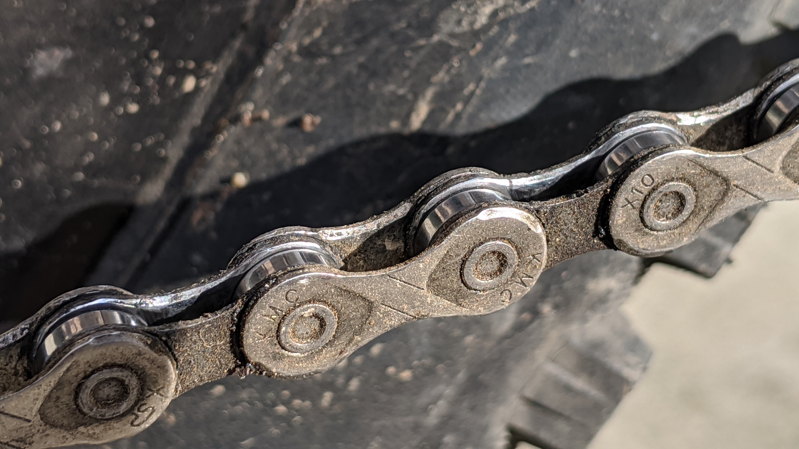
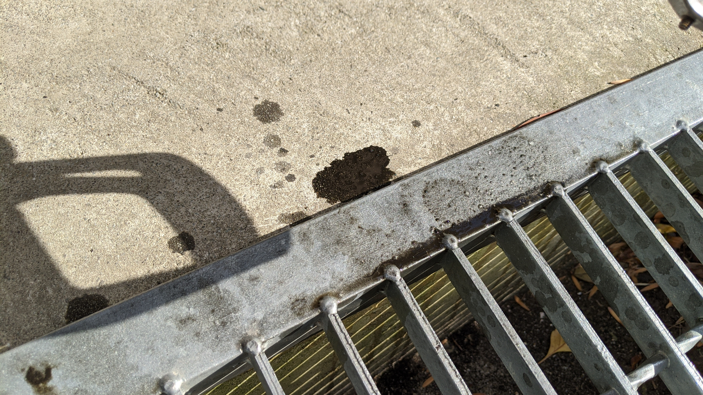
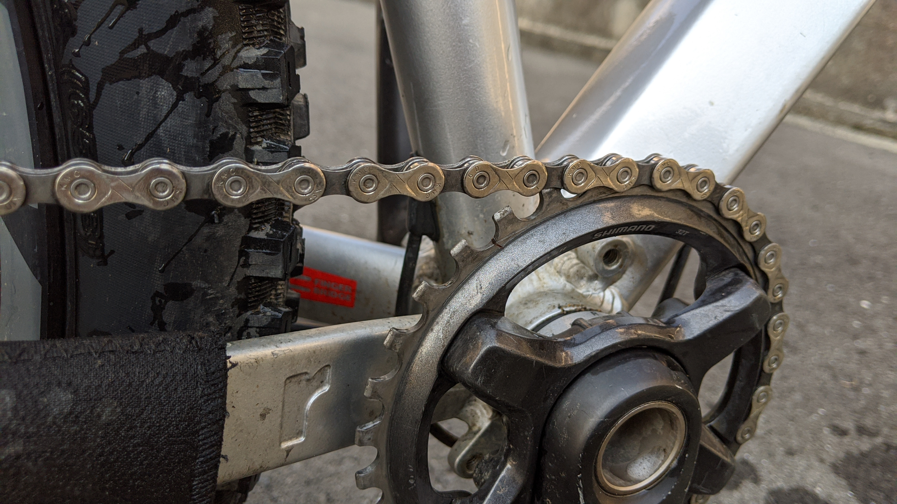
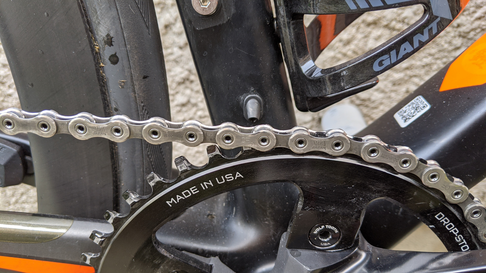

Twitter で水で流せて効き目抜群のディグリーザーと噂になっていた[グゥーキンアルファ](https://amzn.to/33vW7ZY)を買ってみました。

刷毛で塗って放置するだけでスプロケとチェーンがピカピカに！処理も水で流すだけ！すごい！とのこと。マジですか？

<a href="http://www.amazon.co.jp/exec/obidos/ASIN/B01LN1TYKQ/gensobunya-22/ref=nosim/" name="amazletlink" target="_blank">Vipro's(ヴィプロス) Gherkin α(グゥーキンアルファ) 反応乳化型ハイブリッド洗浄剤(低臭タイプ) 1,000ml VS-035</a>
posted with <a href="http://www.amazlet.com/" title="amazlet" target="_blank">amazlet</a> at 20.03.20

Vipro's(ヴィプロス)  売り上げランキング: 1,530 

<a href="http://www.amazon.co.jp/exec/obidos/ASIN/B01LN1TYKQ/gensobunya-22/ref=nosim/" name="amazletlink" target="_blank">Amazon.co.jpで詳細を見る</a>

## 実際に使ってみた

少量で効果があるとのことなので、必要な分のみをトレイに出して刷毛で塗っていきます。刷毛はホームセンターの塗料コーナーで良さげなコシと長さの物を買いました。

作業前のドライブトレインはこちら。ライド直後で砂埃だらけでです。

ドライルブばかり使っているのでそこまで汚くは見えませんが、実際はかなり黒いものがリンクの隙間から見えています。チェーンリングもだいぶ黒い汚れがついています。

手順としては塗ってから数分放置して、そのあと軽くこすって水で流せば良いはずです。まずは塗ってから浸透を待つために放置…

すぐ墨汁になって出てきました。凄まじい洗浄力。チェーン自体にも中々効果がありますが、チェーンリングの固着した泥だか油だか鉄粉だか分からなくなったものへの効き具合がものすごいです。

普段掃除しづらい、クランクアーム裏のチェーンリング歯の部分も軽く刷毛で塗るだけでスルッと汚れが取れて銀色を取り戻していきます。

ある程度汚れが浮くのを待って、刷毛で汚れを撫でたあとに流水でざっと流し、その後はパークツールのサイクロンで水洗いしていきます。6~7 回サイクロンを回したところで、水が黒くも白くもならなくなったので掃除完了です。

白くなっているうちはディグリーザーが残っているということなので洗わないといけません。結構めんどくさい。

なんということでしょう～～～そこには購入以来見たことのなかったチェーンリングの輝きが～～～（チェーンは頑張ればこれくらいになる）

## それフィルタークリーナーじゃね？

だいたいそうです。[AZ](https://amzn.to/2xeuAAs)のフィルタークリーナーとかコスパ良いですね。乳化して水で流せるという点に関しては共通です。

ただ、グゥーキンアルファのメリットとして臭いが抑えられているという 1 点が非常に強力です。フィルタークリーナーは灯油臭いので…

フィルタークリーナーで代替できているのでは？という質問に対しては使ったことがないのでなんとも言えません。

## 中性洗剤でいいとか[今年書いた本](https://amzn.to/3926JRv)で言ってなかった？

言ってました。

シクロクロスはほぼ毎週洗って汚れがあまり堆積しないので中性洗剤でいいんじゃないですかね…濯ぐのも簡単ですし。ロードや MTB のチェーンリングやチェーンは頻繁に洗わない分頑固な汚れが多いので、ちゃんとディグリーザーで洗うと気分が良いということが今回わかりました。

あと、この本の中で紹介していた[マックオフの濃縮ナノテククリーナー](https://amzn.to/3a7AVfx)が現役だとチェーンにも使えると聞いたので、そちらも今度検証してみます。

<a href="http://www.amazon.co.jp/exec/obidos/ASIN/B01LN1TYKQ/gensobunya-22/ref=nosim/" name="amazletlink" target="_blank">Vipro's(ヴィプロス) Gherkin α(グゥーキンアルファ) 反応乳化型ハイブリッド洗浄剤(低臭タイプ) 1,000ml VS-035</a>
posted with <a href="http://www.amazlet.com/" title="amazlet" target="_blank">amazlet</a> at 20.03.20

Vipro's(ヴィプロス)  売り上げランキング: 1,530 

<a href="http://www.amazon.co.jp/exec/obidos/ASIN/B01LN1TYKQ/gensobunya-22/ref=nosim/" name="amazletlink" target="_blank">Amazon.co.jpで詳細を見る</a>

## 2020/12 追記 チェーンクリーナーで洗ってみた

ドロドロになった CX のチェーンと、放置に放置を重ねたロードチェーンを両方[パークツールチェーンマシン](https://amzn.to/38etq6T)と[グゥーキンアルファ](https://amzn.to/33vW7ZY)で洗ってみました。

予想通りのピッカピカです。

泥の混ざった汚れも完全に落としてくれたことが意外でしたが、乳化剤の影響で「油性+水性洗剤の W ダブル作用」という効果があるようです（商品説明から引用）

手間も大幅削減できるので、少し贅沢ですがこの組み合わせを積極的に使いたいと思わせる洗い映えになりました。
